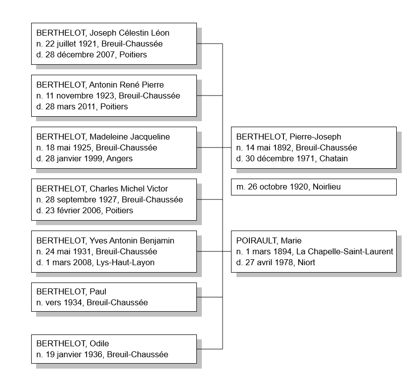
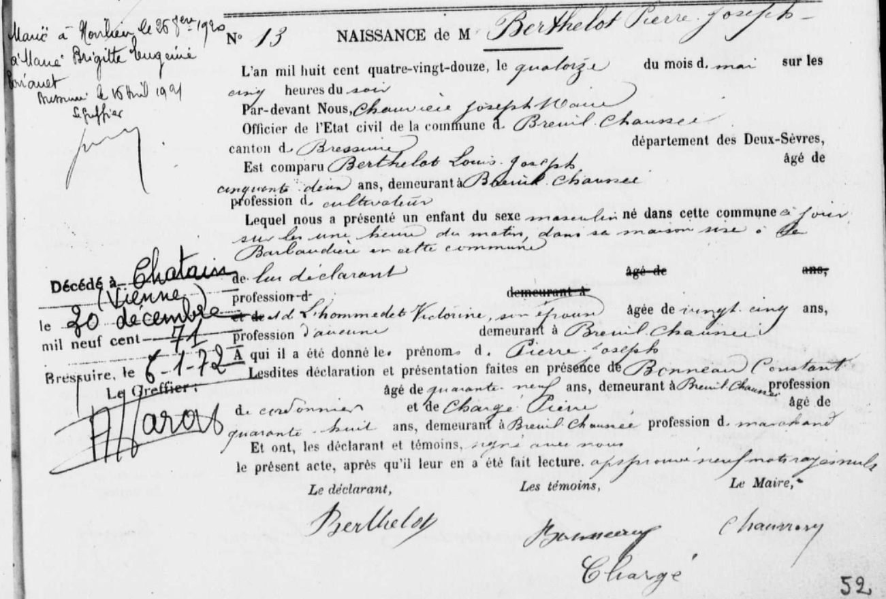
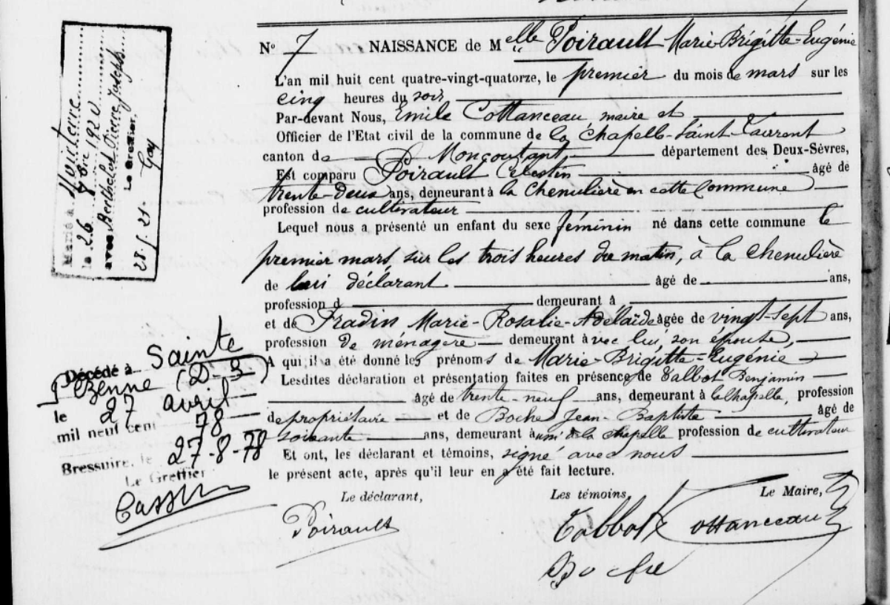

# Généalogie de la famille BERTHELOT

## par Benjamin François VION, 2020

---

# Préambule

Ce document vise à regrouper l'intégralité de mes recherches sur ma généalogie. Chaque individu en ligne directe a fait l'objet de recherches approfondies et a une section dédiée qui rassemble toutes les sources et toutes les informations que j'ai pu glaner au fil de mes recherches. On y retrouve essentiellement les extraits d'actes de naissance, mariage, décès pour les individus nés après 1795 et avant 1912 (ou 1902 selon le département de naissance).

Chaque famille possède sa section qui permet de connaître l'ensemble de la fratrie, les remariages, les héritages, etc.

Parfois j'ai des doutes sur certaines informations, auquel cas elles sont en *italique* dans le document.

<u>Lien Geneanet de l'arbre généalogique complet</u> : [Benjamin François VION : généalogie par Benjamin VION - Geneanet](https://gw.geneanet.org/kribouille_w?lang=fr&p=benjamin+francois&n=vion&oc=0)

# Table des matières

- [Souche de l'arbre](#souche)

- Grand-mère et arrières-grands-parents paternels
  
  - [BERTHELOT, Odile](#berthelot1)
  
  - [BERTHELOT, Pierre Joseph](#berthelot2)
  
  - [POIRAULT, Marie Brigitte Eugénie](#berthelot3)

- Trisaïeuls paternels (les parents de l'arrière-grand père)

## Souche de l'arbre <a name="souche"/>

---

## BERTHELOT, Odile <a name="berthelot1"/>

## BERTHELOT, Pierre Joseph <a name="berthelot2"/>

### Acte de naissance, Breuil-Chaussée, 14 mai 1892

Source : https://archives-deux-sevres-vienne.fr/ark:/58825/vtae9129b236124e4c8/daogrp/0/layout:table/idsearch:RECH_8a77c7ec96924b2d57e41d16c4059856?id=https%3A%2F%2Farchives-deux-sevres-vienne.fr%2Fark%3A%2F58825%2Fvtae9129b236124e4c8%2Fcanvas%2F0%2F46&vx=2357.97&vy=-1703.34&vr=0&vz=5.56381

#### Résumé

| Commune                     | Breuil-Chaussée, canton de Bressuire                   |
| --------------------------- | ------------------------------------------------------ |
| **Enfant**                  | Pierre Joseph BERTHELOT                                |
| **Naissance**               | 14 mai 1892 à 01h00 du matin                           |
| **Père, âge et profession** | Louis Joseph BERTHELOT, 52 ans, cultivateur            |
| **Mère, âge et profession** | Victorine L'HOMMEDET, 25 ans, sans profession          |
| **Domicile**                | La Barbaudière                                         |
| **Témoin 1**                | Constant BONNEAU, 49 ans, cantonnier à Breuil-Chaussée |
| **Témoin 2**                | Pierre CHARGE, 48 ans, marchand                        |

## POIRAULT, Marie Brigitte Eugénie <a name="berthelot3"/>

### Acte de naissance, La Chapelle-Saint-Laurent, 1 mars 1894

Source : https://archives-deux-sevres-vienne.fr/ark:/58825/vta4db892456183bf81/daogrp/0/layout:table/idsearch:RECH_38ebb80ff1210f735a42ba4f31e692ec?id=https%3A%2F%2Farchives-deux-sevres-vienne.fr%2Fark%3A%2F58825%2Fvta4db892456183bf81%2Fcanvas%2F0%2F56&vx=1383.31&vy=-1978.54&vr=0&vz=6.40077

Résumé

| Commune                     | La Chapelle-Saint-Laurent, canton de Moncoutant |
| --------------------------- | ----------------------------------------------- |
| **Enfant**                  | Marie Brigitte Eugénie POIRAULT                 |
| **Naissance**               | 1 mars 1894 à 03h00 du matin                    |
| **Père, âge et profession** | Célestin POIRAULT, 32 ans, cultivateur          |
| **Mère, âge et profession** | Marie Rosalie Adélaïde FRADIN, 27 ans, ménagère |
| **Domicile**                | La Chenulière                                   |
| **Témoin 1**                | Benjamin TALBOT, 39 ans, propriétaire           |
| **Témoin 2**                | Jean-Baptiste BOCHE, 60 ans, cultivateur        |
