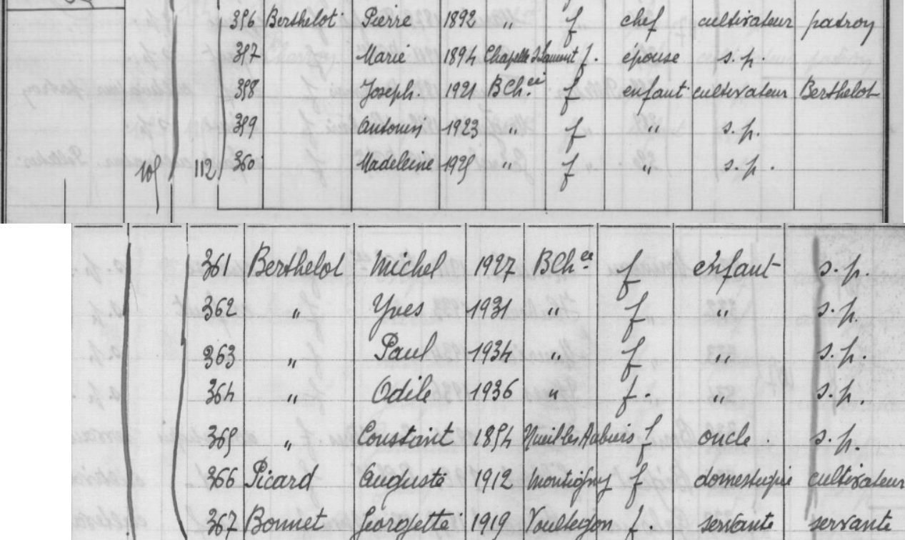
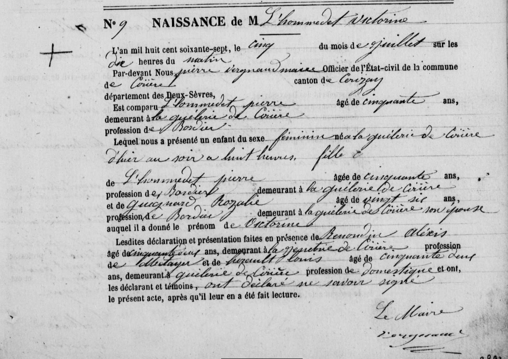
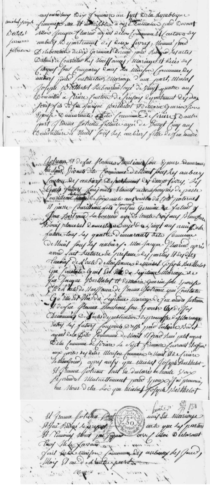

# Généalogie de la famille BERTHELOT

## par Benjamin François VION, 2020

---

# Préambule

Ce document vise à regrouper l'intégralité de mes recherches sur ma généalogie. Chaque individu en ligne directe a fait l'objet de recherches approfondies et a une section dédiée qui rassemble toutes les sources et toutes les informations que j'ai pu glaner au fil de mes recherches. On y retrouve essentiellement les extraits d'actes de naissance, mariage, décès pour les individus nés après 1795 et avant 1912 (ou 1902 selon le département de naissance).

Chaque famille possède sa section qui permet de connaître l'ensemble de la fratrie, les remariages, les héritages, etc.

Parfois j'ai des doutes sur certaines informations, auquel cas elles sont en *italique* dans le document.

<u>Lien Geneanet de l'arbre généalogique complet</u> : [Benjamin François VION : généalogie par Benjamin VION - Geneanet](https://gw.geneanet.org/kribouille_w?lang=fr&p=benjamin+francois&n=vion&oc=0)

# Table des matières

- [Souche de l'arbre](#souche)

- Grand-mère et arrières-grands-parents paternels
  
  - [BERTHELOT, Odile](#berthelot1)
  
  - [BERTHELOT, Pierre Joseph](#berthelot2)
  
  - [POIRAULT, Marie Brigitte Eugénie](#berthelot3)

- Trisaïeuls paternels (les parents de l'arrière-grand père)
  
  - [BERTHELOT, Louis Joseph](#berthelot4)
  
  - [L'HOMMEDET, Victorine](#berthelot5)
  
  - [Mariage de Louis BERTHELOT et de Victorine L'HOMMEDET](#berthelotlhommedet)

- Quadrisaïeuls paternels
  
  - [BERTHELOT, Michel Joseph](#berthelot6)
  
  - [PLANCHET, Marie Anne](#berthelot7)
  
  - [Mariage de Joseph BERTHELOT et de Marie Anne PLANCHET](#berthelotplanchet)

- Quinquisaïeuls paternels
  
  - [BERTHELOT, Michel Joseph](#berthelot8)
  - [JOTREAU, Jeanne](#berthelot9)
  - [Mariage de Michel BERTHELOT et de Jeanne JOTREAU](#berthelotjotreau)

- Sextaïeuls paternels
  
  - [BERTHELOT, Jacques](#berthelot10)
  - [GUERIN, Marie](#berthelot11)

## Souche de l'arbre <a name="souche"/>

---

## BERTHELOT, Odile <a name="berthelot1"/>

## BERTHELOT, Pierre Joseph <a name="berthelot2"/>

### Acte de naissance, Breuil-Chaussée, 14 mai 1892

Source : https://archives-deux-sevres-vienne.fr/ark:/58825/vtae9129b236124e4c8/daogrp/0/layout:table/idsearch:RECH_8a77c7ec96924b2d57e41d16c4059856?id=https%3A%2F%2Farchives-deux-sevres-vienne.fr%2Fark%3A%2F58825%2Fvtae9129b236124e4c8%2Fcanvas%2F0%2F46&vx=2357.97&vy=-1703.34&vr=0&vz=5.56381

#### Résumé

| Commune                     | Breuil-Chaussée, canton de Bressuire                   |
| --------------------------- | ------------------------------------------------------ |
| **Enfant**                  | Pierre Joseph BERTHELOT                                |
| **Naissance**               | 14 mai 1892 à 01h00 du matin                           |
| **Père, âge et profession** | Louis Joseph BERTHELOT, 52 ans, cultivateur            |
| **Mère, âge et profession** | Victorine L'HOMMEDET, 25 ans, sans profession          |
| **Domicile**                | La Barbaudière                                         |
| **Témoin 1**                | Constant BONNEAU, 49 ans, cantonnier à Breuil-Chaussée |
| **Témoin 2**                | Pierre CHARGE, 48 ans, marchand                        |

## POIRAULT, Marie Brigitte Eugénie <a name="berthelot3"/>

### Acte de naissance, La Chapelle-Saint-Laurent, 1 mars 1894

Source : https://archives-deux-sevres-vienne.fr/ark:/58825/vta4db892456183bf81/daogrp/0/layout:table/idsearch:RECH_38ebb80ff1210f735a42ba4f31e692ec?id=https%3A%2F%2Farchives-deux-sevres-vienne.fr%2Fark%3A%2F58825%2Fvta4db892456183bf81%2Fcanvas%2F0%2F56&vx=1383.31&vy=-1978.54&vr=0&vz=6.40077

#### Résumé

| Commune                     | La Chapelle-Saint-Laurent, canton de Moncoutant |
| --------------------------- | ----------------------------------------------- |
| **Enfant**                  | Marie Brigitte Eugénie POIRAULT                 |
| **Naissance**               | 1 mars 1894 à 03h00 du matin                    |
| **Père, âge et profession** | Célestin POIRAULT, 32 ans, cultivateur          |
| **Mère, âge et profession** | Marie Rosalie Adélaïde FRADIN, 27 ans, ménagère |
| **Domicile**                | La Chenulière                                   |
| **Témoin 1**                | Benjamin TALBOT, 39 ans, propriétaire           |
| **Témoin 2**                | Jean-Baptiste BOCHE, 60 ans, cultivateur        |

## Recensement à Breuil-Chaussée en 1936

___

## BERTHELOT, Louis Joseph <a name="berthelot4"/>

### Acte de naissance, Nueil-sous-les-Aubiers, 16 mars 1840

Source : https://archives-deux-sevres-vienne.fr/ark:/58825/vta64057a5a151af376/daogrp/0/layout:table/idsearch:RECH_5bfc84fe88ee260c229d346856d300cf?id=https%3A%2F%2Farchives-deux-sevres-vienne.fr%2Fark%3A%2F58825%2Fvta64057a5a151af376%2Fcanvas%2F0%2F44&vx=1224.29&vy=-2254.58&vr=0&vz=7.02094

#### Résumé

| Commune                     | Nueil-sous-les-Aubiers, canton de Chatillon            |
| --------------------------- | ------------------------------------------------------ |
| **Enfant**                  | Louis Joseph BERTHELOT                                 |
| **Naissance**               | 13 mars 1840 à 4h00 du matin                           |
| **Père, âge et profession** | Joseph BERTHELOT, 35 ans, cultivateur                  |
| **Mère, âge et profession** | Marianne PLANCHET, 25 ans                              |
| **Domicile**                | La Sarenière                                           |
| **Témoin 1**                | Jacques DAVID, 42 ans, cultivateur, cousin de l'enfant |
| **Témoin 2**                | Louis GUIET, 43 ans, cultivateur, oncle de l'enfant    |

### Acte de décès, Breuil-Chaussée, 3 juillet 1910

Source : https://archives-deux-sevres-vienne.fr/ark:/58825/vta48192d8f59b8ecbc/daogrp/0/layout:table/idsearch:RECH_8a77c7ec96924b2d57e41d16c4059856?id=https%3A%2F%2Farchives-deux-sevres-vienne.fr%2Fark%3A%2F58825%2Fvta48192d8f59b8ecbc%2Fcanvas%2F0%2F47

#### Résumé

| Commune                   | Breuil-Chaussée, canton de Bressuire                                      |
| ------------------------- | ------------------------------------------------------------------------- |
| **Décédé**                | Louis Joseph BERTHELOT                                                    |
| **le**                    | 2 juillet 1910 à 6h30 du matin                                            |
| **Père**                  | N/A                                                                       |
| **Mère**                  | N/A                                                                       |
| **Domicile**              | La Barbaudière                                                            |
| **Témoin 1 et déclarant** | Constant BERTHELOT, 54 ans, cultivateur à Azay-le-Rideau, frère du défunt |
| **Témoin 2**              | Pierre GARNIER, 43 ans, instituteur                                       |

## L'HOMMEDET, Victorine <a name="berthelot5"/>

### Acte de naissance, Cirières, 4 juillet 1867

Source : https://archives-deux-sevres-vienne.fr/ark:/58825/vta217e7dac5bc18f37/daogrp/0/layout:table/idsearch:RECH_654fdd0f390a25b4dd0efa45f1acc12a?id=https%3A%2F%2Farchives-deux-sevres-vienne.fr%2Fark%3A%2F58825%2Fvta217e7dac5bc18f37%2Fcanvas%2F0%2F220&vx=2900.34&vy=-2079.96&vr=0&vz=6.65529

#### Résumé

| Commune                     | Cirières, canton de Cerizay        |
| --------------------------- | ---------------------------------- |
| **Enfant**                  | Victorine L'HOMMEDET               |
| **Naissance**               | 4 juillet 1867 à 20h00             |
| **Père, âge et profession** | Pierre L'HOMMEDET, 50 ans, bordier |
| **Mère, âge et profession** | Rosalie GUIGNARD, 26 ans, bordier  |
| **Domicile**                | La Guélerie                        |
| **Témoin 1**                | Alexis RENONDIN, 52 ans, métayer   |
| **Témoin 2**                | Louis HERAULT, 52 ans, domestique  |

## Mariage de Louis BERTHELOT et de Victorine L'HOMMEDET <a name="berthelotlhommedet"/>

Source : https://archives-deux-sevres-vienne.fr/ark:/58825/vtad1dce3f86d1a28be/daogrp/0/layout:table/idsearch:RECH_8a77c7ec96924b2d57e41d16c4059856?id=https%3A%2F%2Farchives-deux-sevres-vienne.fr%2Fark%3A%2F58825%2Fvtad1dce3f86d1a28be%2Fcanvas%2F0%2F138&vx=2554.24&vy=-851.569&vr=0&vz=6.64876

#### Résumé

| Commune                         | Breuil-Chaussée, canton de Bressuire                 |
| ------------------------------- | ---------------------------------------------------- |
| **Mari**                        | Louis Joseph BERTHELOT, 51 ans, cultivateur          |
| **Femme**                       | Victorine L'HOMMEDET, 24 ans, servante               |
| **Mariage**                     | 22 février 1892 à 14h00                              |
| **Père du marié**               | Joseph BERTHELOT, décédé à Terves le 30 août 1877    |
| **Mère du marié**               | Victoire PLANCHET, 75 ans, présente                  |
| **Père de la mariée**           | Pierre L'HOMMEDET, décédé à Cirières le 19 mars 1889 |
| **Mère de la mariée**           | Rosalie GUIGNARD, 58 ans, présente                   |
| **Domicile**                    | La Barbaudière                                       |
| **Témoin 1 : frère du marié**   | Constant BERTEHLOT, 35 ans, cultivateur à Terves     |
| **Témoin 2 : frère du marié**   | Auguste BERTHELOT, 30 ans, cultivateur à Terves      |
| **Témoin 3 : ami de la mariée** | Victor BERTHELOT, 49 ans, cultivateur à Breuil       |
| **Témoin 4 : ami de la mariée** | Maximin REVAUD, 23 ans, cultivateur à Breuil         |

---

## BERTHELOT, Michel Joseph <a name="berthelot6"/>

### Acte de naissance, Cirières, 4 septembre 1805

Source : https://archives-deux-sevres-vienne.fr/ark:/58825/vtac23ed03c18b5e2fe/daogrp/0/layout:table/idsearch:RECH_654fdd0f390a25b4dd0efa45f1acc12a?id=https%3A%2F%2Farchives-deux-sevres-vienne.fr%2Fark%3A%2F58825%2Fvtac23ed03c18b5e2fe%2Fcanvas%2F0%2F21&vx=2603.18&vy=-1462.5&vr=0&vz=5.74923

#### Résumé

| Commune                     | Cirières, canton de Cerizay                     |
| --------------------------- | ----------------------------------------------- |
| **Enfant**                  | Victorine L'HOMMEDET                            |
| **Naissance**               | 4 septembre 1805 à 18h00 (17 Fructidor An XIII) |
| **Père, âge et profession** | Michel Joseph BERTHELOT                         |
| **Mère, âge et profession** | Anne JOTTREAU                                   |
| **Domicile**                | N/A                                             |
| **Témoin 1**                | Alexis CHEVAUT                                  |
| **Témoin 2**                | Jean MAHU                                       |

### Acte de décès, Terves, 30 août 1877

Source : https://archives-deux-sevres-vienne.fr/ark:/58825/vtacdc603908b864d20/daogrp/0/layout:table/idsearch:RECH_43b577bcad48fd75c7e0ede660fe3de4?id=https%3A%2F%2Farchives-deux-sevres-vienne.fr%2Fark%3A%2F58825%2Fvtacdc603908b864d20%2Fcanvas%2F0%2F41&vx=2644.15&vy=-1652.66&vr=0&vz=5.25596

#### Résumé

| Commune                   | Terves, canton de Bressuire                                 |
| ------------------------- | ----------------------------------------------------------- |
| **Décédé**                | Joseph BERTHELOT, fermier, 73 ans                           |
| **le**                    | 30 août 1877 à 7h du matin                                  |
| **Père**                  | Michel BERTHELOT                                            |
| **Mère**                  | Véronique GAUTREAU                                          |
| **Domicile**              | Putigny                                                     |
| **Témoin 1 et déclarant** | Joseph BERTHELOT, 37 ans, fermier à Putigny, fils du défunt |
| **Témoin 2**              | FAZILLEAU, 32 ans, fermier, gendre du défunt                |

## PLANCHET, Marie Anne<a name="berthelot7"/>

### Acte de naissance, Nueil-sous-les-Aubiers, 11 juillet 1814

Source : https://archives-deux-sevres-vienne.fr/ark:/58825/vta8662a8e3a022cd7d/daogrp/0/layout:table/idsearch:RECH_5bfc84fe88ee260c229d346856d300cf?id=https%3A%2F%2Farchives-deux-sevres-vienne.fr%2Fark%3A%2F58825%2Fvta8662a8e3a022cd7d%2Fcanvas%2F0%2F130&vx=1415.45&vy=-1231.98&vr=0&vz=6.75777

#### Résumé

| Commune                     | Nueil-sous-les-Aubiers, canton de Chatillon |
| --------------------------- | ------------------------------------------- |
| **Enfant**                  | Marie Anne PLANCHET                         |
| **Naissance**               | 11 juillet 1814 à 17h00                     |
| **Père, âge et profession** | Louis PLANCHET, 41 ans, cultivateur         |
| **Mère, âge et profession** | Marie HAY                                   |
| **Domicile**                | La Sarronnière                              |
| **Témoin 1**                | Pierre MERCERON, instituteur, 40 ans        |
| **Témoin 2**                | Pierre COURTIN, 33 ans, sabotier            |

### Acte de décès, Breuil-Chaussée, 24 avril 1893

Source : https://archives-deux-sevres-vienne.fr/ark:/58825/vtadc346f9b4714511d/daogrp/0/layout:table/idsearch:RECH_8a77c7ec96924b2d57e41d16c4059856?id=https%3A%2F%2Farchives-deux-sevres-vienne.fr%2Fark%3A%2F58825%2Fvtadc346f9b4714511d%2Fcanvas%2F0%2F125&vx=2865.36&vy=-934.382&vr=0&vz=6.89644

#### Résumé

| Commune                   | Breuil-Chaussée, canton de Bressuire                                |
| ------------------------- | ------------------------------------------------------------------- |
| **Décédée**               | Victoire PLANCHET (elle se faisait appeler Victoire)                |
| **le**                    | 24 avril 1893 à 3h00 du matin                                       |
| **Père**                  | Louis PLANCHET                                                      |
| **Mère**                  | Marie HAY                                                           |
| **Domicile**              | La Barbaudière                                                      |
| **Témoin 1 et déclarant** | Joseph BERTHELOT, 52 ans, fermier, fils de la défunte               |
| **Témoin 2**              | Auguste BERTHELOT, 33 ans, cultivateur à Terves, fils de la défunte |

## Mariage de Joseph BERTHELOT et de Marie Anne PLANCHET <a name="berthelotplanchet"/>

Source : https://archives-deux-sevres-vienne.fr/ark:/58825/vta258e1a056ace7688/daogrp/0/layout:table/idsearch:RECH_5bfc84fe88ee260c229d346856d300cf?id=https%3A%2F%2Farchives-deux-sevres-vienne.fr%2Fark%3A%2F58825%2Fvta258e1a056ace7688%2Fcanvas%2F0%2F25&vx=1180.78&vy=-760.984&vr=0&vz=5.70435

#### Résumé

| Commune                           | Nueil-sous-les-Aubiers, canton de Chatillon             |
| --------------------------------- | ------------------------------------------------------- |
| **Mari**                          | Joseph Michel BERTHELOT, domestique                     |
| **Femme**                         | Marie Anne PLANCHET                                     |
| **Mariage**                       | 24 novembre 1837                                        |
| **Père du marié**                 | Michel BERTHELOT, cultivateur, présent                  |
| **Mère du marié**                 | Anne JOTTREAU, présente                                 |
| **Père de la mariée**             | Louis PLANCHET, propriétaire, présent                   |
| **Mère de la mariée**             | Marie HAY, présente                                     |
| **Domicile**                      | La Barbaudière                                          |
| **Témoin 1 : père du marié**      | Michel BERTEHLOT, 64 ans, cultivateur à Cirières        |
| **Témoin 2 : frère du marié**     | Jean Baptiste BERTHELOT, 27 ans, cultivateur à Cirières |
| **Témoin 3 : père de la mariée**  | Louis PLANCHET, propriétaire, 66 ans                    |
| **Témoin 4 : frère de la mariée** | Louis PLANCHET, cultivateur, 34 ans                     |

---

## BERTHELOT, Michel Joseph <a name="berthelot8"/>

### Acte de décès, Montigny, 12 février 1845

Source : https://archives-deux-sevres-vienne.fr/ark:/58825/vta9fe789aa57c8efb4/daogrp/0/layout:table/idsearch:RECH_bc84e1bc87c13bc9205af0a9e66769de?id=https%3A%2F%2Farchives-deux-sevres-vienne.fr%2Fark%3A%2F58825%2Fvta9fe789aa57c8efb4%2Fcanvas%2F0%2F33&vx=1399.36&vy=-927.091&vr=0&vz=6.63112

#### Résumé

| Commune                   | Montigny, canton de Cerizay                                              |
| ------------------------- | ------------------------------------------------------------------------ |
| **Décédé**                | Michel BERTHELOT, métayer, 73 ans, veuf de Jeanne JOTREAU, né à Cirières |
| **le**                    | 12 février 1845 à 23h00                                                  |
| **Père**                  | Jacques BERTHELOT                                                        |
| **Mère**                  | Marie GUERIN                                                             |
| **Domicile**              | Le Poirier                                                               |
| **Témoin 1 et déclarant** | Baptiste BERTHELOT, 36 ans, métayer, fils du défunt                      |
| **Témoin 2**              | Benjamin BERTHELOT, 32 ans, domestique à Brétignolles                    |

## JOTREAU, Jeanne<a name="berthelot9"/>

### Acte de décès, Cirières, 19 février 1838

Source : https://archives-deux-sevres-vienne.fr/ark:/58825/vta7e7f62a43c23f156/daogrp/0/layout:table/idsearch:RECH_654fdd0f390a25b4dd0efa45f1acc12a?id=https%3A%2F%2Farchives-deux-sevres-vienne.fr%2Fark%3A%2F58825%2Fvta7e7f62a43c23f156%2Fcanvas%2F0%2F12&vx=2812.55&vy=-2017.06&vr=0&vz=5.46711

#### Résumé

| Commune                   | Cirières, canton de Cerizay                                                     |
| ------------------------- | ------------------------------------------------------------------------------- |
| **Décédée**               | Jeanne JOTREAU épouse de Michel BERTHELOT, 67 ans, née à Nueil-sous-les-Aubiers |
| **le**                    | 19 février 1838 à 15h00                                                         |
| **Père**                  | André JOTREAU                                                                   |
| **Mère**                  | ROULLEAU                                                                        |
| **Domicile**              | La Poture                                                                       |
| **Témoin 1 et déclarant** | Henry DENIS, 55 ans, bordier, ami et voisin de la défunte                       |
| **Témoin 2**              | Joseph POINT, 45 ans,                                                           |

## Mariage de Michel BERTHELOT et de Jeanne JOTREAU <a name="berthelotjotreau"/>

Source : https://archives-deux-sevres-vienne.fr/ark:/58825/vta7db11f2531074708/daogrp/0/layout:table/idsearch:RECH_5bfc84fe88ee260c229d346856d300cf?id=https%3A%2F%2Farchives-deux-sevres-vienne.fr%2Fark%3A%2F58825%2Fvta7db11f2531074708%2Fcanvas%2F0%2F154

#### Résumé

| Commune                                | Nueil-sous-les-Aubiers, canton de Chatillon                      |
| -------------------------------------- | ---------------------------------------------------------------- |
| **Mari**                               | Michel Joseph BERTHELOT, 24 ans, laboureur, domicilié à Cirières |
| **Femme**                              | Jeanne JOTREAU, 25 ans, domiciliée à Nueil                       |
| **Mariage**                            | 30 novembre 1798 (10 Frimaire An VII) à 11h du matin             |
| **Père du marié**                      | Jacques BERTHELOT, décédé                                        |
| **Mère du marié**                      | Marie GUERIN, présente, domiciliée à Cirières                    |
| **Père de la mariée**                  | André JOTREAU, décédé à Nueil-sous-les-Aubiers                   |
| **Mère de la mariée**                  | Jeanne ROULEAU, décédée à Nueil-sous-les-Aubiers                 |
| **Domicile**                           | N/A                                                              |
| **Témoin 1 : oncle du marié**          | Pierre COURILLEAU, 60 ans, laboureur                             |
| **Témoin 2 : cousin du marié**         | Pierre COURILLEAU                                                |
| **Témoin 3 : beau-frère de la mariée** | Jean BERTRAND, 33 ans, laboureur                                 |
| **Témoin 4 : ami de la mariée**        | Louis PLANCHET, 25 ans, domestique                               |

---

## BERTHELOT, Jacques <a name="berthelot10"/>

## GUERIN, Marie <a name="berthelot11"/>
