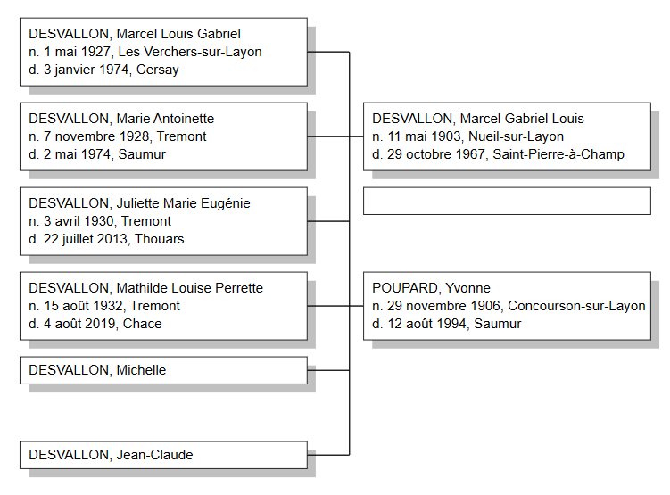
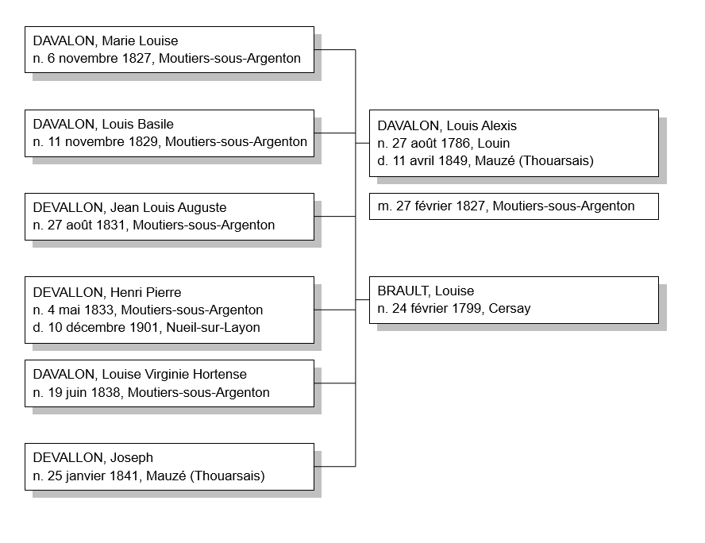
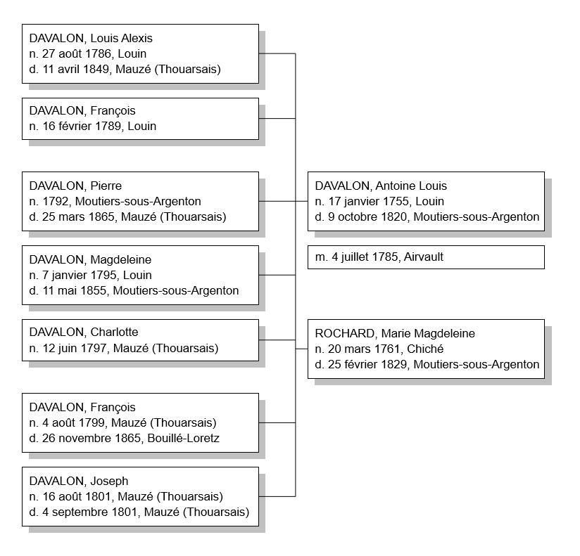
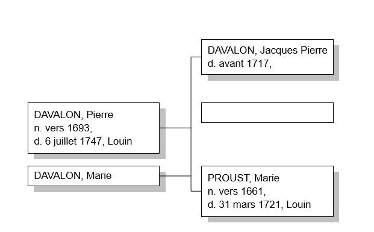

# Généalogie de la famille DESVALLON

## par Benjamin François VION, 2020

---

# Préambule

Ce document vise à regrouper l'intégralité de mes recherches sur ma généalogie. Chaque individu en ligne directe a fait l'objet de recherches approfondies et a une section dédiée qui rassemble toutes les sources et toutes les informations que j'ai pu glaner au fil de mes recherches. On y retrouve essentiellement les extraits d'actes de naissance, mariage, décès pour les individus nés après 1795 et avant 1912 (ou 1902 selon le département de naissance).

Chaque famille possède sa section qui permet de connaître l'ensemble de la fratrie, les remariages, les héritages, etc.

Parfois j'ai des doutes sur certaines informations, auquel cas elles sont en *italique* dans le document.

Les arrières-grands-parents DESVALLON sont issus du Maine-et-Loire, qui est un département assez avare en terme de documents. 1902 est la date limite de consultation des actes d'état civil, et il n'y a ni recensement (en cours de numérisation apparemment) et ni successions. Les premières sources ne sont donc pas fiables à 100%.

# Table des matières

- [Souche de l'arbre](#souche)

- Grand-père et arrières-grands-parents paternels
  
  - [DESVALLON, Marcel Louis Gabriel](#desvallon1)
  
  - [DESVALLON, Marcel Gabriel Louis](#desvallon2)
  
  - [POUPARD, Yvonne](#desvallon3)

- Trisaïeuls paternels (les parents de l'arrière-grand père)
  
  - [DESVALLON, Louis Eugène](#desvallon4)
  
  - [BOUGUIER, Joséphine](#desvallon5)
  
  - [Mariage de Louis DESVALLON et de Joséphine BOUGUIER](#desvallonbouguier)

- Quadrisaïeuls paternels
  
  - [DESVALLON, Henri Pierre](#desvallon6)
  
  - [JOUET, Françoise Francisque](#desvallon7)
  
  - [Mariage de Henri DESVALLON et de Françoise JOUET](#desvallonjouet)

- Quinquisaïeuls paternels
  
  - [DESVALLON, Louis Alexis](#desvallon8)
  
  - [BRAULT, Louise](#desvallon9)
  
  - [Mariage de Alexis Louis DESVALLON et de Louise BRAULT](#desvallonbrault)

- Sextaïeuls paternels
  
  - [DESVALLON, Antoine Louis](#desvallon10)
  
  - [ROCHARD, Madeleine](#desvallon11)
  
  - [Mariage de Louis DESVALLON et de Madeleine ROCHARD](#desvallonrochard)

- Septaïeuls paternels
  
  - [DESVALLON, Louis Pierre](#desvallon12)
  
  - [BICHON, Marie-Anne](#desvallon13)
  
  - [Mariage de Louis DESVALLON et de Marie-Anne BICHON](#desvallonbichon)

- Octaïeuls paternels
  
  - [DESVALLON, Pierre](#desvallon14)
  
  - [FAUVEAU, Marie](#desvallon15)
  
  - [Mariage de Pierre DESVALLON et de Marie FAUVEAU](#desvallonfauveau)

## Souche de l'arbre <a name=souche/>

---

## DESVALLON, Marcel Louis Gabriel <a name="desvallon1"/>

Source : "[DESVALLON MARCEL GABRIEL LOUIS (1927 - 1974) à Cersay - décès](https://deces.politologue.com/desvallon-marcel-gabriel-louis.uOvYVG70rO7OVpv0MO9jKOvjROLThGv0rG7Y9GLn)"

## DESVALLON, Marcel Gabriel Louis <a name="desvallon2"/>

### Succession

Source : [https://archives-deux-sevres-vienne.fr/ark:/58825/vta156cbad4a8c6111a/daogrp/0/layout:table/idsearch:RECH_7ca1f985198eeef10c1e4acd82054e82#id:1017175636?gallery=true&brightness=100.00&contrast=100.00¢er=3405.495,-1403.948&zoom=8&rotation=0.000](https://archives-deux-sevres-vienne.fr/ark:/58825/vta156cbad4a8c6111a/daogrp/0/layout:table/idsearch:RECH_7ca1f985198eeef10c1e4acd82054e82#id:1017175636?gallery=true&brightness=100.00&contrast=100.00&center=3405.495,-1403.948&zoom=8&rotation=0.000)

## POUPARD, Yvonne <a name="desvallon3"/>

Source : [POUPARD YVONNE (1906 - 1994) à Saumur - décès](https://deces.politologue.com/poupard-yvonne.uOvYRG70gOvX8pvOApP0-OL-MCvXrpv0MOvjApvxROv08)

## Condamnation pour vol d'octobre 1927

Source : [L'Ouest-Éclair | 1927-10-10 | Gallica](https://gallica.bnf.fr/ark:/12148/bpt6k612106k/f6.item.zoom)

---

## DESVALLON, Louis Eugène <a name="desvallon4"/>

### Acte de naissance, Nueil-sur-Layon, 7 janvier 1875

Source : [Registres d'état civil - Visualiseur](https://www.archinoe.fr/v2/ad49/visualiseur/registre.html?id=490039242)

#### Résumé

| Commune                     | Nueil-sur-Layon, canton de Vihiers                            |
| --------------------------- | ------------------------------------------------------------- |
| **Enfant**                  | Gabriel Joseph Alexandre VION                                 |
| **Naissance**               | 7 janvier 1875 à 15h00                                        |
| **Père, âge et profession** | Henri DESVALLON, journalier de 42 ans                         |
| **Mère, âge et profession** | Françoise JOUET, journalière de 38 ans                        |
| **Domicile**                | La Boissonière, Nueil-sur-Layon                               |
| **Témoin 1**                | Alexandre Auguste JAUDOIN, instituteur de 32 ans, ami du père |
| **Témoin 2**                | François DECRON, journalier de 69 ans, ami du père            |

### Service militaire

Source : [1 R 1246 - Classe 1895 - matricule n°1297 - Visualiseur](https://www.archinoe.fr/v2/ark:/71821/56701557196d982e417d724773da3ae0)

Matricule n° 1297, Louis Eugène DESVALLON

Né le 7 janvier 1875 à Nueil s/ Passavant, canton de Vihiers, y résidant, fils de Henri DESVALLON et de Françoise JOUET, habitants aussi à Nueil s/ Passavant

Cheveux et sourcils bruns, yeux roux, front ordinaire, nez moyen, bouche moyenne, menton rond, visage ovale. Taille : 1m63

Appelé à l'activité le 16 novembre 1896 au 7ème régiment de chasseurs à cheval. Chasseur de 1ère classe

Père de 6 enfants (au moment de la rédaction de la fiche)

## BOUGUIER, Joséphine <a name="desvallon5"/>

### Acte de naissance, Les Verchers-sur-Layon, 15 octobre 1882

Source : [Registres d'état civil - Visualiseur](https://www.archinoe.fr/v2/ad49/visualiseur/registre.html?id=490038742)

#### Résumé

| Commune                     | Les Verchers-sur-Layon, canton de Doué-la-Fontaine  |
| --------------------------- | --------------------------------------------------- |
| **Enfant**                  | Joséphine BOUGUIER                                  |
| **Naissance**               | 15 octobre 1882 à 11h00                             |
| **Père, âge et profession** | Joseph BOUGUIER, 32 ans, cultivateur                |
| **Mère, âge et profession** | Modeste Henriette CHARPENTIER, 28 ans, cultivatrice |
| **Domicile**                | Les Verchers-sur-Layon                              |
| **Témoin 1**                | Auguste MORILLON, charron de 34 ans                 |
| **Témoin 2**                | Pierre COCU, maréchal de 30 ans                     |

Le **charron** utilise le bois et le fer pour construire et réparer des véhicules attelés. Le cœur de son métier est sa maîtrise de la roue. Le moyeu est en orme, les raies en acacia et les jantes en frêne.

## Mariage de Louis DESVALLON et de Joséphine BOUGUIER <a name="desvallonbouguier"/>

Source : [Registres d'état civil - Visualiseur](https://www.archinoe.fr/v2/ad49/visualiseur/registre.html?id=490041681)

#### Résumé

| Commune                           | Nueil-sur-Layon, canton de Vihiers                                                                                                              |
| --------------------------------- | ----------------------------------------------------------------------------------------------------------------------------------------------- |
| **Mari**                          | Louis Eugène DESVALLON, domestique âgé de 26 ans, né le 7 janvier 1875 dans cette commune. Fils de Henri DESVALLON et , cultivateurs domiciliés |
| **Femme**                         | Joséphine BOUGUIER, couturière de 19 ans, née le 15 octobre 1882 aux Verchers                                                                   |
| **Mariage**                       | 18 novembre 1901                                                                                                                                |
| **Père du marié**                 | Henri DESVALLON, cultivateur à la Caillonnerie de Nueil, ici présent                                                                            |
| **Mère du marié**                 | Françoise JOUET, cultivateur à la Caillonnerie de Nueil, ici présente                                                                           |
| **Père de la mariée**             | Joseph BOUGUIER, cultivateur à Nueil, ici présent                                                                                               |
| **Mère de la mariée**             | Modeste Henriette CHARPENTIER, cultivateur à Nueil, ici présente                                                                                |
| **Domicile**                      | Nueil-sur-Layon                                                                                                                                 |
| **Témoin 1 : frère du marié**     | François DESVALLON, cultivateur de 37 ans domicilié à Bouillé-Saint-Paul                                                                        |
| **Témoin 2 : cousin du marié**    | Auguste FRESNEAU, journalier de 45 ans à Nueil                                                                                                  |
| **Témoin 3 : oncle de la mariée** | Pierre BOUGUIER, cultivateur de 48 ans à Nueil                                                                                                  |
| **Témoin 4 : oncle de la mariée** | David LOUIS, cultivateur de 63 ans à Cléré                                                                                                      |

---

## DESVALLON, Henri Pierre <a name="desvallon6"/>

### Acte de naissance, Moutiers-sous-Argenton, 4 mai 1833

Source : [https://archives-deux-sevres-vienne.fr/ark:/58825/vta38a8995f24456bf9/daogrp/0/layout:table/idsearch:RECH_9f327360164f4f6d8503478c6f421560#id:1120044653?gallery=true&brightness=100.00&contrast=100.00¢er=1440.968,-1845.069&zoom=11&rotation=0.000](https://archives-deux-sevres-vienne.fr/ark:/58825/vta38a8995f24456bf9/daogrp/0/layout:table/idsearch:RECH_9f327360164f4f6d8503478c6f421560#id:1120044653?gallery=true&brightness=100.00&contrast=100.00&center=1440.968,-1845.069&zoom=11&rotation=0.000)

#### Résumé

| Commune                     | Moutiers-sous-Argenton, arrondissement de Bressuire |
| --------------------------- | --------------------------------------------------- |
| **Enfant**                  | Pierre Henri DESVALLON                              |
| **Naissance**               | 4 mai 1833 à 14h00                                  |
| **Père, âge et profession** | Louis DESVALLON, 46 ans, bordier                    |
| **Mère, âge et profession** | Louise BRAULT, 34 ans                               |
| **Domicile**                | Bourg de Moutiers                                   |
| **Témoin 1**                | Louis MERCERON, cultivateur de 45 ans à Moutiers    |
| **Témoin 2**                | François MERCERON, cultivateur de 42 ans à Moutiers |

## Acte de décès, Nueil-sur-Layon, 10 décembre 1901

Source : [Registres d'état civil - Visualiseur](https://www.archinoe.fr/v2/ad49/visualiseur/registre.html?id=490041681)

#### Résumé

| Commune                   | Nueil-sur-Layon, canton de Vihiers                                                 |
| ------------------------- | ---------------------------------------------------------------------------------- |
| **Décédé**                | Pierre Henri DESVALLON, jouurnalier de 68 ans, époux de Françoise Francisque JOUET |
| **le**                    | 10 décembre 1901 à 2h00 du matin                                                   |
| **Père**                  | Louis DESVALLON, décédé                                                            |
| **Mère**                  | Louise BRAULT, décédée                                                             |
| **Domicile**              | La Caillonerie, Nueil-sur-Layon                                                    |
| **Témoin 1 et déclarant** | Joseph TALBOT, fermier de 59 ans, voisin du défunt                                 |
| **Témoin 2**              | Pierre MORET, cultivateur de 66 ans, ami du défunt                                 |

## JOUET, Françoise Francisque <a name="desvallon7"/>

### Acte de naissance, Nueil-sur-Layon, 15 décembre 1836

Source : [Registres d'état civil - Visualiseur](https://www.archinoe.fr/v2/ad49/visualiseur/registre.html?id=490005397)

#### Résumé

| Commune                     | Nueil-sur-Layon, canton de Vihiers        |
| --------------------------- | ----------------------------------------- |
| **Enfant**                  | Françoise Francisque JOUET                |
| **Naissance**               | 15 décembre 1836 à 6h00 du matin          |
| **Père, âge et profession** | Louis JOUET, 30 ans, cultivateur          |
| **Mère, âge et profession** | Margueritte NOMBALAIS, 31 ans             |
| **Domicile**                | Nueil-sur-Layon                           |
| **Témoin 1**                | André Lemoine, propriétaire, 24 ans       |
| **Témoin 2**                | Michel Claude GUJARD, instituteur, 29 ans |

## Mariage de Henri DESVALLON et de Françoise JOUET <a name="desvallonjouet"/>

Source : [Registres d'état civil - Visualiseur](https://www.archinoe.fr/v2/ad49/visualiseur/registre.html?id=490005399)

#### Résumé

| Commune                           | Nueil-sur-Layon, canton de Vihiers                          |
| --------------------------------- | ----------------------------------------------------------- |
| **Mari**                          | Pierre Henri DESVALLON, domestique,                         |
| **Femme**                         | Françoise Francisque JOUET, domestique                      |
| **Mariage**                       | 25 juin 1857                                                |
| **Père du marié**                 | Louis DESVALLON, décédé à Mauzé-Thouarsais le 11 avril 1849 |
| **Mère du marié**                 | Louise BRAULT, journalière, ici présente                    |
| **Père de la mariée**             | Louis JOUET, ici présent                                    |
| **Mère de la mariée**             | Margueritte NOMBALAIS, ici présente                         |
| **Domicile**                      | La Touche, les Verchers-sur-Layon                           |
| **Témoin 1 : frère du marié**     | Alexis DESVALLON, journalier de 42 ans à Nueil              |
| **Témoin 2 : ami des mariés**     | Suzanne PERDRIX, cordonnier à Nueil de 26 ans               |
| **Témoin 3 : frère de la mariée** | Jean JOUET, domestique de 24 ans à Nueil                    |
| **Témoin 4 : ami des mariés**     | Charles LEMOINE, meunier à Nueil de 44 ans                  |

---

## DESVALLON, Louis Alexis <a name="desvallon8"/>

### Baptême, Louin, 27 août 1786

Source : [https://archives-deux-sevres-vienne.fr/ark:/58825/vta39b3739a54f651fc/daogrp/0/layout:table/idsearch:RECH_070c9ef961e726461ccd0738ce4cf696#id:889279093?gallery=true&brightness=100.00&contrast=100.00¢er=1484.533,-1173.236&zoom=10&rotation=0.000](https://archives-deux-sevres-vienne.fr/ark:/58825/vta39b3739a54f651fc/daogrp/0/layout:table/idsearch:RECH_070c9ef961e726461ccd0738ce4cf696#id:889279093?gallery=true&brightness=100.00&contrast=100.00&center=1484.533,-1173.236&zoom=10&rotation=0.000)

#### Résumé

| Commune                     | Louin, entre Bressuire et Parthenay |
| --------------------------- | ----------------------------------- |
| **Enfant**                  | Alexis Louis DESVALLON              |
| **Baptême et naissance**    | 27 août 1786                        |
| **Père, âge et profession** | Louis DESVALLON                     |
| **Mère, âge et profession** | Madeleine ROCHARD                   |
| **Domicile**                | Louin                               |
| **Parrain**                 | Alexis BERTHONNIAU                  |
| **Marraine**                | Marine Marie Jeanne JAULAIN         |

### Premier mariage avec Jeanne CLOCHARD à La Chapelle-Gaudin

Source : https://archives-deux-sevres-vienne.fr/ark:/58825/vta95c8bae27bc1820e/daogrp/0?id=https%3A%2F%2Farchives-deux-sevres-vienne.fr%2Fark%3A%2F58825%2Fvta95c8bae27bc1820e%2Fcanvas%2F0%2F44&vx=1303.66&vy=-1585.53&vr=0&vz=6.29503

#### Résumé

| Commune                           | La Chapelle Gaudin, canton de Saint-Varent         |
| --------------------------------- | -------------------------------------------------- |
| **Mari**                          | Alexis Louis DESVALLON, né le 27 août 1786 à Louin |
| **Femme**                         | Jeanne CLOCHARD, 27 ans, née à La Chapelle Gaudin  |
| **Mariage**                       | 3 novembre 1810                                    |
| **Père du marié**                 | Louis DESVALLON, bordier à Moutiers, présent       |
| **Mère du marié**                 | Madeleine ROCHARD, présente                        |
| **Père de la mariée**             | Jean CLOCHARD, journalier, décédé                  |
| **Mère de la mariée**             | Jeanne THURPAU, décédée                            |
| **Domicile**                      | N/A                                                |
| **Témoin 1 : père du marié**      | Louis DESVALLON, bordier de 58 ans                 |
| **Témoin 2 : frère du marié**     | Pierre DESVALLON                                   |
| **Témoin 3**                      | Pierre GABARD ou GALLARD                           |
| **Témoin 4 : frère de la mariée** | X CLOCHARD, bordier à La Chapelle Gaudin           |
| **Témoin 5 : frère de la mariée** | Louis CLOCHARD, journalier à la Chapelle Gaudin    |

### Acte de décès, Mauzé-Thouarsais, 11 avril 1849

Source : https://archives-deux-sevres-vienne.fr/ark:/58825/vtaa38f97c11d0e3865/daogrp/0/layout:table/idsearch:RECH_35b6139bae0b8576991cd29f7531f7bb?id=https%3A%2F%2Farchives-deux-sevres-vienne.fr%2Fark%3A%2F58825%2Fvtaa38f97c11d0e3865%2Fcanvas%2F0%2F116&vx=2886.23&vy=-2409.56&vr=0&vz=6.8998

#### Résumé

| Commune                   | Mauzé-Thouarsais, canton de Thouars                                           |
| ------------------------- | ----------------------------------------------------------------------------- |
| **Décédé**                | Louis DESVALLON, journalier, époux de Louise BRAULT, 64 ans                   |
| **le**                    | 11 avril 1849 à 9h du matin                                                   |
| **Père**                  | N/A                                                                           |
| **Mère**                  | N/A                                                                           |
| **Domicile**              | La Capinière, Mauzé-Thouarsais                                                |
| **Témoin 1 et déclarant** | Louis DESVALLON, journalier, 36 ans, fils du défunt, domicilié à La Capinière |
| **Témoin 2**              | Jean DUBOIT, vigneron, 60 ans, domicilié à La Capinière                       |

## BRAULT Louise <a name="desvallon9"/>

### Acte de naissance, Cersay, 6 Ventôse an 7 (24 février 1799)

Source : https://archives-deux-sevres-vienne.fr/ark:/58825/vtab323397ddaa0481e/daogrp/0/layout:table/idsearch:RECH_c9158ef91556665bcd59e4e8b195eb95?id=https%3A%2F%2Farchives-deux-sevres-vienne.fr%2Fark%3A%2F58825%2Fvtab323397ddaa0481e%2Fcanvas%2F0%2F186&vx=1830.06&vy=-1041.05&vr=0&vz=4.92098

#### Résumé

| Commune                     | Cersay                                    |
| --------------------------- | ----------------------------------------- |
| **Enfant**                  | Louise BRAULT                             |
| **Naissance**               | 24 février 1799 à 6h du matin             |
| **Père, âge et profession** | Pierre BRAULT, journalier à Cersay        |
| **Mère, âge et profession** | Agathe LE COMTE                           |
| **Domicile**                | Le Colombier, lieu-dit à Cersay           |
| **Témoin 1**                | Louis XXXXX, laboureur de 41 ans à Cersay |
| **Témoin 2**                | Louise MELE, 22 ans à Cersay              |

## Mariage de Alexis Louis DESVALLON et de Louise BRAULT <a name="desvallonbrault"/>

Source : https://archives-deux-sevres-vienne.fr/ark:/58825/vta5a647b6a440575c7/daogrp/0/layout:table/idsearch:RECH_8fb7cbc243aedc783d0e6408de38e628?id=https%3A%2F%2Farchives-deux-sevres-vienne.fr%2Fark%3A%2F58825%2Fvta5a647b6a440575c7%2Fcanvas%2F0%2F161&vx=2540.39&vy=-1403.23&vr=0&vz=5.21828

#### Résumé

| Commune                           | Moutiers-sous-Argenton, canton d'Argenton le Château                                                                    |
| --------------------------------- | ----------------------------------------------------------------------------------------------------------------------- |
| **Mari**                          | Alexis Louis DESVALLON, né le 27 août 1786 à Louin, 40 ans, veuf de Jeanne CLOCHARD décédée à Moutiers le 20 avril 1826 |
| **Femme**                         | Louise BRAULT, servante domestique, domiciliée au village de la Charpentrie à Moutiers, 28 ans,                         |
| **Mariage**                       | 27 février 1827 à 9h00                                                                                                  |
| **Père du marié**                 | Louis DESVALLON, décédé à Moutiers le 9 octobre 1820 (en fait c'était le 7)                                             |
| **Mère du marié**                 | Madeleine ROCHARD, fileuse de laine, 65 ans à Mauzé, présente                                                           |
| **Père de la mariée**             | Pierre BRAULT, journalier de 63 ans à Breuil-sous-Argenton, présent                                                     |
| **Mère de la mariée**             | Agathe LE COMTE, décédée à Breuil le 27 juin 1817                                                                       |
| **Domicile**                      | N/A                                                                                                                     |
| **Témoin 1 : prêtre de Moutiers** | Jean Charles DOYEN, 46 ans                                                                                              |
| **Témoin 2**                      | Joseph LUJER, domestique de 25 ans à Boesse                                                                             |
| **Témoin 3**                      | Etienne BILLY, maréchal de 33 ans                                                                                       |
| **Témoin 4**                      | Dominique BILLY, bordier de 47 ans                                                                                      |

---

## DESVALLON, Antoine Louis <a name="desvallon10"/>

### Baptême, Louin, 17 janvier 1755

Source : https://archives-deux-sevres-vienne.fr/ark:/58825/vta7efb1b3d5802837a/daogrp/0/layout:table/idsearch:RECH_7637314785b1559b9fc3cf0854ca0f71?id=https%3A%2F%2Farchives-deux-sevres-vienne.fr%2Fark%3A%2F58825%2Fvta7efb1b3d5802837a%2Fcanvas%2F0%2F119&vx=1596.87&vy=-2937.9&vr=0&vz=6.35545

#### Résumé

| Commune                     | Louin                           |
| --------------------------- | ------------------------------- |
| **Enfant**                  | Antoine Louis DESVALLON         |
| **Naissance**               | 17 janvier 1755                 |
| **Père, âge et profession** | Louis Pierre DESVALLON          |
| **Mère, âge et profession** | Pas indiqué (Marie-Anne BICHON) |
| **Domicile**                | Bourg de Louin                  |
| **Parrain**                 | Louis BICHON                    |
| **Marraine**                | Michelle DESVALLON sa tante     |

Remarque : Sa grande soeur est décédée il y a deux jours seulement le 15 janvier à l'âge de 18 mois et demi. Son acte de décès est justement celui qui précède ce baptême dans le registre.

### Acte de décès, Moutiers-sous-Argenton, 9 octobre 1820

Source : https://archives-deux-sevres-vienne.fr/ark:/58825/vta1b9a2d4ad71fe8dc/daogrp/0/layout:table/idsearch:RECH_8fb7cbc243aedc783d0e6408de38e628?id=https%3A%2F%2Farchives-deux-sevres-vienne.fr%2Fark%3A%2F58825%2Fvta1b9a2d4ad71fe8dc%2Fcanvas%2F0%2F141&vx=2643.64&vy=-1872.21&vr=0&vz=6.65671

#### Résumé

| Commune                   | Moutiers-sous-Argenton                                                  |
| ------------------------- | ----------------------------------------------------------------------- |
| **Décédé**                | Louis DESVALLON, journalier, 72 ans (erreur en fait il en avait 65 ans) |
| **le**                    | 7 octobre 1820 à 20h                                                    |
| **Père**                  | N/A                                                                     |
| **Mère**                  | N/A                                                                     |
| **Domicile**              | Village de MIGAUDON à Moutiers-sous-Argenton                            |
| **Témoin 1 et déclarant** | Charles CHARRIER, maréchal de 37 ans, voisin du défunt                  |
| **Témoin 2**              | Pierre DESVALLON, 28 ans, fils du défunt                                |

## ROCHARD, Marie Magdeleine <a name="desvallon11"/>

### Baptême, Chiché, 20 mars 1761

Source : https://archives-deux-sevres-vienne.fr/ark:/58825/vtab8a0478a7efb1a3f/daogrp/0/layout:table/idsearch:RECH_232db40d4ef9825911fd26dd55c19efb?id=https%3A%2F%2Farchives-deux-sevres-vienne.fr%2Fark%3A%2F58825%2Fvtab8a0478a7efb1a3f%2Fcanvas%2F0%2F113&vx=3932.8&vy=-2984.49&vr=0&vz=6.34106 

#### Résumé

| Commune                     | Chiché                  |
| --------------------------- | ----------------------- |
| **Enfant**                  | Marie Madeleine ROCHARD |
| **Naissance**               | 20 mars 1761            |
| **Père, âge et profession** | Jean ROCHARD            |
| **Mère, âge et profession** | Marie BIARDEAU          |
| **Domicile**                | Chiché                  |
| **Parrain**                 | Germain DEBOEUF         |
| **Marraine**                | Marie DEBOEUF           |

### Acte de décès, Moutiers-sous-Argenton, 25 février 1829

Source : https://archives-deux-sevres-vienne.fr/ark:/58825/vta1b9a2d4ad71fe8dc/daogrp/0/layout:table/idsearch:RECH_287c441c1c0b38ea96ba7443546268f2?id=https%3A%2F%2Farchives-deux-sevres-vienne.fr%2Fark%3A%2F58825%2Fvta1b9a2d4ad71fe8dc%2Fcanvas%2F0%2F215&vx=2800.12&vy=-977.937&vr=0&vz=7.1457

#### Résumé

| Commune                   | Moutiers-sous-Argenton, canton d'Argenton-le-Château                        |
| ------------------------- | --------------------------------------------------------------------------- |
| **Décédée**               | Marie Madeleine ROCHARD, 68 ans, veuve de Louis DESVALLON                   |
| **le**                    | 25 février 1829 à 7h00 du matin                                             |
| **Père**                  | René ROCHARD (contradiction avec le baptême ou c'est Jean ROCHARD)          |
| **Mère**                  | Madeleine BELIARD (a dû se remarier)                                        |
| **Domicile**              | Bourg de Moutiers-sous-Argenton                                             |
| **Témoin 1 et déclarant** | Louis DESVALLON, son fils, 42 ans, bordier                                  |
| **Témoin 2**              | Pierre DESVALLON, son fils, 37 ans, domestique domicilié à Mauzé-Thouarsais |

## Mariage de Louis DESVALLON et de Madeleine ROCHARD <a name="desvallonrochard"/>

#### Résumé

| Commune                                         | Airvault                                                            |
| ----------------------------------------------- | ------------------------------------------------------------------- |
| **Mari**                                        | Louis DESVALLON, domestique chez Mr Bodin Ménard marchand à Thouars |
| **Femme**                                       | Magdeleine ROCHARD, domestique chez dame Noirault à Thouars         |
| **Mariage**                                     | 4 juillet 1785                                                      |
| **Père du marié**                               | Louis DESVALLON, tisserand. Rattaché à la paroisse d'Airvault       |
| **Mère du marié**                               | Marie-Anne BICHON, décédée. Rattachée à la paroisse d'Airvault      |
| **Père de la mariée**                           | Jean ROCHARD, décédé, paroisse de Chiché                            |
| **Mère de la mariée**                           | Marie BIARDEAU, paroisse de Chiché                                  |
| **Domicile**                                    | N/A                                                                 |
| **Témoin 1 : père du marié**                    | Louis DESVALLON                                                     |
| **Témoin 2 : cousin germain maternel du marié** | Louis RIMBAULT                                                      |
| **Témoin 3 : ami du marié**                     | Pierre GACHET, tisserand                                            |
| **Témoin 4 : frère de la mariée**               | François ROCHARD                                                    |
| **Témoin 5 : mère de la mariée**                | Marie BIARDEAU                                                      |
| **Témoin 6 : ami de la mariée**                 | Jean AMINOT                                                         |

## Recensement à Louin en 1796

Source : https://archives-deux-sevres-vienne.fr/ark:/58825/vtad234b14e1d71ce36/daogrp/0/layout:table/idsearch:RECH_c101add60cf2d7501d288ac0120097e3?id=https%3A%2F%2Farchives-deux-sevres-vienne.fr%2Fark%3A%2F58825%2Fvtad234b14e1d71ce36%2Fcanvas%2F0%2F8&vx=951.323&vy=-1474.98&vr=0&vz=4.37038

---

## DESVALLON, Louis Pierre <a name="desvallon12"/>

### Baptême, Louin, 10 novembre 1717

Source : https://archives-deux-sevres-vienne.fr/ark:/58825/vta94cec7b10dcd434e/daogrp/0/layout:table/idsearch:RECH_7637314785b1559b9fc3cf0854ca0f71?id=https%3A%2F%2Farchives-deux-sevres-vienne.fr%2Fark%3A%2F58825%2Fvta94cec7b10dcd434e%2Fcanvas%2F0%2F50&vx=1871.31&vy=-2738.21&vr=0&vz=6.79569

#### Résumé

| Commune                     | Louin                  |
| --------------------------- | ---------------------- |
| **Enfant**                  | Louis Pierre DESVALLON |
| **Naissance**               | 10 novembre 1717       |
| **Père, âge et profession** | Pierre DESVALLON       |
| **Mère, âge et profession** | Marie FAUVEAU          |
| **Domicile**                |                        |
| **Parrain**                 | Louis DESCHAMPS        |
| **Marraine**                | Marie LAURENCE         |

### Acte de décès, Louin, 9 décembre 1793 (19 frimaire An 2)

Source : https://archives-deux-sevres-vienne.fr/ark:/58825/vta56019b9f32bbe474/daogrp/0/layout:table/idsearch:RECH_7637314785b1559b9fc3cf0854ca0f71?id=https%3A%2F%2Farchives-deux-sevres-vienne.fr%2Fark%3A%2F58825%2Fvta56019b9f32bbe474%2Fcanvas%2F0%2F7&vx=3714.67&vy=-3034.95&vr=0&vz=5.98787

#### Résumé

| Commune                   | Louin                                                                              |
| ------------------------- | ---------------------------------------------------------------------------------- |
| **Décédé**                | Louis Pierre DESVALLON, 78 ans (en fait il en avait 76), veuf de Marie-Anne BICHON |
| **le**                    | 9 décembre 1793                                                                    |
| **Père**                  | Non indiqué                                                                        |
| **Mère**                  | Non indiqué                                                                        |
| **Domicile**              | Bourg de Louin                                                                     |
| **Témoin 1 et déclarant** | Louis DESVALLON, son fils, tisserand                                               |
| **Témoin 2**              | Louis ROUX, vigneron                                                               |

## BICHON, Marie-Anne <a name="desvallon13"/>

### Baptême, Airvault, 24 août 1724

Source : https://archives-deux-sevres-vienne.fr/ark:/58825/vtac8499ba4e1f70578/daogrp/0/layout:table/idsearch:RECH_c78c137465effb24b3622cae90b6273a?id=https%3A%2F%2Farchives-deux-sevres-vienne.fr%2Fark%3A%2F58825%2Fvtac8499ba4e1f70578%2Fcanvas%2F0%2F34&vx=3736.04&vy=-1299.28&vr=0&vz=5.49802

#### Résumé

| Commune                     | Airvault                  |
| --------------------------- | ------------------------- |
| **Enfant**                  | Marie-Anne BICHON         |
| **Naissance**               | 24 août 1724              |
| **Père, âge et profession** | Georges BICHON, boulanger |
| **Mère, âge et profession** | Marie Madeleine FLEURY    |
| **Domicile**                |                           |
| **Parrain**                 | Antoine CRESPEAU          |
| **Marraine**                | Marie Anne TURQUOIS       |

### Acte de décès, Airvault, 24 janvier 1778

Source : https://archives-deux-sevres-vienne.fr/ark:/58825/vta1e54db3e5d9fd4b4/daogrp/0/layout:table/idsearch:RECH_c78c137465effb24b3622cae90b6273a?id=https%3A%2F%2Farchives-deux-sevres-vienne.fr%2Fark%3A%2F58825%2Fvta1e54db3e5d9fd4b4%2Fcanvas%2F0%2F108&vx=1539.08&vy=-1012.76&vr=0&vz=6.36834

#### Résumé

| Commune                   | Airvault                                         |
| ------------------------- | ------------------------------------------------ |
| **Décédée**               | Marie-Anne BICHON, sage-femme d'Airvault, 53 ans |
| **le**                    | 24 janvier 1778                                  |
| **Père**                  | Non indiqué                                      |
| **Mère**                  | Non indiquée                                     |
| **Domicile**              | Non indiqué                                      |
| **Témoin 1 et déclarant** | Louis Pierre DESVALLON, son mari, tisserand      |
| **Témoin 2**              | Ses enfants Louis, Joseph et d'autres            |

## Mariage de Louis DESVALLON et de Marie-Anne BICHON <a name="desvallonbichon"/>

Pas trouvé ni à Airvault, ni à Louin, ni à Soulièvres. A probablement eu lieu entre 1750 et 1753 car l'ainée a été déclarée légitime.

---

## DESVALLON, Pierre <a name="desvallon14"/>

### Acte de décès, Louin, 6 juillet 1747

Source : https://archives-deux-sevres-vienne.fr/ark:/58825/vta7efb1b3d5802837a/daogrp/0?id=https%3A%2F%2Farchives-deux-sevres-vienne.fr%2Fark%3A%2F58825%2Fvta7efb1b3d5802837a%2Fcanvas%2F0%2F37

#### Résumé

| Commune                   | Louin                                                                                                                               |
| ------------------------- | ----------------------------------------------------------------------------------------------------------------------------------- |
| **Décédé**                | Pierre DESVALLON, 54 ans                                                                                                            |
| **le**                    | 6 juillet 1747                                                                                                                      |
| **Père**                  | Non indiqué                                                                                                                         |
| **Mère**                  | Non indiquée                                                                                                                        |
| **Domicile**              | Non indiqué                                                                                                                         |
| **Témoin 1 et déclarant** | Paul DESVALLON son fils                                                                                                             |
| **Témoin 2**              | Ses filles Marie-Jeanne DESVALLON, Jeanne DESVALLON et Michelle DESVALLON, Pierre FAUVEAU son beau-frère, Martin BONTEMPS son neveu |

### Second mariage avec Marie FILLATRAULT

Source : https://archives-deux-sevres-vienne.fr/ark:/58825/vta7efb1b3d5802837a/daogrp/0?id=https%3A%2F%2Farchives-deux-sevres-vienne.fr%2Fark%3A%2F58825%2Fvta7efb1b3d5802837a%2Fcanvas%2F0%2F8

#### Résumé

| Commune                                | Airvault                                    |
| -------------------------------------- | ------------------------------------------- |
| **Mari**                               | Pierre DESVALLON, veuf de Marie FAUVEAU     |
| **Femme**                              | Marie FILLATRAULT, veuve de Nicolas BOIVIEN |
| **Mariage**                            | 30 mai 1745                                 |
| **Père du marié**                      | Non indiqué                                 |
| **Mère du marié**                      | Non indiquée                                |
| **Père de la mariée**                  | Martin François FILLATRAULT                 |
| **Mère de la mariée**                  | Jaquette LAUVAUT                            |
| **Domicile**                           | N/A                                         |
| **Témoin 1 : père de la mariée**       | Martin François FILLATRAULT                 |
| **Témoin 2 : frère de la mariée**      | François FILLATRAULT                        |
| **Témoin 3 : beau-frère de la mariée** | François MARSAULT                           |
| **Témoin 4 : voisin de la mariée**     | Jean GOUDEAU                                |
| **Témoin 5 : mère de la mariée**       | Jaquette LAUVAUT                            |

Marie FILLATRAULT est décédée un peu après leur mariage, le 15 avril 1746 

-> source : https://archives-deux-sevres-vienne.fr/ark:/58825/vta7efb1b3d5802837a/daogrp/0?id=https%3A%2F%2Farchives-deux-sevres-vienne.fr%2Fark%3A%2F58825%2Fvta7efb1b3d5802837a%2Fcanvas%2F0%2F19&vx=3819.73&vy=-1415.12&vr=0&vz=5.49801 

## FAUVEAU, Marie <a name="desvallon15"/>

### Acte de décès, Louin, 4 mai 1738

Source : https://archives-deux-sevres-vienne.fr/ark:/58825/vtab6f4f871a0533f84/daogrp/0/layout:table/idsearch:RECH_74abf8232cc72f2a36f2ed467d6fe0f5?id=https%3A%2F%2Farchives-deux-sevres-vienne.fr%2Fark%3A%2F58825%2Fvtab6f4f871a0533f84%2Fcanvas%2F0%2F92&vx=4023.08&vy=-672.896&vr=0&vz=6.63942

#### Résumé

| Commune                   | Louin                                                                           |
| ------------------------- | ------------------------------------------------------------------------------- |
| **Décédée**               | Marie FAUVEAU, 45 ans                                                           |
| **le**                    | 4 mai 1738                                                                      |
| **Père**                  | Non indiqué                                                                     |
| **Mère**                  | Non indiquée                                                                    |
| **Domicile**              | Non indiqué                                                                     |
| **Témoin 1 et déclarant** | Pierre DESVALLON son mari, <mark>drapier </mark> de ce bourg                    |
| **Témoin 2**              | Ses enfants Louis et Paul DESVALLON, Pierre FAUVEAU son frère, Pierre SAUVAGEAU |

<mark>drapier</mark> : Fabricant et/ou marchand de draps

## Mariage de Pierre DESVALLON et de Marie FAUVEAU <a name="desvallonfauveau"/>

Source : https://archives-deux-sevres-vienne.fr/ark:/58825/vta94cec7b10dcd434e/daogrp/0/layout:table/idsearch:RECH_74abf8232cc72f2a36f2ed467d6fe0f5?id=https%3A%2F%2Farchives-deux-sevres-vienne.fr%2Fark%3A%2F58825%2Fvta94cec7b10dcd434e%2Fcanvas%2F0%2F41

#### Résumé

| Commune                           | Louin                      |
| --------------------------------- | -------------------------- |
| **Mari**                          | Pierre DESVALLON           |
| **Femme**                         | Marie FAUVEAU              |
| **Mariage**                       | 26 janvier 1717            |
| **Père du marié**                 | Jacques DESVALLON, décédé  |
| **Mère du marié**                 | Marie PROUST, présente     |
| **Père de la mariée**             | François FAUVEAU, présent  |
| **Mère de la mariée**             | Barthélémie JOLY, présente |
| **Domicile**                      | N/A                        |
| **Témoin 1 : mère du marié**      | Marie DESVALLON née PROUST |
| **Témoin 2 : soeur du marié**     | Marie DESVALLON            |
| **Témoin 3**                      | Louis DESCHAMPS            |
| **Témoin 4 : père de la mariée**  | François FAUVEAU           |
| **Témoin 5 : mère de la mariée**  | Barthélémie JOLY           |
| **Témoin 6 : frère de la mariée** | André FAUVEAU              |
| **Témoin 7**                      | Louis MORGEON              |
| **Témoin 8**                      | André GUILLON              |

---

## DESVALLON, Jacques Pierre

On sait juste qu'il était décédé quand son fils s'est marié en 1717.

## PROUST, Marie

### Acte de décès, Louin, 31 mars 1721

Source : https://archives-deux-sevres-vienne.fr/ark:/58825/vta94cec7b10dcd434e/daogrp/0/layout:table/idsearch:RECH_74abf8232cc72f2a36f2ed467d6fe0f5?id=https%3A%2F%2Farchives-deux-sevres-vienne.fr%2Fark%3A%2F58825%2Fvta94cec7b10dcd434e%2Fcanvas%2F0%2F84&vx=3687.47&vy=-2370.58&vr=0&vz=5.46327

#### Résumé

| Commune                   | Louin                                                                                                |
| ------------------------- | ---------------------------------------------------------------------------------------------------- |
| **Décédée**               | Marie PROUST, environ 60 ans, veuve du défunt (Jacques) Pierre DESVALLON                             |
| **le**                    | 31 mars 1721                                                                                         |
| **Père**                  | Non indiqué                                                                                          |
| **Mère**                  | Non indiquée                                                                                         |
| **Domicile**              | Non indiqué                                                                                          |
| **Témoin 1 et déclarant** | Pierre DESVALLON son fils                                                                            |
| **Témoin 2**              | Marie DESVALLON sa fille, Martin et Philippe SAUVAGEAU, René BAREAU, Jacques COINDRE et Pierre GALLY |
