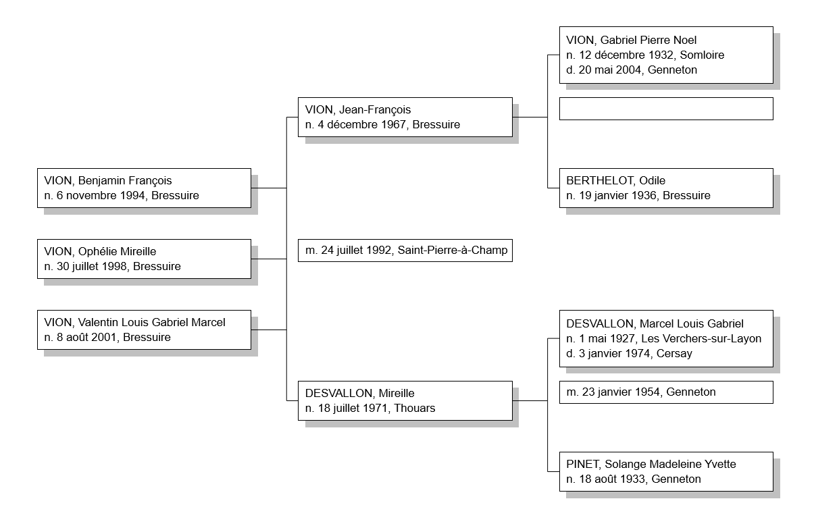
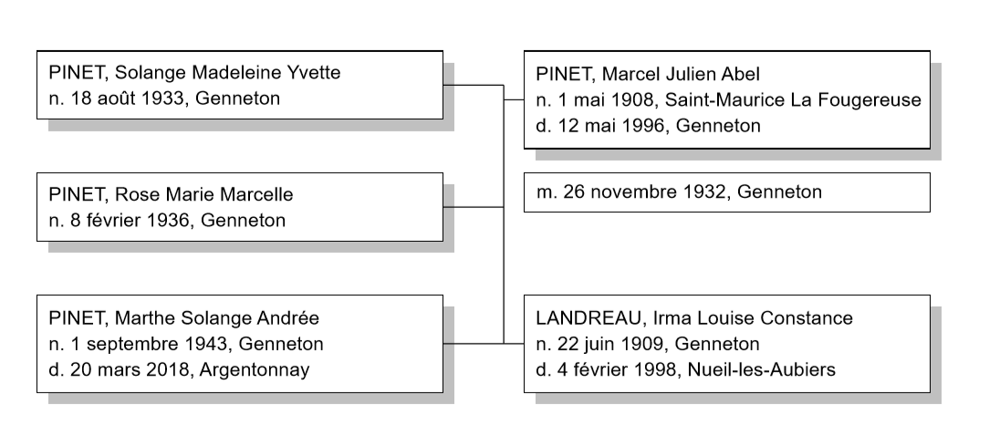
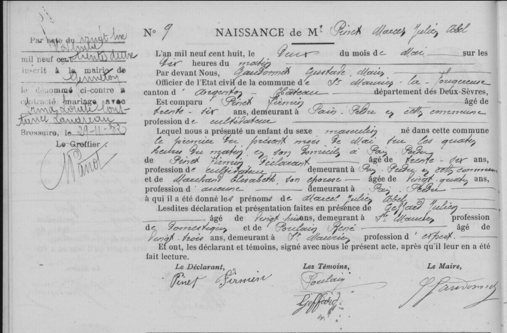
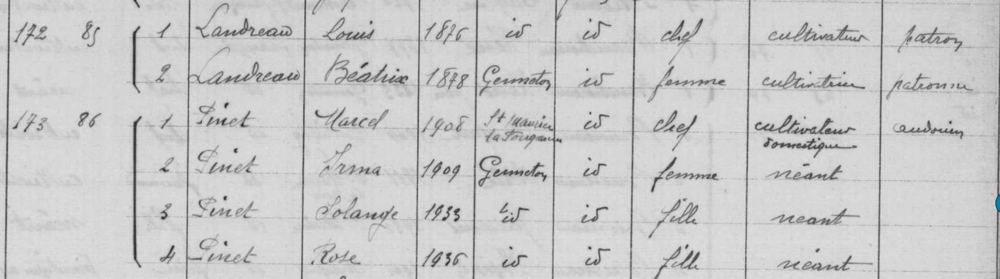
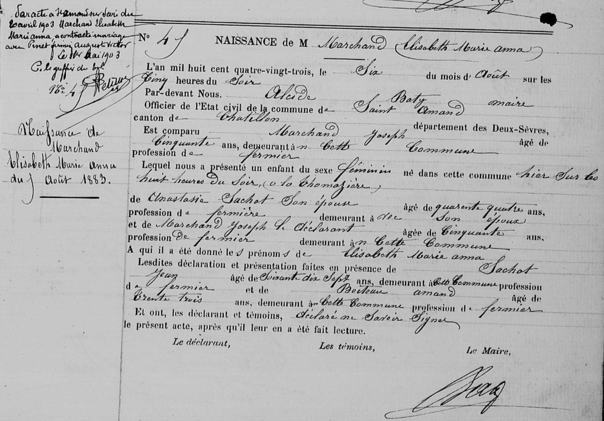

# Généalogie de la famille PINET

## par Benjamin François VION, 2020

---

# Préambule

Ce document vise à regrouper l'intégralité de mes recherches sur ma généalogie. Chaque individu en ligne directe a fait l'objet de recherches approfondies et a une section dédiée qui rassemble toutes les sources et toutes les informations que j'ai pu glaner au fil de mes recherches. On y retrouve essentiellement les extraits d'actes de naissance, mariage, décès pour les individus nés après 1795 et avant 1912 (ou 1902 selon le département de naissance).

Chaque famille possède sa section qui permet de connaître l'ensemble de la fratrie, les remariages, les héritages, etc.

Parfois j'ai des doutes sur certaines informations, auquel cas elles sont en *italique* dans le document.

<u>Lien Geneanet de l'arbre généalogique complet</u> : [Benjamin François VION : généalogie par Benjamin VION - Geneanet](https://gw.geneanet.org/kribouille_w?lang=fr&p=benjamin+francois&n=vion&oc=0)

# Table des matières

- [Souche de l'arbre](#souche)

- Grand-mère et arrières-grands-parents paternels
  
  - [PINET, Solange Madeleine Yvette](#pinet1)
  
  - [PINET, Marcel Julien Abel](#pinet2)
  
  - [LANDREAU, Irma Louise Constance](#pinet3)
  
  - [Mariage de Marcel PINET et de Irma LANDREAU](#pinetlandreau)

- Trisaïeuls paternels (les parents de l'arrière-grand père)
  
  - [PINET, Firmin Auguste Victor](#pinet4)
  
  - [MARCHAND, Elisabeth Marie Anna](#pinet5)
  
  - [Mariage de Firmin PINET et de Elisabeth MARCHAND](#pinetmarchand)

- Quadrisaïeuls paternels
  
  - [PINET, Firmin Auguste](#pinet6)
  
  - [MORISSET, Henriette](#pinet7)
  
  - [Mariage de Firmin PINET et de Henriette MORISSET](#pinetmorisset)

## Souche de l'arbre <a name="souche"/>

---

## PINET, Solange Madeleine Yvette <a name="pinet1"/>

## PINET, Marcel Julien Abel <a name="pinet2"/>

### Acte de naissance, Saint-Maurice-la-Fougereuse, 1 mai 1908

Source : https://archives-deux-sevres-vienne.fr/ark:/58825/vta274d7e76340f2606/daogrp/0/layout:table/idsearch:RECH_905400e4a4eb40822aef1e6e7ce7f28e?id=https%3A%2F%2Farchives-deux-sevres-vienne.fr%2Fark%3A%2F58825%2Fvta274d7e76340f2606%2Fcanvas%2F0%2F46&vx=1022.09&vy=-745.498&vr=0&vz=6.51676

#### Résumé

| Commune                     | Saint-Maurice-la-Fougereuse, canton d'Argenton-Château |
| --------------------------- | ------------------------------------------------------ |
| **Enfant**                  | Marcel Julien Abel PINET                               |
| **Naissance**               | 1 mai 1908 à 4h du matin                               |
| **Père, âge et profession** | Firmin PINET, 36 ans, cultivateur                      |
| **Mère, âge et profession** | Elisabeth MARCHAND, 24 ans                             |
| **Domicile**                | Pain-Perdu, Saint-Maurice-la-Fougereuse                |
| **Témoin 1**                | Julien GEFFARD, 28 ans, domestique à Saint-Maurice     |
| **Témoin 2**                | René POULAIN, 23 ans, expert à Saint-Maurice           |

## LANDREAU, Irma Louise Constance <a name="pinet3"/>

### Acte de naissance, Genneton, 22 juin 1909

Source : https://archives-deux-sevres-vienne.fr/ark:/58825/vta4ef4d66d053d3d11/daogrp/0/layout:table/idsearch:RECH_50aae37ffe3d2a57627ea884625a0cb5?id=https%3A%2F%2Farchives-deux-sevres-vienne.fr%2Fark%3A%2F58825%2Fvta4ef4d66d053d3d11%2Fcanvas%2F0%2F40&vx=2496.06&vy=-675.902&vr=0&vz=6.44987

#### Résumé

| Commune                     | Genneton, canton d'Argenton-Château                 |
| --------------------------- | --------------------------------------------------- |
| **Enfant**                  | Irma Louise Constance LANDREAU                      |
| **Naissance**               | 22 juin 1909 à 2h du matin                          |
| **Père, âge et profession** | Louis Constant LANDREAU, cultivateur, 33 ans        |
| **Mère, âge et profession** | Béatrice Geneviève BERSON, 30 ans, cultivatrice     |
| **Domicile**                | La Rablerie, Genneton                               |
| **Témoin 1**                | Louis GIRARD, 63 ans, cultivateur à Genneton        |
| **Témoin 2**                | Alexandre THOMAZEAU, 43 ans, cultivateur à Genneton |

## Mariage de Marcel PINET et de Irma LANDREAU <a name="pinetlandreau"/>

Source : https://archives-deux-sevres-vienne.fr/ark:/58825/vtac16f8b5f0a722b8e/daogrp/0/layout:table/idsearch:RECH_fd5d65c91a6ce5e14dfaa12b648c25d4?id=https%3A%2F%2Farchives-deux-sevres-vienne.fr%2Fark%3A%2F58825%2Fvtac16f8b5f0a722b8e%2Fcanvas%2F0%2F5&vx=1623.61&vy=-2000.61&vr=0&vz=6.40641

### Recensement à Genneton en 1936

Source : https://archives-deux-sevres-vienne.fr/ark:/58825/vtaf7328fd659295f47/daogrp/0/layout:table/idsearch:RECH_59d3ef610562310bb969437d3fa95fe7?id=https%3A%2F%2Farchives-deux-sevres-vienne.fr%2Fark%3A%2F58825%2Fvtaf7328fd659295f47%2Fcanvas%2F0%2F7&vx=1730.49&vy=-846.209&vr=0&vz=7.22263

Vivaient à la Rablerie Louis et Béatrice LANDREAU les parents d'Irma, et séparément Marcel, Irma, et leurs deux filles (Marthe va naître en 1943).

---

## PINET, Firmin Auguste Victor <a name="pinet4"/>

### Acte de naissance, Nueil-sous-les-Aubiers, 26 février 1872

Source : https://archives-deux-sevres-vienne.fr/ark:/58825/vtaceb00319d1f345b0/daogrp/0/layout:table/idsearch:RECH_05fd12d8fe0014d018466deab8a82026?id=https%3A%2F%2Farchives-deux-sevres-vienne.fr%2Fark%3A%2F58825%2Fvtaceb00319d1f345b0%2Fcanvas%2F0%2F261&vx=2731.77&vy=-939.701&vr=0&vz=5.9289

#### Résumé

| Commune                     | Nueil-sous-les-Aubiers, canton de Châtillon |
| --------------------------- | ------------------------------------------- |
| **Enfant**                  | Firmin Auguste Victor PINET                 |
| **Naissance**               | 26 février 1872 à *11*h00                   |
| **Père, âge et profession** | Firmin PINET, 31 ans, cultivateur           |
| **Mère, âge et profession** | Henriette MORISSET, 29 ans, sans profession |
| **Domicile**                | La Chagnelais, Nueil                        |
| **Témoin 1**                | Ferdinand LONGEOT, 42 ans                   |
| **Témoin 2**                | Léon TRANCHET, 22 ans                       |

### Second mariage avec Octavie CHARBONNIER

Mentionné sur son acte de naissance, un second mariage avec Octavie Delphine CHARBONNIER le 23 janvier 1939 à Mauzé-Thouarsais.

## MARCHAND, Elisabeth Marie Anna <a name="pinet5"/>

### Acte de naissance, Saint-Amand-sur-Sèvre, 5 août 1883

Source : https://archives-deux-sevres-vienne.fr/ark:/58825/vta21f8e28382ea98c9/daogrp/0/layout:table/idsearch:RECH_b0bd50ead5fec93462f2b1d7da665871?id=https%3A%2F%2Farchives-deux-sevres-vienne.fr%2Fark%3A%2F58825%2Fvta21f8e28382ea98c9%2Fcanvas%2F0%2F210&vx=2759.46&vy=-1882.1&vr=0&vz=6.23566

#### Résumé

| Commune                     | Saint-Amand-sur-Sèvre, canton de Châtillon |
| --------------------------- | ------------------------------------------ |
| **Enfant**                  | Elisabeth Marie Anna MARCHAND              |
| **Naissance**               | 5 août 1883 à 20h00                        |
| **Père, âge et profession** | Joseph MARCHAND, 50 ans, fermier           |
| **Mère, âge et profession** | Anastasia SACHOT, 44 ans, fermière         |
| **Domicile**                | La Thomazière, Saint-Amand-sur-Sèvre       |
| **Témoin 1**                | Jean SACHOT, 77 ans, fermier               |
| **Témoin 2**                | Amand *BOCTEAU*, 33 ans, fermier           |

## Mariage de Firmin PINET et de Elisabeth MARCHAND <a name="pinetmarchand"/>

Source : https://archives-deux-sevres-vienne.fr/ark:/58825/vta90b9a263e8bbac2d/daogrp/0/layout:table/idsearch:RECH_b0bd50ead5fec93462f2b1d7da665871?id=https%3A%2F%2Farchives-deux-sevres-vienne.fr%2Fark%3A%2F58825%2Fvta90b9a263e8bbac2d%2Fcanvas%2F0%2F5&vx=1100.43&vy=-1271.35&vr=0&vz=4.2852

Résumé

| Commune                                | Saint-Amand-sur-Sèvre, canton de Châtillon                                |
| -------------------------------------- | ------------------------------------------------------------------------- |
| **Mari**                               | Firmin Auguste Victor PINET, domicilié à Cersay, cultivateur              |
| **Femme**                              | Elisabeth Marie Anna MARCHAND, domiciliée à Saint-Amand , sans profession |
| **Mariage**                            | 20 avril 1903                                                             |
| **Père du marié**                      | Firmin PINET, décédé à Etusson le 11/10/1901                              |
| **Mère du marié**                      | Henriette MORISSET, 66 ans, cultivatrice, domiciliée à Etusson, présente  |
| **Père de la mariée**                  | Joseph MARCHAND, 69 ans, cultivateur à Saint-Amand, présent               |
| **Mère de la mariée**                  | Anastasia SACHOT, 64 ans, cultivatrice à Saint-Amand, présent             |
| **Domicile**                           | Non indiqué                                                               |
| **Témoin 1 : beau-frère du marié**     | Clément GUIBERT, 31 ans, cultivateur à Etusson                            |
| **Témoin 2 : frère du marié**          | Dominique PINET, 27 ans, cultivateur à Nueil                              |
| **Témoin 3 : beau-frère de la mariée** | Edouard BOISSINOT, 30 ans, cultivateur à Saint-Amand                      |
| **Témoin 4 : frère de la mariée**      | Pierre MARCHAND, 31 ans, cultivateur                                      |

## Recensement à Saint-Maurice-la-Fougereuse en 1906

Source : https://archives-deux-sevres-vienne.fr/ark:/58825/vta71d351f94778b397/daogrp/0/layout:table/idsearch:RECH_a43193c981295c7a897a910e90106fb8?id=https%3A%2F%2Farchives-deux-sevres-vienne.fr%2Fark%3A%2F58825%2Fvta71d351f94778b397%2Fcanvas%2F0%2F28&vx=1303.51&vy=-1756.42&vr=0&vz=6.02497

Arrivés depuis peu à Saint-Maurice (ils habitaient Argenton-l-Eglise), avec leurs deux premières filles Elisabeth et Marie. Ils avaient une domestique.

---

## PINET, Firmin Auguste <a name="pinet6"/>

## MORISSET, Henriette <a name="pinet7"/>

## Mariage de Firmin PINET et de Henriette MORISSET <a name="pinetmorisset"/>

