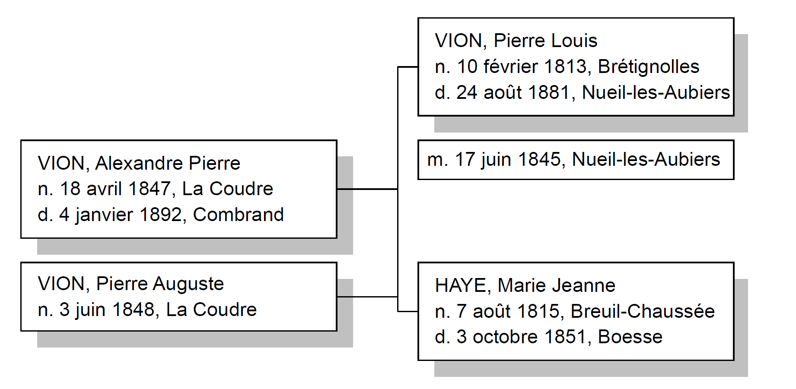

# Généalogie des familles

# VION - BERTHELOT

## et

# DESVALLON - PINET

## par Benjamin François VION, 2020

---

# Préambule

Ce document vise à regrouper l'intégralité de mes recherches sur ma généalogie. Chaque individu en ligne directe a fait l'objet de recherches approfondies et a une section dédiée qui rassemble toutes les sources et toutes les informations que j'ai pu glaner au fil de mes recherches. On y retrouve essentiellement les extraits d'actes de naissance, mariage, décès pour les individus nés après 1795 et avant 1912 (ou 1902 selon le département de naissance). 

Chaque famille possède sa section qui permet de connaître l'ensemble de la fratrie, les remariages, etc. 

Parfois j'ai des doutes sur certaines informations, auquel cas elles sont en *italique* dans le document.

---

# Table des matières

- [Souche de l'arbre](#souche)

- [Famille VION](#vion)
  
  - [VION, Gabriel Pierre Noël](#vion1)
  
  - [VION, Gabriel Joseph Alexandre](#vion2)
  
  - [MERCERON, Marie Gabrielle Eugénie Euphrosine](#vion3)
  
  - [Mariage de Gabriel VION et de Marie MERCERON](#vionmerceron)
  
  - [VION, Pierre Alexandre](#vion4)
  
  - [BRÉBION, Adélina Hortense Eugénie](#vion5)
  
  - [Mariage de Pierre VION et de Adélina BRÉBION](#vionbrebion)
  
  - [VION, Alexandre Pierre ](#vion6)
  
  - [HÉRAULT, Philomène Florine](#vion7)
  
  - [Mariage de Alexandre VION et de Philomène HÉRAULT](#vionherault)

# Souche de l'arbre 

---

# Famille VION 

## VION, Gabriel Pierre Noël 

### Avis de décès

Source : https://www.dansnoscoeurs.fr/gabriel-vion/332710

## VION, Gabriel Joseph Alexandre 

### Acte de naissance, Les Aubiers, 2 mai 1907

Source : [https://archives-deux-sevres-vienne.fr/ark:/58825/vta1b21ea1028e6d66d/daogrp/0/layout:table/idsearch:RECH_82000e6461037f5748515e017cb8b754#id:1253007678?gallery=true&brightness=100.00&contrast=100.00¢er=2233.746,-1647.913&zoom=10&rotation=0.000](https://archives-deux-sevres-vienne.fr/ark:/58825/vta1b21ea1028e6d66d/daogrp/0/layout:table/idsearch:RECH_82000e6461037f5748515e017cb8b754#id:1253007678?gallery=true&brightness=100.00&contrast=100.00&center=2233.746,-1647.913&zoom=10&rotation=0.000)

#### Résumé

| Commune                     | Les Aubiers,  canton de Châtillon sur Sèvre                                      |
| --------------------------- | -------------------------------------------------------------------------------- |
| __Enfant__                  | Gabriel Joseph Alexandre VION                                                    |
| __Naissance__               | 2 mai 1907 à 09h00 du matin                                                      |
| __Père, âge et profession__ | Pierre Alexandre VION, 30 ans, cultivateur                                       |
| __Mère, âge et profession__ | Adélina Hortense Eugénie BRÉBION, 24 ans, sans profession                        |
| __Domicile__                | La Brossardière, Les Aubiers (lieu-dit entre la route des Aubiers et Maulévrier) |
| __Témoin 1__                | Georges PELTIER, 40 ans, peintre aux Aubiers                                     |
| __Témoin 2__                | Édouard MAINCHAIN, 56 ans, peintre aux Aubiers                                   |

#### Annotation de mariage

Le 4 janvier 1932, à la mairie de Saint-Maurice La Fougereuse avec Marie Gabrielle Eugénie MERCERON

#### Annotation de décès

Le 16 mars 1967 à Genneton

### Succession

Source : [https://archives-deux-sevres-vienne.fr/ark:/58825/vta156cbad4a8c6111a/daogrp/0#id:1993337333?gallery=true¢er=3114.000,-978.000&zoom=7&rotation=0.000&brightness=100.00&contrast=100.00](https://archives-deux-sevres-vienne.fr/ark:/58825/vta156cbad4a8c6111a/daogrp/0#id:1993337333?gallery=true&center=3114.000,-978.000&zoom=7&rotation=0.000&brightness=100.00&contrast=100.00)

## MERCERON, Marie Gabrielle Eugénie Euphrosine <a name="vion3"/>

### Acte de naissance, Breuil-Chaussée, 5 février 1912

Source : [https://archives-deux-sevres-vienne.fr/ark:/58825/vtaa86932b1bc7738a2/daogrp/0/layout:table/idsearch:RECH_fad56a0db115df3938e14f91b895896e#id:940689247?gallery=true&brightness=100.00&contrast=100.00¢er=684.052,-698.321&zoom=11&rotation=0.000](https://archives-deux-sevres-vienne.fr/ark:/58825/vtaa86932b1bc7738a2/daogrp/0/layout:table/idsearch:RECH_fad56a0db115df3938e14f91b895896e#id:940689247?gallery=true&brightness=100.00&contrast=100.00&center=684.052,-698.321&zoom=11&rotation=0.000)

#### Résumé

| Commune                     | Breuil-Chaussée, canton de Bressuire             |
| --------------------------- | ------------------------------------------------ |
| **Enfant**                  | Marie Gabrielle Eugénie Euphrosine MERCERON      |
| **Naissance**               | 5 février 1912 à 00h30 du matin                  |
| **Père, âge et profession** | Henri Ferdinand Joseph MERCERON, 39 ans, fermier |
| **Mère, âge et profession** | Eugénie Adèle DAVID, 34 ans, fermière            |
| **Domicile**                | La Touche de Breuil-Chaussée                     |
| **Témoin 1**                | Delphin BONNIN, 40 ans, fermier                  |
| **Témoin 2**                | Pierre GARNIER, 45 ans, instituteur public       |

#### Annotation de mariage

Le 4 janvier 1932, à la mairie de Saint-Maurice La Fougereuse avec Gabriel Joseph Alexandre VION

#### Annotation de décès

Le 26 juin 1985 à Galtür en AUTRICHE

## Mariage de Gabriel VION et de Marie MERCERON <a name="vionmerceron"/>

Extrait de la table décennale des Naissances, Mariages, Décès de Saint-Maurice La Fougereuse (1923 - 1932)

Source : [https://archives-deux-sevres-vienne.fr/ark:/58825/vta57bc665cfbd2d8af/daogrp/0/layout:table/idsearch:RECH_d1d26f4fd837ea9f3cf1037df5d75d51#id:1111042363?gallery=true&brightness=100.00&contrast=100.00¢er=2537.500,-1871.500&zoom=8&rotation=0.000](https://archives-deux-sevres-vienne.fr/ark:/58825/vta57bc665cfbd2d8af/daogrp/0/layout:table/idsearch:RECH_d1d26f4fd837ea9f3cf1037df5d75d51#id:1111042363?gallery=true&brightness=100.00&contrast=100.00&center=2537.500,-1871.500&zoom=8&rotation=0.000)

---

## VION, Pierre Alexandre <a name="vion4"/>

### Acte de naissance, Le Pin, 2 février 1877

Source : [https://archives-deux-sevres-vienne.fr/ark:/58825/vta1e5ca6803dd75d52/daogrp/0/layout:table/idsearch:RECH_38dd6aa59fa5fc78d477da139ccb6588#id:328741911?gallery=true&brightness=100.00&contrast=100.00¢er=2824.238,-677.191&zoom=11&rotation=0.000](https://archives-deux-sevres-vienne.fr/ark:/58825/vta1e5ca6803dd75d52/daogrp/0/layout:table/idsearch:RECH_38dd6aa59fa5fc78d477da139ccb6588#id:328741911?gallery=true&brightness=100.00&contrast=100.00&center=2824.238,-677.191&zoom=11&rotation=0.000)

#### Résumé

| Commune                     | Le Pin, canton de Cerizay                                 |
| --------------------------- | --------------------------------------------------------- |
| **Enfant**                  | Pierre Alexandre VION                                     |
| **Naissance**               | 2 février 1877 à 18h00                                    |
| **Père, âge et profession** | Alexandre VION, 30 ans, cultivateur                       |
| **Mère, âge et profession** | Philomène HÉRAULT, 27 ans, sans profession                |
| **Domicile**                | Galard, Le Pin (lieu-dit à 7 minutes au Nord de la ville) |
| **Témoin 1**                | Marie HÉRAULT, 50 ans, charpentier au Pin                 |
| **Témoin 2**                | Auguste HÉRAULT, 36 ans, journalier au Pin                |

#### Annotation de mariage

Le 7 novembre 1905, à la mairie du Pin avec Adélina BRÉBION

#### Service militaire

[Source](https://archinoe.com/cg79/visualiseur/visu_matricule.php?id=790020658&PHPSID=f76d879e544bc8542fd4fa0113ac76baw=2560&h=1440)

[Archives d&eacute;partementales des Deux-S&egrave;vres](https://archinoe.com/cg79/matricule_liste.php?PHPSID=f76d879e544bc8542fd4fa0113ac76ba&page=1)

**Fiche matriculaire 2194 créée le 10 janvier 1923**

Pierre Alexandre VION, domestique

Né le 2 février 1877 au Pin, de feu Alexandre VION et de feu HERAULT Philomène

N° 30 de tirage dans le canton de Cerizay

Cheveux et sourcils châtains clairs, yeux bleus, front large, menton pointu

1m61

Ainé de 7 enfants

Incorporé le 14 novembre 1899 au 144e régiment d'infanterie, matricule 1002, 2ème classe

Passé dans l'armée territoriale le 1/10/1911

Campagne contre l'Allemagne du 06 août 1914 au 31 janvier 1919

**évacué blessé le 12/09/1916 à Cléry (par balle à l'épaule droite), évacué malade le 10/06/1917 sur ambulance**

Libéré du service militaire le 10 novembre 1926 (il avait 49 ans)

## BRÉBION, Adélina Hortense Eugénie <a name="vion5"/>

### Acte de naissance, Noirterre, 11 décembre 1882

Source : [https://archives-deux-sevres-vienne.fr/ark:/58825/vtaf8c3d541b5b95cd5/daogrp/0/layout:table/idsearch:RECH_d71fc3aecd8b831d13ce0e76ef26bfe8#id:1188917110?gallery=true&brightness=100.00&contrast=100.00¢er=2995.493,-1887.348&zoom=10&rotation=0.000](https://archives-deux-sevres-vienne.fr/ark:/58825/vtaf8c3d541b5b95cd5/daogrp/0/layout:table/idsearch:RECH_d71fc3aecd8b831d13ce0e76ef26bfe8#id:1188917110?gallery=true&brightness=100.00&contrast=100.00&center=2995.493,-1887.348&zoom=10&rotation=0.000)

#### Résumé

| Commune                     | Noirterre, canton de Bressuire                              |
| --------------------------- | ----------------------------------------------------------- |
| **Enfant**                  | Adélina Hortense Eugénie BRÉBION                            |
| **Naissance**               | 11 décembre 1882 à 06h00 du matin                           |
| **Père, âge et profession** | Auguste Camille BRÉBION, 28 ans, cultivateur                |
| **Mère, âge et profession** | Hortense Eugénie PARAUD, 24 ans, sans profession            |
| **Domicile**                | La Pirandrie, Noirterre (lieu-dit au Nord-Est de Bressuire) |
| **Témoin 1**                | *BOUTET* , 36 ans, Noirterre                                |
| **Témoin 2**                | Jacques, 51 ans,  Noirterre                                 |

#### Annotation de mariage

Le 7 novembre 1905, à la mairie du Pin avec Pierre VION

### Succession

Source : [https://archives-deux-sevres-vienne.fr/ark:/58825/vta5e3ee4bab3026dc9/daogrp/0#id:1933553261?gallery=true¢er=2795.680,-2725.776&zoom=8&rotation=0.000&brightness=100.00&contrast=100.00](https://archives-deux-sevres-vienne.fr/ark:/58825/vta5e3ee4bab3026dc9/daogrp/0#id:1933553261?gallery=true&center=2795.680,-2725.776&zoom=8&rotation=0.000&brightness=100.00&contrast=100.00)

## Mariage de Pierre VION et de Adélina BRÉBION <a name="vionbrebion"/>

Source : [https://archives-deux-sevres-vienne.fr/ark:/58825/vta03f2d1e6f4f4b20b/daogrp/0/layout:table/idsearch:RECH_38dd6aa59fa5fc78d477da139ccb6588#id:2104479950?gallery=true&brightness=100.00&contrast=100.00¢er=997.958,-1261.430&zoom=8&rotation=0.000](https://archives-deux-sevres-vienne.fr/ark:/58825/vta03f2d1e6f4f4b20b/daogrp/0/layout:table/idsearch:RECH_38dd6aa59fa5fc78d477da139ccb6588#id:2104479950?gallery=true&brightness=100.00&contrast=100.00&center=997.958,-1261.430&zoom=8&rotation=0.000)

### Résumé

| Commune                           | Le Pin, canton de Cerizay                                                                                        |
| --------------------------------- | ---------------------------------------------------------------------------------------------------------------- |
| **Mari**                          | Pierre Alexandre VION, 28 ans, né au Pin le 2 février 1877, demeurant à Nueil-les-Aubiers                        |
| __Femme__                         | Adélina Hortense Eugénie BRÉBION, 22 ans, née à Noirterre le 11 décembre 1882, sans profession, demeurant au Pin |
| **Mariage**                       | 7 novembre 1905 à 09h00 du matin                                                                                 |
| **Père du marié**                 | Alexandre VION, décédé                                                                                           |
| **Mère du marié**                 | Philomène HÉRAULT, décédée au Pin                                                                                |
| __Père de la mariée__             | Auguste BRÉBION, décédé                                                                                          |
| __Mère de la mariée__             | Eugénie Hortense PARAUD, décédée au Pin                                                                          |
| **Domicile**                      | La Pirandrie, Noirterre (lieu-dit au Nord-Est de Bressuire)                                                      |
| **Témoin 1 : frère du marié**     | Pierre VION, 26 ans, cultivateur aux Aubiers                                                                     |
| **Témoin 2 : cousin du marié**    | Auguste VION, 28 ans, cultivateur au Pin                                                                         |
| __Témoin 3 : ami de la mariée__   | Louis CHAUVET, 54 ans, cultivateur au Pin                                                                        |
| __Témoin 4 : oncle de la mariée__ | Alexis *PERRAULT*, 59 ans,  cultivateur à Nueil les Aubiers                                                      |

### Recensement

Ils vivaient tous les deux en 1906 chez la famille du frère de Pierre (qui s'appelait aussi Pierre)

Source : [https://archives-deux-sevres-vienne.fr/ark:/58825/vtad3843cd9a4ffc3ea/daogrp/0#id:677790955?gallery=true¢er=1405.000,-2467.000&zoom=11&rotation=0.000&brightness=100.00&contrast=100.00](https://archives-deux-sevres-vienne.fr/ark:/58825/vtad3843cd9a4ffc3ea/daogrp/0#id:677790955?gallery=true&center=1405.000,-2467.000&zoom=11&rotation=0.000&brightness=100.00&contrast=100.00)

---

## VION, Alexandre Pierre <a name="vion6" />

### Acte de naissance, La Coudre, 18 avril 1847

Source : [https://archives-deux-sevres-vienne.fr/ark:/58825/vta9d5327f8a243a368/daogrp/0/layout:table/idsearch:RECH_f9df069e235ccfcde6359174366ba5a7#id:535052998?gallery=true&brightness=100.00&contrast=100.00¢er=2396.401,-1914.266&zoom=12&rotation=0.000](https://archives-deux-sevres-vienne.fr/ark:/58825/vta9d5327f8a243a368/daogrp/0/layout:table/idsearch:RECH_f9df069e235ccfcde6359174366ba5a7#id:535052998?gallery=true&brightness=100.00&contrast=100.00&center=2396.401,-1914.266&zoom=12&rotation=0.000)

#### Résumé

| Commune                     | La Coudre, canton de Argenton-le-Château                                                            |
| --------------------------- | --------------------------------------------------------------------------------------------------- |
| **Enfant**                  | Pierre Alexandre VION (**mais il se faisait appeler Alexandre**)                                    |
| **Naissance**               | 18 avril 1847 à 04h00 du matin                                                                      |
| **Père, âge et profession** | Pierre VION, 33 ans, cultivateur                                                                    |
| **Mère, âge et profession** | Marie-Jeanne HAYE (Marie Charri sur l'acte, rectifié par la suite à Bressuire), cultivateur, 32 ans |
| **Domicile**                | La Coudre                                                                                           |
| **Témoin 1**                | Pierre Vion 68 ans, cultivateur, grand-père de l'enfant                                             |
| **Témoin 2**                | Pierre *GRAVELOT*, 58 ans, cultivateur                                                              |

### Acte de décès, Combrand, 04 janvier 1892

Source : [https://archives-deux-sevres-vienne.fr/ark:/58825/vta9949bf08ff2ef02c/daogrp/0/layout:table/idsearch:RECH_4c0fcec1a3e5ebbf674360db1ff654a4#id:83859069?gallery=true&brightness=100.00&contrast=100.00¢er=3073.358,-1855.405&zoom=12&rotation=0.000](https://archives-deux-sevres-vienne.fr/ark:/58825/vta9949bf08ff2ef02c/daogrp/0/layout:table/idsearch:RECH_4c0fcec1a3e5ebbf674360db1ff654a4#id:83859069?gallery=true&brightness=100.00&contrast=100.00&center=3073.358,-1855.405&zoom=12&rotation=0.000)

#### Résumé

| Commune                   | Combrand, canton de Cerizay                                   |
| ------------------------- | ------------------------------------------------------------- |
| **Décédé**                | VION Alexandre, 46 ans                                        |
| **le**                    | 04 janvier 1892 à 16h00                                       |
| **Père**                  | Pierre VION                                                   |
| **Mère**                  | HAYE Marie-Jeanne (erreur sur l'acte)                         |
| **Domicile**              | Ligonière, Combrand                                           |
| **Témoin 1 et déclarant** | VION Auguste, frère, 44 ans, cultivateur au Pin               |
| **Témoin 2**              | MAROLLEAU Auguste, 31 ans, cultivateur à Combrand, beau-frère |

### Second mariage à Combrand, 29 avril 1884

Source : [https://archives-deux-sevres-vienne.fr/ark:/58825/vta1d14e756a3ce1e86/daogrp/0/layout:table/idsearch:RECH_4c0fcec1a3e5ebbf674360db1ff654a4#id:508798388?gallery=true&brightness=100.00&contrast=100.00¢er=1779.938,-1377.973&zoom=9&rotation=0.000](https://archives-deux-sevres-vienne.fr/ark:/58825/vta1d14e756a3ce1e86/daogrp/0/layout:table/idsearch:RECH_4c0fcec1a3e5ebbf674360db1ff654a4#id:508798388?gallery=true&brightness=100.00&contrast=100.00&center=1779.938,-1377.973&zoom=9&rotation=0.000)

### Résumé

| Commune                            | Combrand, canton de Cerizay                                                                                                                |
| ---------------------------------- | ------------------------------------------------------------------------------------------------------------------------------------------ |
| **Mari**                           | Pierre Alexandre VION, 37 ans, né à la Coudre le 18 avril 1847, cultivateur demeurant au Pin, veuf en premières noces de Philomène HERAULT |
| **Femme**                          | Elisa Victorine MAROLLEAU, 29 ans, née à Noirterre le 7 octobre 1854, sans profession, demeurant à Combrand                                |
| **Mariage**                        | 7 novembre 1905 à 09h00 du matin                                                                                                           |
| **Père du marié**                  | Pierre VION, décédé à Nueil-les-Aubiers le 24 août 1881                                                                                    |
| **Mère du marié**                  | Marie-Jeanne HAYE, décédée à Boësse le 3 octobre 1851                                                                                      |
| **Père de la mariée**              | Pierre MAROLLEAU, cultivateur de 68 ans à Combrand                                                                                         |
| **Mère de la mariée**              | Euphrosine GOTREAU, 58 ans à Combrand                                                                                                      |
| **Domicile**                       | N/A                                                                                                                                        |
| **Témoin 1 : frère du marié**      | Auguste VION, 35 ans, cultivateur à Rorthais                                                                                               |
| **Témoin 2 : beau-frère du marié** | Elie COUTANT, 35 ans, cultivateur à Nueil                                                                                                  |
| **Témoin 3 : frère de la mariée**  | Pierre MAROLLEAU, 33 ans, cultivateur à Terves                                                                                             |
| **Témoin 4 : frère de la mariée**  | Auguste MAROLLEAU, 27 ans, cultivateur à Terves                                                                                            |

## HÉRAULT, Philomène Florine <a name="vion7"/>

### Acte de naissance, Rorthais, 30 juillet 1849

Source : [https://archives-deux-sevres-vienne.fr/ark:/58825/vtaccdb9e5f05e5e6a8/daogrp/0/layout:table/idsearch:RECH_946f6355f321b2d5f307e55c81fc5b1d#id:236787456?gallery=true&brightness=100.00&contrast=100.00¢er=3027.019,-646.757&zoom=11&rotation=0.000](https://archives-deux-sevres-vienne.fr/ark:/58825/vtaccdb9e5f05e5e6a8/daogrp/0/layout:table/idsearch:RECH_946f6355f321b2d5f307e55c81fc5b1d#id:236787456?gallery=true&brightness=100.00&contrast=100.00&center=3027.019,-646.757&zoom=11&rotation=0.000)

#### Résumé

| Commune                     | Rorthais, canton de Châtillon    |
| --------------------------- | -------------------------------- |
| **Enfant**                  | Philomène Florine HÉRAULT        |
| **Naissance**               | 30 juillet 1849 à 08h00 du matin |
| **Père, âge et profession** | Pierre Antoine HÉRAULT, 36 ans   |
| **Mère, âge et profession** | Celeste MANCEAU                  |
| **Domicile**                | La Basse Trappe, Rorthais        |
| **Témoin 1**                | Antoine HÉRAULT, 63 ans          |
| **Témoin 2**                | Baptiste MANCEAU, 27 ans         |

### Acte de décès, Le Pin, 9 janvier 1880

Source : [https://archives-deux-sevres-vienne.fr/ark:/58825/vtadbe01efe1f23abc2/daogrp/0/layout:table/idsearch:RECH_38dd6aa59fa5fc78d477da139ccb6588#id:1956779825?gallery=true&brightness=100.00&contrast=100.00¢er=1398.633,-693.923&zoom=11&rotation=0.000](https://archives-deux-sevres-vienne.fr/ark:/58825/vtadbe01efe1f23abc2/daogrp/0/layout:table/idsearch:RECH_38dd6aa59fa5fc78d477da139ccb6588#id:1956779825?gallery=true&brightness=100.00&contrast=100.00&center=1398.633,-693.923&zoom=11&rotation=0.000)

#### Résumé

| Commune                   | Le Pin, canton de Cerizay                                                                                                                                                      |
| ------------------------- | ------------------------------------------------------------------------------------------------------------------------------------------------------------------------------ |
| **Décédée**               | Philomène Florine HÉRAULT, 30 ans (ils disent 32 sur l'acte c'est une erreur. Ils disent aussi qu'elle est née à ST Pierre des Echaubrognes mais elle est bien née à Rorthais) |
| **le**                    | 09 janvier 1880 à 23h00 du soir                                                                                                                                                |
| **Père**                  | Pierre HÉRAULT                                                                                                                                                                 |
| **Mère**                  | Celeste MANCEAU                                                                                                                                                                |
| **Domicile**              | Galard, Le Pin (lieu-dit à 7 minutes au Nord de la ville)                                                                                                                      |
| **Témoin 1 et déclarant** | VION Alexandre, époux, 32 ans                                                                                                                                                  |
| **Témoin 2**              | HÉRAULT Antoine, son frère de 45 ans                                                                                                                                           |

## Mariage de Alexandre VION et de Philomène HÉRAULT <a name="vionherault"/>

Source : [https://archives-deux-sevres-vienne.fr/ark:/58825/vta17416c30b8588002/daogrp/0/layout:table/idsearch:RECH_333c0f504637b9034e708644fad3f5d6#id:168751679?gallery=true&brightness=100.00&contrast=100.00¢er=1691.138,-1221.279&zoom=9&rotation=0.000](https://archives-deux-sevres-vienne.fr/ark:/58825/vta17416c30b8588002/daogrp/0/layout:table/idsearch:RECH_333c0f504637b9034e708644fad3f5d6#id:168751679?gallery=true&brightness=100.00&contrast=100.00&center=1691.138,-1221.279&zoom=9&rotation=0.000)

### Résumé

| Commune                           | Rorthais, canton de Châtillon                                                                                                |
| --------------------------------- | ---------------------------------------------------------------------------------------------------------------------------- |
| **Mari**                          | Pierre Alexandre VION, 27 ans, né à la Coudre le 18 avril 1847, cultivateur demeurant à Nueil                                |
| **Femme**                         | Philomène Florine HERAULT, 24 ans née à Rorthais le 30 juillet 1849, sans profession, demeurant à la Basse Trappe à Rorthais |
| **Mariage**                       | 16 juin 1874 à 8h00 du matin                                                                                                 |
| **Père du marié**                 | Pierre VION, 60 ans, cultivateur à Nueil                                                                                     |
| **Mère du marié**                 | Marie-Jeanne HAYE, décédée à Boësse le 3 octobre 1851                                                                        |
| **Père de la mariée**             | Pierre HERAULT, cultivateur de 60 ans à Rorthais                                                                             |
| **Mère de la mariée**             | Celeste MANCEAU, cultivateur à Rorthais                                                                                      |
| **Domicile**                      | N/A                                                                                                                          |
| **Témoin 1 : oncle du marié**     | Pierre BAUDIN, 52 ans, cultivateur à Combrand                                                                                |
| **Témoin 2 : frère du marié**     | Auguste VION, 26 ans, cultivateur à Rorthais                                                                                 |
| **Témoin 3 : oncle de la mariée** | Joseph ROI, 48 ans, cultivateur au Pin                                                                                       |
| **Témoin 4 : oncle de la mariée** | Antoine HERAULT, 34 ans, cultivateur au Pin                                                                                  |

---

## Préambule

Je n'ai trouvé aucune preuve de mariage entre Pierre Louis VION et Marie Jeanne HAYE.  Mais Marie HAYE s'est bien mariée à Pierre Henri VION, le petit frère de Pierre Louis. Et c'est bien Pierre Louis et Marie HAYE les parents d'Alexandre et d'Auguste. Donc quand Pierre Louis se remarie avec Celeste PERIDY en 1853 (2 ans après la mort de sa prétendue femme), et qu'il est dit qu'il est veuf en premières noces, bah j'ai des doutes ...

## VION, Pierre Louis <a name="vion8"/>

### Acte de naissance, Brétignolles, 10 février 1813

Source : [https://archives-deux-sevres-vienne.fr/ark:/58825/vta81aa9c192a625b6c/daogrp/0/layout:table/idsearch:RECH_e19763a27cc693b1c31268ba86d62704#id:194212694?gallery=true&brightness=100.00&contrast=100.00¢er=2595.171,-1864.932&zoom=11&rotation=0.000](https://archives-deux-sevres-vienne.fr/ark:/58825/vta81aa9c192a625b6c/daogrp/0/layout:table/idsearch:RECH_e19763a27cc693b1c31268ba86d62704#id:194212694?gallery=true&brightness=100.00&contrast=100.00&center=2595.171,-1864.932&zoom=11&rotation=0.000)

#### Résumé

| Commune                     | Brétignolles, canton de Cerizay              |
| --------------------------- | -------------------------------------------- |
| **Enfant**                  | Pierre Louis VION                            |
| **Naissance**               | 10 février 1813 à 04h00 du matin             |
| **Père, âge et profession** | Pierre Vion, <mark>bordier </mark> de 33 ans |
| **Mère, âge et profession** | Marie MOREAU                                 |
| **Domicile**                | Non indiqué (mais probablement Brétignolles) |
| **Témoin 1**                | _Pierre HÉRAULT_, bordier                    |
| **Témoin 2**                | Louis, oncle de l'enfant, bordier            |

<mark>bordier</mark> : Exploitant (et souvent 
habitant) un bourdou c'est-à-dire une grange. Ce terme désigne parfois 
un métayer (la grange désignant aussi le pré qui l'entoure), mais le 
plus souvent un fils non encore émancipé et exploitant une partie des 
terres de son père.

### Acte de décès, Nueil-les-Aubiers, 24 août 1881

Source : [https://archives-deux-sevres-vienne.fr/ark:/58825/vta0a935bc3b471bb0b/daogrp/0/layout:table/idsearch:RECH_82000e6461037f5748515e017cb8b754#id:186568532?gallery=true&brightness=100.00&contrast=100.00¢er=2697.034,-1935.750&zoom=10&rotation=0.000](https://archives-deux-sevres-vienne.fr/ark:/58825/vta0a935bc3b471bb0b/daogrp/0/layout:table/idsearch:RECH_82000e6461037f5748515e017cb8b754#id:186568532?gallery=true&brightness=100.00&contrast=100.00&center=2697.034,-1935.750&zoom=10&rotation=0.000)

#### Résumé

| Commune                   | Nueil-sous-les-Aubiers, canton de Chatillon-sur-Sèvre                                                                                                              |
| ------------------------- | ------------------------------------------------------------------------------------------------------------------------------------------------------------------ |
| **Décédé**                | Pierre VION, cultivateur, 68 ans. Marié à PERIDY Celeste                                                                                                           |
| **le**                    | 24 août 1881 à 07h00 du matin                                                                                                                                      |
| **Père**                  | Pierre VION, décédé à Nueil                                                                                                                                        |
| **Mère**                  | Marie BOISSINOT (elle est née MOREAU, je sais pas si c'est une erreur ou si elle s'était remariée... improbable car son mari est décédé bien après elle), décédée. |
| **Domicile**              | L'Antaizière, Nueil-sous-les-Aubiers (proche de Mauléon)                                                                                                           |
| **Témoin 1 et déclarant** | VION Alexandre, son fils de 34 ans cultivateur à Galard au Pin                                                                                                     |
| **Témoin 2**              | FUSEAU Victor, son gendre de 30 ans, cultivateur à Rorthais                                                                                                        |

### Second mariage à Rorthais, 22 novembre 1853

Source : [https://archives-deux-sevres-vienne.fr/ark:/58825/vta07975308ebf35f86/daogrp/0/layout:table/idsearch:RECH_333c0f504637b9034e708644fad3f5d6#id:2087173765?gallery=true&brightness=100.00&contrast=100.00¢er=2159.605,-1070.120&zoom=12&rotation=0.000](https://archives-deux-sevres-vienne.fr/ark:/58825/vta07975308ebf35f86/daogrp/0/layout:table/idsearch:RECH_333c0f504637b9034e708644fad3f5d6#id:2087173765?gallery=true&brightness=100.00&contrast=100.00&center=2159.605,-1070.120&zoom=12&rotation=0.000)

### Résumé

| Commune                                | Rorthais, canton de Châtillon                                                        |
| -------------------------------------- | ------------------------------------------------------------------------------------ |
| **Mari**                               | Pierre Louis VION, 40 ans, demeurant à Boësse, veuf en premières noces de Marie HAYE |
| **Femme**                              | Celeste PERIDY, sans profession, 30 ans                                              |
| **Mariage**                            | 22 novembre 1853                                                                     |
| **Père du marié**                      | Pierre VION, présent                                                                 |
| **Mère du marié**                      | Marie MOREAU, décédée                                                                |
| **Père de la mariée**                  | François PERIDY, décédé                                                              |
| **Mère de la mariée**                  | Renée GUIET, présente                                                                |
| **Domicile**                           | N/A                                                                                  |
| **Témoin 1 : ami du marié**            | Pierre Marie PERIDY, cultivateur de Saint-Aubin de Baubigné, 40 ans                  |
| **Témoin 2 ami  du marié**             | François PERIDY, cultivateur de Saint-Aubin de Baubigné, 32 ans                      |
| **Témoin 3 : frère de la mariée**      | Alexis PERIDY, cultivateur de Saint-Aubin de Baubigné, 30 ans                        |
| **Témoin 4 : beau-frère de la mariée** | Boris _JANVIER_, maréchal à Saint-Aubin de Baubigné, 26 ans                          |

## HAYE, Marie Jeanne <a name="vion9"/>

### Acte de naissance, Breuil-Chaussée, 7 août 1815

Source : [https://archives-deux-sevres-vienne.fr/ark:/58825/vta2edfc844fea6bf59/daogrp/0/layout:table/idsearch:RECH_fad56a0db115df3938e14f91b895896e#id:1282733887?gallery=true&brightness=100.00&contrast=100.00¢er=2734.514,-1043.561&zoom=9&rotation=0.000](https://archives-deux-sevres-vienne.fr/ark:/58825/vta2edfc844fea6bf59/daogrp/0/layout:table/idsearch:RECH_fad56a0db115df3938e14f91b895896e#id:1282733887?gallery=true&brightness=100.00&contrast=100.00&center=2734.514,-1043.561&zoom=9&rotation=0.000)

#### Résumé

| Commune                     | Breuil-Chaussée, canton de Bressuire                        |
| --------------------------- | ----------------------------------------------------------- |
| **Enfant**                  | Marie Jeanne HAYE                                           |
| **Naissance**               | 07 août 1815 à 5h00 du matin                                |
| **Père, âge et profession** | Jean HAYE, métayer                                          |
| **Mère, âge et profession** | Jeanne THIBAUDEAU                                           |
| **Domicile**                | Breuil-Chaussée                                             |
| **Témoin 1**                | Louis THIBAUDEAU, grand-père de l'enfant, métayer de 60 ans |
| **Témoin 2**                | Pierre THIBAUDEAU, oncle de l'enfant, métayer de 33 ans     |

### Acte de décès, Boësse, 3 octobre 1851

Source : [https://archives-deux-sevres-vienne.fr/ark:/58825/vtae9bf5651e49ffdda/daogrp/0/layout:table/idsearch:RECH_c40043737f5517e9095eb4c4cc81709c#id:94438502?gallery=true&brightness=100.00&contrast=100.00¢er=984.637,-2044.405&zoom=10&rotation=0.000](https://archives-deux-sevres-vienne.fr/ark:/58825/vtae9bf5651e49ffdda/daogrp/0/layout:table/idsearch:RECH_c40043737f5517e9095eb4c4cc81709c#id:94438502?gallery=true&brightness=100.00&contrast=100.00&center=984.637,-2044.405&zoom=10&rotation=0.000)

#### Résumé

| Commune                   | Boësse, canton d'Argenton-Château                                                              |
| ------------------------- | ---------------------------------------------------------------------------------------------- |
| **Décédé**                | Marie HAYE, 36 ans                                                                             |
| **le**                    | 3 octobre 1851 à 11h du matin                                                                  |
| **Père**                  | Jean HAYE                                                                                      |
| **Mère**                  | Marie THIBAUDEAU                                                                               |
| **Domicile**              | La Basse Roche, Boësse                                                                         |
| **Témoin 1 et déclarant** | Jacques BOISSINOT, cultivateur de 55 ans demeurant à VIlleneuve à Boësse, voisin de la défunte |
| **Témoin 2**              | Louis POINT, cultivateur de 59 ans demeurant à VIlleneuve à Boësse, voisin de la défunte       |

## Mariage de Pierre VION et de Marie HAYE

Source : [https://archives-deux-sevres-vienne.fr/ark:/58825/vta258e1a056ace7688/daogrp/0/layout:table/idsearch:RECH_82000e6461037f5748515e017cb8b754#id:879573280?gallery=true&brightness=100.00&contrast=100.00¢er=2750.896,-1287.889&zoom=8&rotation=0.000](https://archives-deux-sevres-vienne.fr/ark:/58825/vta258e1a056ace7688/daogrp/0/layout:table/idsearch:RECH_82000e6461037f5748515e017cb8b754#id:879573280?gallery=true&brightness=100.00&contrast=100.00&center=2750.896,-1287.889&zoom=8&rotation=0.000)

### Résumé

| Commune                           | Nueil-sous-les-Aubiers, canton de Châtillon                                                                                                                                                           |
| --------------------------------- | ----------------------------------------------------------------------------------------------------------------------------------------------------------------------------------------------------- |
| **Mari**                          | Henri Pierre VILLON (j'ai failli ne jamais retrouver ce foutu mariage à cause de cette orthographe de VILLON ...), bordier, demeurant à La Coudre, 29 ans, né le 19 mai (erreur c'était en août) 1817 |
| **Femme**                         | Marie Jeanne HAYE, sans profession, domiciliée à Nueil-sous-les-Aubiers, 29 ans, veuve de feu Jean Baptiste XXXX                                                                                      |
| **Mariage**                       | 17 juin 1845 à 8h00 du matin                                                                                                                                                                          |
| **Père du marié**                 | Pierre VION , cultivateur, présent                                                                                                                                                                    |
| **Mère du marié**                 | Marie MOREAU, décédée à La Coudre le 3 mars 1845                                                                                                                                                      |
| **Père de la mariée**             | Jean HAYE, décédé à Breuil-Chaussée le 22 décembre 1830                                                                                                                                               |
| **Mère de la mariée**             | Marie Jeanne THIBAUDEAU, demeurant à Nueil, présente                                                                                                                                                  |
| **Domicile**                      | N/A                                                                                                                                                                                                   |
| **Témoin 1 : ami du marié**       | Pierre BEAU, instituteur, 31 ans                                                                                                                                                                      |
| **Témoin 2 : ami du marié**       | Jean Pierre XXXXX, 39 ans, menuisier                                                                                                                                                                  |
| **Témoin 3 : frère de la mariée** | Jean HAYE, métayer, 43 ans, à Brétignolles                                                                                                                                                            |
| **Témoin 4 : frère de la mariée** | Louis HAYE, bordier, 25 ans, au Pin                                                                                                                                                                   |

---

## VION, Pierre <a name="vion10"/>
