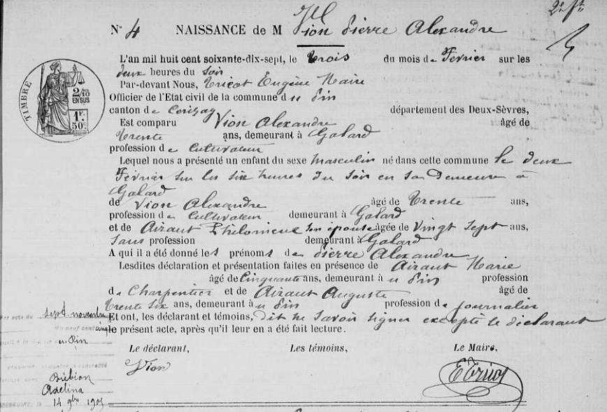
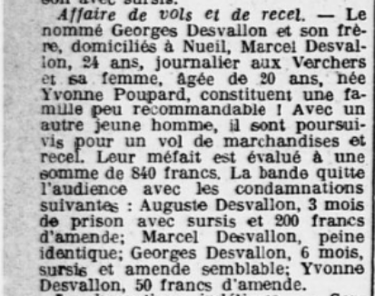
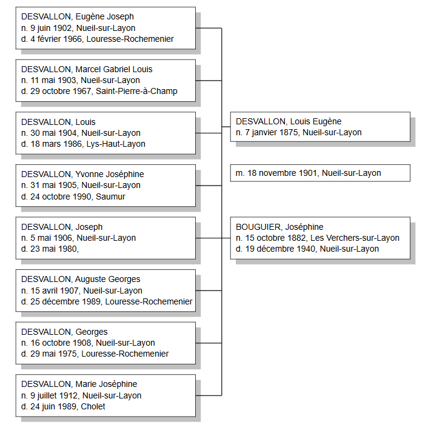
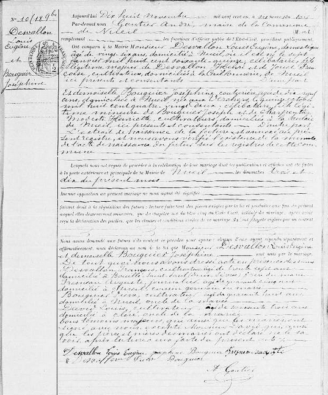
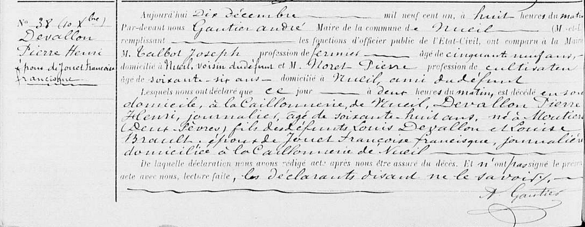
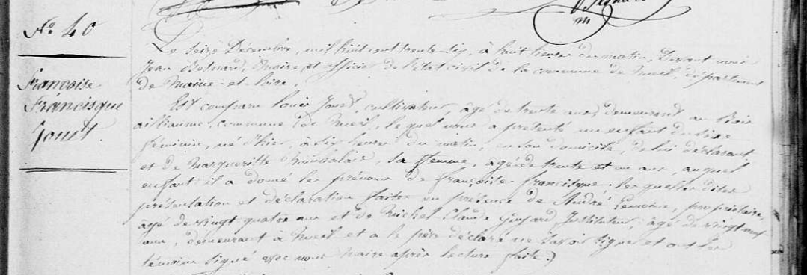
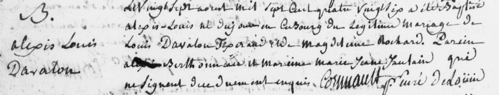
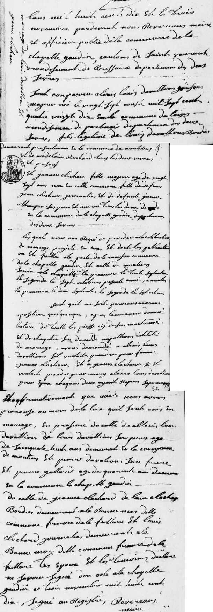

# Généalogie des familles

# VION - BERTHELOT

## et

# DESVALLON - PINET

## par Benjamin François VION, 2020

---

# Préambule

Ce document vise à regrouper l'intégralité de mes recherches sur ma généalogie. Chaque individu en ligne directe a fait l'objet de recherches approfondies et a une section dédiée qui rassemble toutes les sources et toutes les informations que j'ai pu glaner au fil de mes recherches. On y retrouve essentiellement les extraits d'actes de naissance, mariage, décès pour les individus nés après 1795 et avant 1912 (ou 1902 selon le département de naissance). 

Chaque famille possède sa section qui permet de connaître l'ensemble de la fratrie, les remariages, les héritages, etc. 

Parfois j'ai des doutes sur certaines informations, auquel cas elles sont en *italique* dans le document.

---

# Table des matières

- [Souche de l'arbre](#souche)

- [Famille VION](#vion)
  
  - Grand-père et arrières-grands-parents paternels
    
    - [VION, Gabriel Pierre Noël](#vion1)
    
    - [VION, Gabriel Joseph Alexandre](#vion2)
    
    - [MERCERON, Marie Gabrielle Eugénie Euphrosine](#vion3)
    
    - [Mariage de Gabriel VION et de Marie MERCERON](#vionmerceron)
  
  - Trisaïeuls paternels (les parents de l'arrière-grand père)
    
    - [VION, Pierre Alexandre](#vion4)
    
    - [BRÉBION, Adélina Hortense Eugénie](#vion5)
    
    - [Mariage de Pierre VION et de Adélina BRÉBION](#vionbrebion)
  
  - Quadrisaïeuls paternels
    
    - [VION, Alexandre Pierre ](#vion6)
    
    - [HÉRAULT, Philomène Florine](#vion7)
    
    - [Mariage de Alexandre VION et de Philomène HÉRAULT](#vionherault)
  
  - Quinquisaïeuls paternels
    
    - [VION, Pierre Louis](#vion8)
    
    - [HAYE, Marie Jeanne](#vion9)
    
    - [Mariage de Pierre VION et de Marie HAYE](#vionhaye)
  
  - Sextaïeuls paternels
    
    - [VION, Pierre](#vion10)
    
    - [MOREAU, Marie Madeleine](#vion11)
    
    - [Mariage de Pierre VION et de Marie MOREAU](#vionmoreau)
  
  - Septaïeuls paternels
    
    - [VION, Jean Pierre](#vion12)
    
    - [RICHARD, Perrine](#vion13)

- [Famille DESVALLON](#desvallon)
  
  - Grand-père et arrières-grands-parents paternels
    
    - [DESVALLON, Marcel Louis Gabriel](#desvallon1)
    
    - [DESVALLON, Marcel Gabriel Louis](#desvallon2)
    
    - [POUPARD, Yvonne](#desvallon3)
  
  - Trisaïeuls paternels (les parents de l'arrière-grand père)
    
    - [DESVALLON, Louis Eugène](#desvallon4)
    
    - [BOUGUIER, Joséphine](#desvallon5)
    
    - [Mariage de Louis DESVALLON et de Joséphine BOUGUIER](#desvallonbouguier)
  
  - Quadrisaïeuls paternels
    
    - [DESVALLON, Henri Pierre](#desvallon6)
    
    - [JOUET, Françoise Francisque](#desvallon7)
    
    - [Mariage de Henri DESVALLON et de Françoise JOUET](#desvallonjouet)
  
  - Quinquisaïeuls paternels
  
  - 

---

# Souche de l'arbre 

---

# Famille VION

## VION, Gabriel Pierre Noël 

### Avis de décès

Source : https://www.dansnoscoeurs.fr/gabriel-vion/332710

## VION, Gabriel Joseph Alexandre 

### Acte de naissance, Les Aubiers, 2 mai 1907

Source : [https://archives-deux-sevres-vienne.fr/ark:/58825/vta1b21ea1028e6d66d/daogrp/0/layout:table/idsearch:RECH_82000e6461037f5748515e017cb8b754#id:1253007678?gallery=true&brightness=100.00&contrast=100.00¢er=2233.746,-1647.913&zoom=10&rotation=0.000](https://archives-deux-sevres-vienne.fr/ark:/58825/vta1b21ea1028e6d66d/daogrp/0/layout:table/idsearch:RECH_82000e6461037f5748515e017cb8b754#id:1253007678?gallery=true&brightness=100.00&contrast=100.00&center=2233.746,-1647.913&zoom=10&rotation=0.000)

#### Résumé

| Commune                     | Les Aubiers,  canton de Châtillon sur Sèvre                                      |
| --------------------------- | -------------------------------------------------------------------------------- |
| __Enfant__                  | Gabriel Joseph Alexandre VION                                                    |
| __Naissance__               | 2 mai 1907 à 09h00 du matin                                                      |
| __Père, âge et profession__ | Pierre Alexandre VION, 30 ans, cultivateur                                       |
| __Mère, âge et profession__ | Adélina Hortense Eugénie BRÉBION, 24 ans, sans profession                        |
| __Domicile__                | La Brossardière, Les Aubiers (lieu-dit entre la route des Aubiers et Maulévrier) |
| __Témoin 1__                | Georges PELTIER, 40 ans, peintre aux Aubiers                                     |
| __Témoin 2__                | Édouard MAINCHAIN, 56 ans, peintre aux Aubiers                                   |

#### Annotation de mariage

Le 4 janvier 1932, à la mairie de Saint-Maurice La Fougereuse avec Marie Gabrielle Eugénie MERCERON

#### Annotation de décès

Le 16 mars 1967 à Genneton

### Succession

Source : [https://archives-deux-sevres-vienne.fr/ark:/58825/vta156cbad4a8c6111a/daogrp/0#id:1993337333?gallery=true¢er=3114.000,-978.000&zoom=7&rotation=0.000&brightness=100.00&contrast=100.00](https://archives-deux-sevres-vienne.fr/ark:/58825/vta156cbad4a8c6111a/daogrp/0#id:1993337333?gallery=true&center=3114.000,-978.000&zoom=7&rotation=0.000&brightness=100.00&contrast=100.00)

## MERCERON, Marie Gabrielle Eugénie Euphrosine <a name="vion3"/>

### Acte de naissance, Breuil-Chaussée, 5 février 1912

Source : [https://archives-deux-sevres-vienne.fr/ark:/58825/vtaa86932b1bc7738a2/daogrp/0/layout:table/idsearch:RECH_fad56a0db115df3938e14f91b895896e#id:940689247?gallery=true&brightness=100.00&contrast=100.00¢er=684.052,-698.321&zoom=11&rotation=0.000](https://archives-deux-sevres-vienne.fr/ark:/58825/vtaa86932b1bc7738a2/daogrp/0/layout:table/idsearch:RECH_fad56a0db115df3938e14f91b895896e#id:940689247?gallery=true&brightness=100.00&contrast=100.00&center=684.052,-698.321&zoom=11&rotation=0.000)

#### Résumé

| Commune                     | Breuil-Chaussée, canton de Bressuire             |
| --------------------------- | ------------------------------------------------ |
| **Enfant**                  | Marie Gabrielle Eugénie Euphrosine MERCERON      |
| **Naissance**               | 5 février 1912 à 00h30 du matin                  |
| **Père, âge et profession** | Henri Ferdinand Joseph MERCERON, 39 ans, fermier |
| **Mère, âge et profession** | Eugénie Adèle DAVID, 34 ans, fermière            |
| **Domicile**                | La Touche de Breuil-Chaussée                     |
| **Témoin 1**                | Delphin BONNIN, 40 ans, fermier                  |
| **Témoin 2**                | Pierre GARNIER, 45 ans, instituteur public       |

#### Annotation de mariage

Le 4 janvier 1932, à la mairie de Saint-Maurice La Fougereuse avec Gabriel Joseph Alexandre VION

#### Annotation de décès

Le 26 juin 1985 à Galtür en AUTRICHE

## Mariage de Gabriel VION et de Marie MERCERON <a name="vionmerceron"/>

Extrait de la table décennale des Naissances, Mariages, Décès de Saint-Maurice La Fougereuse (1923 - 1932)

Source : [https://archives-deux-sevres-vienne.fr/ark:/58825/vta57bc665cfbd2d8af/daogrp/0/layout:table/idsearch:RECH_d1d26f4fd837ea9f3cf1037df5d75d51#id:1111042363?gallery=true&brightness=100.00&contrast=100.00¢er=2537.500,-1871.500&zoom=8&rotation=0.000](https://archives-deux-sevres-vienne.fr/ark:/58825/vta57bc665cfbd2d8af/daogrp/0/layout:table/idsearch:RECH_d1d26f4fd837ea9f3cf1037df5d75d51#id:1111042363?gallery=true&brightness=100.00&contrast=100.00&center=2537.500,-1871.500&zoom=8&rotation=0.000)

---

## VION, Pierre Alexandre <a name="vion4"/>

### Acte de naissance, Le Pin, 2 février 1877

Source : [https://archives-deux-sevres-vienne.fr/ark:/58825/vta1e5ca6803dd75d52/daogrp/0/layout:table/idsearch:RECH_38dd6aa59fa5fc78d477da139ccb6588#id:328741911?gallery=true&brightness=100.00&contrast=100.00¢er=2824.238,-677.191&zoom=11&rotation=0.000](https://archives-deux-sevres-vienne.fr/ark:/58825/vta1e5ca6803dd75d52/daogrp/0/layout:table/idsearch:RECH_38dd6aa59fa5fc78d477da139ccb6588#id:328741911?gallery=true&brightness=100.00&contrast=100.00&center=2824.238,-677.191&zoom=11&rotation=0.000)

#### Résumé

| Commune                     | Le Pin, canton de Cerizay                                 |
| --------------------------- | --------------------------------------------------------- |
| **Enfant**                  | Pierre Alexandre VION                                     |
| **Naissance**               | 2 février 1877 à 18h00                                    |
| **Père, âge et profession** | Alexandre VION, 30 ans, cultivateur                       |
| **Mère, âge et profession** | Philomène HÉRAULT, 27 ans, sans profession                |
| **Domicile**                | Galard, Le Pin (lieu-dit à 7 minutes au Nord de la ville) |
| **Témoin 1**                | Marie HÉRAULT, 50 ans, charpentier au Pin                 |
| **Témoin 2**                | Auguste HÉRAULT, 36 ans, journalier au Pin                |

#### Annotation de mariage

Le 7 novembre 1905, à la mairie du Pin avec Adélina BRÉBION

### Service militaire

[Source](https://archinoe.com/cg79/visualiseur/visu_matricule.php?id=790020658&PHPSID=f76d879e544bc8542fd4fa0113ac76baw=2560&h=1440)

[Archives d&eacute;partementales des Deux-S&egrave;vres](https://archinoe.com/cg79/matricule_liste.php?PHPSID=f76d879e544bc8542fd4fa0113ac76ba&page=1)

**Fiche matriculaire 2194 créée le 10 janvier 1923**

Pierre Alexandre VION, domestique

Né le 2 février 1877 au Pin, de feu Alexandre VION et de feu HERAULT Philomène

N° 30 de tirage dans le canton de Cerizay

Cheveux et sourcils châtains clairs, yeux bleus, front large, menton pointu

1m61

Ainé de 7 enfants

Incorporé le 14 novembre 1899 au 144e régiment d'infanterie, matricule 1002, 2ème classe

Passé dans l'armée territoriale le 1/10/1911

Campagne contre l'Allemagne du 06 août 1914 au 31 janvier 1919

**évacué blessé le 12/09/1916 à Cléry (par balle à l'épaule droite), évacué malade le 10/06/1917 sur ambulance**

Libéré du service militaire le 10 novembre 1926 (il avait 49 ans)

## BRÉBION, Adélina Hortense Eugénie <a name="vion5"/>

### Acte de naissance, Noirterre, 11 décembre 1882

Source : [https://archives-deux-sevres-vienne.fr/ark:/58825/vtaf8c3d541b5b95cd5/daogrp/0/layout:table/idsearch:RECH_d71fc3aecd8b831d13ce0e76ef26bfe8#id:1188917110?gallery=true&brightness=100.00&contrast=100.00¢er=2995.493,-1887.348&zoom=10&rotation=0.000](https://archives-deux-sevres-vienne.fr/ark:/58825/vtaf8c3d541b5b95cd5/daogrp/0/layout:table/idsearch:RECH_d71fc3aecd8b831d13ce0e76ef26bfe8#id:1188917110?gallery=true&brightness=100.00&contrast=100.00&center=2995.493,-1887.348&zoom=10&rotation=0.000)

#### Résumé

| Commune                     | Noirterre, canton de Bressuire                              |
| --------------------------- | ----------------------------------------------------------- |
| **Enfant**                  | Adélina Hortense Eugénie BRÉBION                            |
| **Naissance**               | 11 décembre 1882 à 06h00 du matin                           |
| **Père, âge et profession** | Auguste Camille BRÉBION, 28 ans, cultivateur                |
| **Mère, âge et profession** | Hortense Eugénie PARAUD, 24 ans, sans profession            |
| **Domicile**                | La Pirandrie, Noirterre (lieu-dit au Nord-Est de Bressuire) |
| **Témoin 1**                | *BOUTET* , 36 ans, Noirterre                                |
| **Témoin 2**                | Jacques, 51 ans,  Noirterre                                 |

#### Annotation de mariage

Le 7 novembre 1905, à la mairie du Pin avec Pierre VION

### Succession

Source : [https://archives-deux-sevres-vienne.fr/ark:/58825/vta5e3ee4bab3026dc9/daogrp/0#id:1933553261?gallery=true¢er=2795.680,-2725.776&zoom=8&rotation=0.000&brightness=100.00&contrast=100.00](https://archives-deux-sevres-vienne.fr/ark:/58825/vta5e3ee4bab3026dc9/daogrp/0#id:1933553261?gallery=true&center=2795.680,-2725.776&zoom=8&rotation=0.000&brightness=100.00&contrast=100.00)

## Mariage de Pierre VION et de Adélina BRÉBION <a name="vionbrebion"/>

Source : [https://archives-deux-sevres-vienne.fr/ark:/58825/vta03f2d1e6f4f4b20b/daogrp/0/layout:table/idsearch:RECH_38dd6aa59fa5fc78d477da139ccb6588#id:2104479950?gallery=true&brightness=100.00&contrast=100.00¢er=997.958,-1261.430&zoom=8&rotation=0.000](https://archives-deux-sevres-vienne.fr/ark:/58825/vta03f2d1e6f4f4b20b/daogrp/0/layout:table/idsearch:RECH_38dd6aa59fa5fc78d477da139ccb6588#id:2104479950?gallery=true&brightness=100.00&contrast=100.00&center=997.958,-1261.430&zoom=8&rotation=0.000)

### Résumé

| Commune                           | Le Pin, canton de Cerizay                                                                                        |
| --------------------------------- | ---------------------------------------------------------------------------------------------------------------- |
| **Mari**                          | Pierre Alexandre VION, 28 ans, né au Pin le 2 février 1877, demeurant à Nueil-les-Aubiers                        |
| __Femme__                         | Adélina Hortense Eugénie BRÉBION, 22 ans, née à Noirterre le 11 décembre 1882, sans profession, demeurant au Pin |
| **Mariage**                       | 7 novembre 1905 à 09h00 du matin                                                                                 |
| **Père du marié**                 | Alexandre VION, décédé                                                                                           |
| **Mère du marié**                 | Philomène HÉRAULT, décédée au Pin                                                                                |
| __Père de la mariée__             | Auguste BRÉBION, décédé                                                                                          |
| __Mère de la mariée__             | Eugénie Hortense PARAUD, décédée au Pin                                                                          |
| **Domicile**                      | La Pirandrie, Noirterre (lieu-dit au Nord-Est de Bressuire)                                                      |
| **Témoin 1 : frère du marié**     | Pierre VION, 26 ans, cultivateur aux Aubiers                                                                     |
| **Témoin 2 : cousin du marié**    | Auguste VION, 28 ans, cultivateur au Pin                                                                         |
| __Témoin 3 : ami de la mariée__   | Louis CHAUVET, 54 ans, cultivateur au Pin                                                                        |
| __Témoin 4 : oncle de la mariée__ | Alexis *PERRAULT*, 59 ans,  cultivateur à Nueil les Aubiers                                                      |

## Recensement

Ils vivaient tous les deux en 1906 chez la famille du frère de Pierre (qui s'appelait aussi Pierre)

Source : [https://archives-deux-sevres-vienne.fr/ark:/58825/vtad3843cd9a4ffc3ea/daogrp/0#id:677790955?gallery=true¢er=1405.000,-2467.000&zoom=11&rotation=0.000&brightness=100.00&contrast=100.00](https://archives-deux-sevres-vienne.fr/ark:/58825/vtad3843cd9a4ffc3ea/daogrp/0#id:677790955?gallery=true&center=1405.000,-2467.000&zoom=11&rotation=0.000&brightness=100.00&contrast=100.00)

---

## VION, Alexandre Pierre <a name="vion6" />

### Acte de naissance, La Coudre, 18 avril 1847

Source : [https://archives-deux-sevres-vienne.fr/ark:/58825/vta9d5327f8a243a368/daogrp/0/layout:table/idsearch:RECH_f9df069e235ccfcde6359174366ba5a7#id:535052998?gallery=true&brightness=100.00&contrast=100.00¢er=2396.401,-1914.266&zoom=12&rotation=0.000](https://archives-deux-sevres-vienne.fr/ark:/58825/vta9d5327f8a243a368/daogrp/0/layout:table/idsearch:RECH_f9df069e235ccfcde6359174366ba5a7#id:535052998?gallery=true&brightness=100.00&contrast=100.00&center=2396.401,-1914.266&zoom=12&rotation=0.000)

#### Résumé

| Commune                     | La Coudre, canton de Argenton-le-Château                                                            |
| --------------------------- | --------------------------------------------------------------------------------------------------- |
| **Enfant**                  | Pierre Alexandre VION (**mais il se faisait appeler Alexandre**)                                    |
| **Naissance**               | 18 avril 1847 à 04h00 du matin                                                                      |
| **Père, âge et profession** | Pierre VION, 33 ans, cultivateur                                                                    |
| **Mère, âge et profession** | Marie-Jeanne HAYE (Marie Charri sur l'acte, rectifié par la suite à Bressuire), cultivateur, 32 ans |
| **Domicile**                | La Coudre                                                                                           |
| **Témoin 1**                | Pierre Vion 68 ans, cultivateur, grand-père de l'enfant                                             |
| **Témoin 2**                | Pierre *GRAVELOT*, 58 ans, cultivateur                                                              |

### Acte de décès, Combrand, 04 janvier 1892

Source : [https://archives-deux-sevres-vienne.fr/ark:/58825/vta9949bf08ff2ef02c/daogrp/0/layout:table/idsearch:RECH_4c0fcec1a3e5ebbf674360db1ff654a4#id:83859069?gallery=true&brightness=100.00&contrast=100.00¢er=3073.358,-1855.405&zoom=12&rotation=0.000](https://archives-deux-sevres-vienne.fr/ark:/58825/vta9949bf08ff2ef02c/daogrp/0/layout:table/idsearch:RECH_4c0fcec1a3e5ebbf674360db1ff654a4#id:83859069?gallery=true&brightness=100.00&contrast=100.00&center=3073.358,-1855.405&zoom=12&rotation=0.000)

#### Résumé

| Commune                   | Combrand, canton de Cerizay                                   |
| ------------------------- | ------------------------------------------------------------- |
| **Décédé**                | VION Alexandre, 46 ans                                        |
| **le**                    | 04 janvier 1892 à 16h00                                       |
| **Père**                  | Pierre VION                                                   |
| **Mère**                  | HAYE Marie-Jeanne (erreur sur l'acte)                         |
| **Domicile**              | Ligonière, Combrand                                           |
| **Témoin 1 et déclarant** | VION Auguste, frère, 44 ans, cultivateur au Pin               |
| **Témoin 2**              | MAROLLEAU Auguste, 31 ans, cultivateur à Combrand, beau-frère |

### Second mariage à Combrand, 29 avril 1884

Source : [https://archives-deux-sevres-vienne.fr/ark:/58825/vta1d14e756a3ce1e86/daogrp/0/layout:table/idsearch:RECH_4c0fcec1a3e5ebbf674360db1ff654a4#id:508798388?gallery=true&brightness=100.00&contrast=100.00¢er=1779.938,-1377.973&zoom=9&rotation=0.000](https://archives-deux-sevres-vienne.fr/ark:/58825/vta1d14e756a3ce1e86/daogrp/0/layout:table/idsearch:RECH_4c0fcec1a3e5ebbf674360db1ff654a4#id:508798388?gallery=true&brightness=100.00&contrast=100.00&center=1779.938,-1377.973&zoom=9&rotation=0.000)

#### Résumé

| Commune                            | Combrand, canton de Cerizay                                                                                                                |
| ---------------------------------- | ------------------------------------------------------------------------------------------------------------------------------------------ |
| **Mari**                           | Pierre Alexandre VION, 37 ans, né à la Coudre le 18 avril 1847, cultivateur demeurant au Pin, veuf en premières noces de Philomène HERAULT |
| **Femme**                          | Elisa Victorine MAROLLEAU, 29 ans, née à Noirterre le 7 octobre 1854, sans profession, demeurant à Combrand                                |
| **Mariage**                        | 7 novembre 1905 à 09h00 du matin                                                                                                           |
| **Père du marié**                  | Pierre VION, décédé à Nueil-les-Aubiers le 24 août 1881                                                                                    |
| **Mère du marié**                  | Marie-Jeanne HAYE, décédée à Boësse le 3 octobre 1851                                                                                      |
| **Père de la mariée**              | Pierre MAROLLEAU, cultivateur de 68 ans à Combrand                                                                                         |
| **Mère de la mariée**              | Euphrosine GOTREAU, 58 ans à Combrand                                                                                                      |
| **Domicile**                       | N/A                                                                                                                                        |
| **Témoin 1 : frère du marié**      | Auguste VION, 35 ans, cultivateur à Rorthais                                                                                               |
| **Témoin 2 : beau-frère du marié** | Elie COUTANT, 35 ans, cultivateur à Nueil                                                                                                  |
| **Témoin 3 : frère de la mariée**  | Pierre MAROLLEAU, 33 ans, cultivateur à Terves                                                                                             |
| **Témoin 4 : frère de la mariée**  | Auguste MAROLLEAU, 27 ans, cultivateur à Terves                                                                                            |

### Succession

Source : [https://archives-deux-sevres-vienne.fr/ark:/58825/vtae98b68646e650325/daogrp/0/layout:table/idsearch:RECH_8562a597d4443226cae4b5c39798c61d#id:127863338?gallery=true&brightness=100.00&contrast=100.00¢er=1331.110,-2830.822&zoom=12&rotation=0.000](https://archives-deux-sevres-vienne.fr/ark:/58825/vtae98b68646e650325/daogrp/0/layout:table/idsearch:RECH_8562a597d4443226cae4b5c39798c61d#id:127863338?gallery=true&brightness=100.00&contrast=100.00&center=1331.110,-2830.822&zoom=12&rotation=0.000)

Source : [https://archives-deux-sevres-vienne.fr/ark:/58825/vtab0cb69672803d878/daogrp/0/layout:table/idsearch:RECH_504bb3a226108d5d6470491ce18e345f#id:1790817912?gallery=true&brightness=100.00&contrast=100.00¢er=4481.442,-3098.329&zoom=14&rotation=0.000](https://archives-deux-sevres-vienne.fr/ark:/58825/vtab0cb69672803d878/daogrp/0/layout:table/idsearch:RECH_504bb3a226108d5d6470491ce18e345f#id:1790817912?gallery=true&brightness=100.00&contrast=100.00&center=4481.442,-3098.329&zoom=14&rotation=0.000)

#### Résumé

Succession directe et entre époux de VION Alexandre (46 ans) décédé à Combrand le 4 janvier 1892

VION Alexandre, cultivateur à Ligonière (Combrand), veuf en premières noces avec 3 enfants de Philomène HERAULT (**succession payée le 10 novembre 1887**) et époux en secondes noces de Elilsa Victorine MAROLLEAU, laisse pour héritier :

- ses enfants issus du premier lit (j'adore l'expression), tous les 3 mineurs sous la tutelle de leur oncle VION Auguste, cultivateur au Pin
  
  - VION Philomène
  
  - VION Alexandre
  
  - VION Pierre

- ses enfants issus du second lit
  
  - VION Augustine Alexandrie Virginie
  
  - Marie-Victoire
    
    - toutes deux mineures sous la tutelle de leur mère Victorine MAROLLEAU à Combrand
  
  - Victor Joseph
  
  - Marguerite Euphrosine Juliette
    
    - tous deux habile à recueillir l'usufruit d'1/4 de la succession en vertu de la loi du 9 mars 1891

Inventaire enreigstré le 20 janvier 1892

Divers meubles et objets mobiiliers ont été vendus

La succession consiste en :

- Meubles
  
  - Vendus : 2656,25 francs
  
  - Non vendus : 952,80 francs

- Argent comptant : 10 francs

- Recettes en terre : 100 francs

Dans cette somme sont compris les droits des enfants du premier lit dont:

1. la succession de leur mère décédée le 9 juin 1880 : 395,49 francs

2. la succession de leur grand-père Pierre HERAULT décédé au Pin le 17 juin 1887 : 2047,32 francs

## HÉRAULT, Philomène Florine <a name="vion7"/>

### Acte de naissance, Rorthais, 30 juillet 1849

Source : [https://archives-deux-sevres-vienne.fr/ark:/58825/vtaccdb9e5f05e5e6a8/daogrp/0/layout:table/idsearch:RECH_946f6355f321b2d5f307e55c81fc5b1d#id:236787456?gallery=true&brightness=100.00&contrast=100.00¢er=3027.019,-646.757&zoom=11&rotation=0.000](https://archives-deux-sevres-vienne.fr/ark:/58825/vtaccdb9e5f05e5e6a8/daogrp/0/layout:table/idsearch:RECH_946f6355f321b2d5f307e55c81fc5b1d#id:236787456?gallery=true&brightness=100.00&contrast=100.00&center=3027.019,-646.757&zoom=11&rotation=0.000)

#### Résumé

| Commune                     | Rorthais, canton de Châtillon    |
| --------------------------- | -------------------------------- |
| **Enfant**                  | Philomène Florine HÉRAULT        |
| **Naissance**               | 30 juillet 1849 à 08h00 du matin |
| **Père, âge et profession** | Pierre Antoine HÉRAULT, 36 ans   |
| **Mère, âge et profession** | Celeste MANCEAU                  |
| **Domicile**                | La Basse Trappe, Rorthais        |
| **Témoin 1**                | Antoine HÉRAULT, 63 ans          |
| **Témoin 2**                | Baptiste MANCEAU, 27 ans         |

### Acte de décès, Le Pin, 9 janvier 1880

Source : [https://archives-deux-sevres-vienne.fr/ark:/58825/vtadbe01efe1f23abc2/daogrp/0/layout:table/idsearch:RECH_38dd6aa59fa5fc78d477da139ccb6588#id:1956779825?gallery=true&brightness=100.00&contrast=100.00¢er=1398.633,-693.923&zoom=11&rotation=0.000](https://archives-deux-sevres-vienne.fr/ark:/58825/vtadbe01efe1f23abc2/daogrp/0/layout:table/idsearch:RECH_38dd6aa59fa5fc78d477da139ccb6588#id:1956779825?gallery=true&brightness=100.00&contrast=100.00&center=1398.633,-693.923&zoom=11&rotation=0.000)

#### Résumé

| Commune                   | Le Pin, canton de Cerizay                                                                                                                                                      |
| ------------------------- | ------------------------------------------------------------------------------------------------------------------------------------------------------------------------------ |
| **Décédée**               | Philomène Florine HÉRAULT, 30 ans (ils disent 32 sur l'acte c'est une erreur. Ils disent aussi qu'elle est née à ST Pierre des Echaubrognes mais elle est bien née à Rorthais) |
| **le**                    | 09 janvier 1880 à 23h00 du soir                                                                                                                                                |
| **Père**                  | Pierre HÉRAULT                                                                                                                                                                 |
| **Mère**                  | Celeste MANCEAU                                                                                                                                                                |
| **Domicile**              | Galard, Le Pin (lieu-dit à 7 minutes au Nord de la ville)                                                                                                                      |
| **Témoin 1 et déclarant** | VION Alexandre, époux, 32 ans                                                                                                                                                  |
| **Témoin 2**              | HÉRAULT Antoine, son frère de 45 ans                                                                                                                                           |

## Mariage de Alexandre VION et de Philomène HÉRAULT <a name="vionherault"/>

Source : [https://archives-deux-sevres-vienne.fr/ark:/58825/vta17416c30b8588002/daogrp/0/layout:table/idsearch:RECH_333c0f504637b9034e708644fad3f5d6#id:168751679?gallery=true&brightness=100.00&contrast=100.00¢er=1691.138,-1221.279&zoom=9&rotation=0.000](https://archives-deux-sevres-vienne.fr/ark:/58825/vta17416c30b8588002/daogrp/0/layout:table/idsearch:RECH_333c0f504637b9034e708644fad3f5d6#id:168751679?gallery=true&brightness=100.00&contrast=100.00&center=1691.138,-1221.279&zoom=9&rotation=0.000)

### Résumé

| Commune                           | Rorthais, canton de Châtillon                                                                                                |
| --------------------------------- | ---------------------------------------------------------------------------------------------------------------------------- |
| **Mari**                          | Pierre Alexandre VION, 27 ans, né à la Coudre le 18 avril 1847, cultivateur demeurant à Nueil                                |
| **Femme**                         | Philomène Florine HERAULT, 24 ans née à Rorthais le 30 juillet 1849, sans profession, demeurant à la Basse Trappe à Rorthais |
| **Mariage**                       | 16 juin 1874 à 8h00 du matin                                                                                                 |
| **Père du marié**                 | Pierre VION, 60 ans, cultivateur à Nueil                                                                                     |
| **Mère du marié**                 | Marie-Jeanne HAYE, décédée à Boësse le 3 octobre 1851                                                                        |
| **Père de la mariée**             | Pierre HERAULT, cultivateur de 60 ans à Rorthais                                                                             |
| **Mère de la mariée**             | Celeste MANCEAU, cultivateur à Rorthais                                                                                      |
| **Domicile**                      | N/A                                                                                                                          |
| **Témoin 1 : oncle du marié**     | Pierre BAUDIN, 52 ans, cultivateur à Combrand                                                                                |
| **Témoin 2 : frère du marié**     | Auguste VION, 26 ans, cultivateur à Rorthais                                                                                 |
| **Témoin 3 : oncle de la mariée** | Joseph ROI, 48 ans, cultivateur au Pin                                                                                       |
| **Témoin 4 : oncle de la mariée** | Antoine HERAULT, 34 ans, cultivateur au Pin                                                                                  |

## Recensement au Pin en 1876

5 ans plus tôt, Philomène était encore de ce monde et ils avaient leur petite fille de 2 ans. Ils habitaient chez les beaux-parents.

Source : [https://archives-deux-sevres-vienne.fr/ark:/58825/vta09db87e5d1fe9181/daogrp/0/layout:table/idsearch:RECH_be74a4e13b968804ba02072bf4c8f668#id:979053937?gallery=true&brightness=100.00&contrast=100.00¢er=1239.888,-2162.188&zoom=12&rotation=0.000](https://archives-deux-sevres-vienne.fr/ark:/58825/vta09db87e5d1fe9181/daogrp/0/layout:table/idsearch:RECH_be74a4e13b968804ba02072bf4c8f668#id:979053937?gallery=true&brightness=100.00&contrast=100.00&center=1239.888,-2162.188&zoom=12&rotation=0.000)

## Recensement au Pin en 1881

Philomène HERAULT la mère de famille était décédée l'année passée. Ils habitaient à 9 à Galard. Alexandre (49 ans) habitait chez ses beaux-parents Pierre HERAULT et Celestine MANCEAU, avec ses 3 enfants Philomène 6 ans, Alexandre 5 ans et Pierre 2 ans.

Source : https://archives-deux-sevres-vienne.fr/ark:/58825/vtaae2a264435398c4d/daogrp/0/layout:table/idsearch:RECH_c9ddcebc46ea43efdb5c3fd3c568544c#id:839602266?gallery=true&brightness=100.00&contrast=100.00¢er=1227.009,-1610.911&zoom=10&rotation=0.000

## Recensement au Pin en 1886

Seule Philomène VION l'ainée de 10 ans est recensée avec la belle-famille. Elle ne voulait peut-être pas vivre avec la nouvelle femme de son père (mariés en 1884) ...

Source : [https://archives-deux-sevres-vienne.fr/ark:/58825/vtaae2a264435398c4d/daogrp/0/layout:table/idsearch:RECH_c9ddcebc46ea43efdb5c3fd3c568544c#id:839602266?gallery=true&brightness=100.00&contrast=100.00¢er=1227.009,-1610.911&zoom=10&rotation=0.000](https://archives-deux-sevres-vienne.fr/ark:/58825/vtaae2a264435398c4d/daogrp/0/layout:table/idsearch:RECH_c9ddcebc46ea43efdb5c3fd3c568544c#id:839602266?gallery=true&brightness=100.00&contrast=100.00%C2%A2er=1227.009,-1610.911&zoom=10&rotation=0.000)

---

## Préambule

Je n'ai trouvé aucune preuve de mariage entre Pierre Louis VION et Marie Jeanne HAYE.  Mais Marie HAYE s'est mariée en 1845 à Pierre Henri VION, le petit frère de Pierre Louis. Cependant, ce vrai Pierre Henri VION est décédé à l'âge de 11 ans en 1828. Et c'est bien Pierre Louis et Marie HAYE les parents d'Alexandre et d'Auguste. 

Donc il semble évident que l'acte de mariage que j'ai trouvé soit bien celui de Pierre Louis VION et de Marie HAYE, mais Pierre Louis a été confondu avec son frère décédé. Le plus probable selon moi est que le maire de Brétignolles a fait une bonne grosse boulette quand on lui a demandé de fournir l'acte de naissance de Pierre Louis. Et que le maire de Nueil a recopié tout ça sans réfléchir. En plus la mauvaise orthographe du nom de famille "VILLON" n'a été faite que sur Pierre Henri, sur tous les autres papiers il s'agit bien de l'orthographe VION. Et au moment de signer, il est très probable que Pierre Louis et les témoins n'ont pas lu ou qu'ils ne savaient pas bien lire.

## VION, Pierre Louis <a name="vion8"/>

### Acte de naissance, Brétignolles, 10 février 1813

Source : [https://archives-deux-sevres-vienne.fr/ark:/58825/vta81aa9c192a625b6c/daogrp/0/layout:table/idsearch:RECH_e19763a27cc693b1c31268ba86d62704#id:194212694?gallery=true&brightness=100.00&contrast=100.00¢er=2595.171,-1864.932&zoom=11&rotation=0.000](https://archives-deux-sevres-vienne.fr/ark:/58825/vta81aa9c192a625b6c/daogrp/0/layout:table/idsearch:RECH_e19763a27cc693b1c31268ba86d62704#id:194212694?gallery=true&brightness=100.00&contrast=100.00&center=2595.171,-1864.932&zoom=11&rotation=0.000)

#### Résumé

| Commune                     | Brétignolles, canton de Cerizay              |
| --------------------------- | -------------------------------------------- |
| **Enfant**                  | Pierre Louis VION                            |
| **Naissance**               | 10 février 1813 à 04h00 du matin             |
| **Père, âge et profession** | Pierre Vion, <mark>bordier </mark> de 33 ans |
| **Mère, âge et profession** | Marie MOREAU                                 |
| **Domicile**                | Non indiqué (mais probablement Brétignolles) |
| **Témoin 1**                | _Pierre HÉRAULT_, bordier                    |
| **Témoin 2**                | Louis, oncle de l'enfant, bordier            |

<mark>bordier</mark> : Exploitant (et souvent 
habitant) un bourdou c'est-à-dire une grange. Ce terme désigne parfois 
un métayer (la grange désignant aussi le pré qui l'entoure), mais le 
plus souvent un fils non encore émancipé et exploitant une partie des 
terres de son père.

### Acte de décès, Nueil-les-Aubiers, 24 août 1881

Source : [https://archives-deux-sevres-vienne.fr/ark:/58825/vta0a935bc3b471bb0b/daogrp/0/layout:table/idsearch:RECH_82000e6461037f5748515e017cb8b754#id:186568532?gallery=true&brightness=100.00&contrast=100.00¢er=2697.034,-1935.750&zoom=10&rotation=0.000](https://archives-deux-sevres-vienne.fr/ark:/58825/vta0a935bc3b471bb0b/daogrp/0/layout:table/idsearch:RECH_82000e6461037f5748515e017cb8b754#id:186568532?gallery=true&brightness=100.00&contrast=100.00&center=2697.034,-1935.750&zoom=10&rotation=0.000)

#### Résumé

| Commune                   | Nueil-sous-les-Aubiers, canton de Chatillon-sur-Sèvre                                                                                                              |
| ------------------------- | ------------------------------------------------------------------------------------------------------------------------------------------------------------------ |
| **Décédé**                | Pierre VION, cultivateur, 68 ans. Marié à PERIDY Celeste                                                                                                           |
| **le**                    | 24 août 1881 à 07h00 du matin                                                                                                                                      |
| **Père**                  | Pierre VION, décédé à Nueil                                                                                                                                        |
| **Mère**                  | Marie BOISSINOT (elle est née MOREAU, je sais pas si c'est une erreur ou si elle s'était remariée... improbable car son mari est décédé bien après elle), décédée. |
| **Domicile**              | L'Antaizière, Nueil-sous-les-Aubiers (proche de Mauléon)                                                                                                           |
| **Témoin 1 et déclarant** | VION Alexandre, son fils de 34 ans cultivateur à Galard au Pin                                                                                                     |
| **Témoin 2**              | FUSEAU Victor, son gendre de 30 ans, cultivateur à Rorthais                                                                                                        |

### Second mariage à Rorthais, 22 novembre 1853

Source : [https://archives-deux-sevres-vienne.fr/ark:/58825/vta07975308ebf35f86/daogrp/0/layout:table/idsearch:RECH_333c0f504637b9034e708644fad3f5d6#id:2087173765?gallery=true&brightness=100.00&contrast=100.00¢er=2159.605,-1070.120&zoom=12&rotation=0.000](https://archives-deux-sevres-vienne.fr/ark:/58825/vta07975308ebf35f86/daogrp/0/layout:table/idsearch:RECH_333c0f504637b9034e708644fad3f5d6#id:2087173765?gallery=true&brightness=100.00&contrast=100.00&center=2159.605,-1070.120&zoom=12&rotation=0.000)

#### Résumé

| Commune                                | Rorthais, canton de Châtillon                                                        |
| -------------------------------------- | ------------------------------------------------------------------------------------ |
| **Mari**                               | Pierre Louis VION, 40 ans, demeurant à Boësse, veuf en premières noces de Marie HAYE |
| **Femme**                              | Celeste PERIDY, sans profession, 30 ans                                              |
| **Mariage**                            | 22 novembre 1853                                                                     |
| **Père du marié**                      | Pierre VION, présent                                                                 |
| **Mère du marié**                      | Marie MOREAU, décédée                                                                |
| **Père de la mariée**                  | François PERIDY, décédé                                                              |
| **Mère de la mariée**                  | Renée GUIET, présente                                                                |
| **Domicile**                           | N/A                                                                                  |
| **Témoin 1 : ami du marié**            | Pierre Marie PERIDY, cultivateur de Saint-Aubin de Baubigné, 40 ans                  |
| **Témoin 2 ami  du marié**             | François PERIDY, cultivateur de Saint-Aubin de Baubigné, 32 ans                      |
| **Témoin 3 : frère de la mariée**      | Alexis PERIDY, cultivateur de Saint-Aubin de Baubigné, 30 ans                        |
| **Témoin 4 : beau-frère de la mariée** | Boris _JANVIER_, maréchal à Saint-Aubin de Baubigné, 26 ans                          |

### Registre de déclarations de successions

Source : [https://archives-deux-sevres-vienne.fr/ark:/58825/vtaa4c60d09826e5083/daogrp/0/layout:table/idsearch:RECH_b4fdde5c5160327c207f47ec67c26344#id:449030490?gallery=true&brightness=100.00&contrast=100.00¢er=5106.223,-3794.977&zoom=11&rotation=0.000](https://archives-deux-sevres-vienne.fr/ark:/58825/vtaa4c60d09826e5083/daogrp/0/layout:table/idsearch:RECH_b4fdde5c5160327c207f47ec67c26344#id:449030490?gallery=true&brightness=100.00&contrast=100.00&center=5106.223,-3794.977&zoom=11&rotation=0.000)

#### Résumé

Le 26 octobre 1881 a comparu Auguste VION, cultivateur à la Basse-Trappe à Rorthais. Il a déclaré le décès de son père Pierre VION, demeurant à l'Antaizière à Nueil, le 23 août 1881, époux de Celeste PERIDY.

Il laisse pour hériter ses enfants :

- Enfants qu'il a eu avec Marie HAYE
  
  - Auguste (le comparant)
  
  - Alexandre VION, cultivateur à Gallard, commune du Pin

- Enfants qu'il a eu avec Celeste PERIDY
  
  - Célestin, soldat, domicilié à l'Antaizière
  
  - Marie, femme de Victor FUSEAU, cultivateur à Rorthais
  
  - Alexandrine, femme d'Elie Coutant, domestique à l'Antaizière
  
  - Pierre, mineur
  
  - Célestine, mineur

Ainsi que les membres de la famille JOFFRION, tous cultivateurs au lieu dit de La Planche

- Henri

- Louis

- Anastasie, femme de Pierre PASQUIER

- Julie

et Rosalie JOFFRION, femme de Louis GUIGNARD.

**Succession**

| Légataire                                            | Part                                                                            |
| ---------------------------------------------------- | ------------------------------------------------------------------------------- |
| Henri JOFFRION, Louis JOFFRION et les époux PASQUIER | 1/4 chacun des parts de la société verbale d'agriculture (total de 3990 francs) |

## HAYE, Marie Jeanne <a name="vion9"/>

### Acte de naissance, Breuil-Chaussée, 7 août 1815

Source : [https://archives-deux-sevres-vienne.fr/ark:/58825/vta2edfc844fea6bf59/daogrp/0/layout:table/idsearch:RECH_fad56a0db115df3938e14f91b895896e#id:1282733887?gallery=true&brightness=100.00&contrast=100.00¢er=2734.514,-1043.561&zoom=9&rotation=0.000](https://archives-deux-sevres-vienne.fr/ark:/58825/vta2edfc844fea6bf59/daogrp/0/layout:table/idsearch:RECH_fad56a0db115df3938e14f91b895896e#id:1282733887?gallery=true&brightness=100.00&contrast=100.00&center=2734.514,-1043.561&zoom=9&rotation=0.000)

#### Résumé

| Commune                     | Breuil-Chaussée, canton de Bressuire                        |
| --------------------------- | ----------------------------------------------------------- |
| **Enfant**                  | Marie Jeanne HAYE                                           |
| **Naissance**               | 07 août 1815 à 5h00 du matin                                |
| **Père, âge et profession** | Jean HAYE, métayer                                          |
| **Mère, âge et profession** | Jeanne THIBAUDEAU                                           |
| **Domicile**                | Breuil-Chaussée                                             |
| **Témoin 1**                | Louis THIBAUDEAU, grand-père de l'enfant, métayer de 60 ans |
| **Témoin 2**                | Pierre THIBAUDEAU, oncle de l'enfant, métayer de 33 ans     |

### Acte de décès, Boësse, 3 octobre 1851

Source : [https://archives-deux-sevres-vienne.fr/ark:/58825/vtae9bf5651e49ffdda/daogrp/0/layout:table/idsearch:RECH_c40043737f5517e9095eb4c4cc81709c#id:94438502?gallery=true&brightness=100.00&contrast=100.00¢er=984.637,-2044.405&zoom=10&rotation=0.000](https://archives-deux-sevres-vienne.fr/ark:/58825/vtae9bf5651e49ffdda/daogrp/0/layout:table/idsearch:RECH_c40043737f5517e9095eb4c4cc81709c#id:94438502?gallery=true&brightness=100.00&contrast=100.00&center=984.637,-2044.405&zoom=10&rotation=0.000)

#### Résumé

| Commune                   | Boësse, canton d'Argenton-Château                                                              |
| ------------------------- | ---------------------------------------------------------------------------------------------- |
| **Décédé**                | Marie HAYE, 36 ans                                                                             |
| **le**                    | 3 octobre 1851 à 11h du matin                                                                  |
| **Père**                  | Jean HAYE                                                                                      |
| **Mère**                  | Marie THIBAUDEAU                                                                               |
| **Domicile**              | La Basse Roche, Boësse                                                                         |
| **Témoin 1 et déclarant** | Jacques BOISSINOT, cultivateur de 55 ans demeurant à VIlleneuve à Boësse, voisin de la défunte |
| **Témoin 2**              | Louis POINT, cultivateur de 59 ans demeurant à VIlleneuve à Boësse, voisin de la défunte       |

## Mariage de Pierre VION et de Marie HAYE <a name="vionhaye"/>

Source : [https://archives-deux-sevres-vienne.fr/ark:/58825/vta258e1a056ace7688/daogrp/0/layout:table/idsearch:RECH_82000e6461037f5748515e017cb8b754#id:879573280?gallery=true&brightness=100.00&contrast=100.00¢er=2750.896,-1287.889&zoom=8&rotation=0.000](https://archives-deux-sevres-vienne.fr/ark:/58825/vta258e1a056ace7688/daogrp/0/layout:table/idsearch:RECH_82000e6461037f5748515e017cb8b754#id:879573280?gallery=true&brightness=100.00&contrast=100.00&center=2750.896,-1287.889&zoom=8&rotation=0.000)

### Résumé

| Commune                           | Nueil-sous-les-Aubiers, canton de Châtillon                                                                                                                                                           |
| --------------------------------- | ----------------------------------------------------------------------------------------------------------------------------------------------------------------------------------------------------- |
| **Mari**                          | Henri Pierre VILLON (j'ai failli ne jamais retrouver ce foutu mariage à cause de cette orthographe de VILLON ...), bordier, demeurant à La Coudre, 29 ans, né le 19 mai (erreur c'était en août) 1817 |
| **Femme**                         | Marie Jeanne HAYE, sans profession, domiciliée à Nueil-sous-les-Aubiers, 29 ans, veuve de feu Jean Baptiste XXXX                                                                                      |
| **Mariage**                       | 17 juin 1845 à 8h00 du matin                                                                                                                                                                          |
| **Père du marié**                 | Pierre VION , cultivateur, présent                                                                                                                                                                    |
| **Mère du marié**                 | Marie MOREAU, décédée à La Coudre le 3 mars 1845                                                                                                                                                      |
| **Père de la mariée**             | Jean HAYE, décédé à Breuil-Chaussée le 22 décembre 1830                                                                                                                                               |
| **Mère de la mariée**             | Marie Jeanne THIBAUDEAU, demeurant à Nueil, présente                                                                                                                                                  |
| **Domicile**                      | N/A                                                                                                                                                                                                   |
| **Témoin 1 : ami du marié**       | Pierre BEAU, instituteur, 31 ans                                                                                                                                                                      |
| **Témoin 2 : ami du marié**       | Jean Pierre XXXXX, 39 ans, menuisier                                                                                                                                                                  |
| **Témoin 3 : frère de la mariée** | Jean HAYE, métayer, 43 ans, à Brétignolles                                                                                                                                                            |
| **Témoin 4 : frère de la mariée** | Louis HAYE, bordier, 25 ans, au Pin                                                                                                                                                                   |

---

## Recensement en 1866 à Nueil-sur-Argent

A ce moment-là, Pierre Louis VION s'était remarié avec Celeste Peridy. Ils habitaient ensemble à l'Antaizière avec les deux enfants de Pierre Louis (Alexandre et Auguste) et les 5 autres enfants qu'ils ont eu ensemble.

Source : [https://archives-deux-sevres-vienne.fr/ark:/58825/vta9d80c608f03495a9/daogrp/0/layout:table/idsearch:RECH_1448bb136174b690ba907d290cfe639b#id:517462869?gallery=true&brightness=100.00&contrast=100.00¢er=1281.596,-2529.934&zoom=11&rotation=0.000](https://archives-deux-sevres-vienne.fr/ark:/58825/vta9d80c608f03495a9/daogrp/0/layout:table/idsearch:RECH_1448bb136174b690ba907d290cfe639b#id:517462869?gallery=true&brightness=100.00&contrast=100.00&center=1281.596,-2529.934&zoom=11&rotation=0.000)

---

## VION, Pierre <a name="vion10"/>

### Acte de naissance, Beaulieu-sous-Bressuire, 10 mars 1780

Malheureusement les actes de naissances à Beaulieu n'existent que depuis 1795.

### Acte de décès, Nueil-les-Aubiers, 23 août 1857

Source : [https://archives-deux-sevres-vienne.fr/ark:/58825/vtaaadeac145ba14ac2/daogrp/0/layout:table/idsearch:RECH_82000e6461037f5748515e017cb8b754#id:1531540785?gallery=true&brightness=100.00&contrast=100.00¢er=1150.488,-1851.225&zoom=11&rotation=0.000](https://archives-deux-sevres-vienne.fr/ark:/58825/vtaaadeac145ba14ac2/daogrp/0/layout:table/idsearch:RECH_82000e6461037f5748515e017cb8b754#id:1531540785?gallery=true&brightness=100.00&contrast=100.00&center=1150.488,-1851.225&zoom=11&rotation=0.000)

#### Résumé

| Commune                   | Nueil-sous-les-Aubiers, canton de Chatillon                                |
| ------------------------- | -------------------------------------------------------------------------- |
| **Décédé**                | Pierre VION, 79 ans, né à Beaulieu, cultivateur                            |
| **le**                    | 23 août 1857, 9h du matin                                                  |
| **Père**                  | Pierre VION                                                                |
| **Mère**                  | Renseignement non fourni                                                   |
| **Domicile**              | L'Antaizière, Nueil-sous-les-Aubiers                                       |
| **Témoin 1 et déclarant** | Pierre VION, 45 ans, demeurant à l'Antaizière, cultivateur, fils du défunt |
| **Témoin 2**              | Pierre BERNIER, 38 ans, cultivateur à St Clémentin et gendre du défunt     |

## Succession

Source : [https://archives-deux-sevres-vienne.fr/ark:/58825/vta10663c0044ac9b89/daogrp/0/layout:table/idsearch:RECH_b4fdde5c5160327c207f47ec67c26344#id:1493916748?gallery=true&brightness=100.00&contrast=100.00¢er=2178.166,-1854.237&zoom=11&rotation=0.000](https://archives-deux-sevres-vienne.fr/ark:/58825/vta10663c0044ac9b89/daogrp/0/layout:table/idsearch:RECH_b4fdde5c5160327c207f47ec67c26344#id:1493916748?gallery=true&brightness=100.00&contrast=100.00&center=2178.166,-1854.237&zoom=11&rotation=0.000)

### Résumé

"Succession directe de Pierre VEILLON décédé à Nueil le 22 août 1857"

A comparu Pierre Louis VEILLON, métayer à Nueil 

<u>Testament reçu à Argenton le 26 novembre 1853. Le défunt a stipulé qu'un tiers de ses possessions soit distribué comme suit</u>

| Légataire                     | Part |
| ----------------------------- | ---- |
| Son fils Pierre Louis VION    | 4/24 |
| Son petit-fils Alexandre VION | 3/24 |
| Son petit-fils Auguste VION   | 1/24 |

<u>Répartition des possessions restantes</u>

| Légataire                                                                | Part |
| ------------------------------------------------------------------------ | ---- |
| Son fils Pierre Louis VION                                               | 8/24 |
| Sa fille Marie VION, épouse de Pierre BERNIER, domestique à St-Clémentin | 8/24 |

<u>Liste des possessions</u>

| Possession            | Valeur en FRANCS       |
| --------------------- | ---------------------- |
| Mobilier              | 8269,70 F              |
| Les recettes en terre | 300 F                  |
| L'argent comptant     | 1521,09 F              |
| **Total**             | <u>**10090, 79 F**</u> |

## MOREAU, Marie Madeleine <a name="vion11"/>

### Acte de naissance, Brétignolles, 28 nobembre 1782

Malheureusement les actes de naissances à Brétignolles n'existent que depuis 1803.

## Acte de décès, La Coudre, 3 mars 1845

Source : [https://archives-deux-sevres-vienne.fr/ark:/58825/vta37c4d2048de7b5a9/daogrp/0/layout:table/idsearch:RECH_f9df069e235ccfcde6359174366ba5a7#id:920331379?gallery=true&brightness=100.00&contrast=100.00¢er=2471.827,-1841.569&zoom=11&rotation=0.000](https://archives-deux-sevres-vienne.fr/ark:/58825/vta37c4d2048de7b5a9/daogrp/0/layout:table/idsearch:RECH_f9df069e235ccfcde6359174366ba5a7#id:920331379?gallery=true&brightness=100.00&contrast=100.00&center=2471.827,-1841.569&zoom=11&rotation=0.000)

#### Résumé

| Commune                   | La Coudre, canton d'Argenton-le-Château                                                                                        |
| ------------------------- | ------------------------------------------------------------------------------------------------------------------------------ |
| **Décédée**               | Marie MOREAU, 63 ans, cultivatrice à La Coudre, née à Brétignolles, de son vivant épouse de Pierre VION, cultivateur de 65 ans |
| **le**                    | 3 mars 1845 à 11h00 du matin                                                                                                   |
| **Père**                  | Pierre MOREAU                                                                                                                  |
| **Mère**                  | Marie PALLUAUT, décédée à Brétignolles                                                                                         |
| **Domicile**              | La Coudre                                                                                                                      |
| **Témoin 1 et déclarant** | René POUPLIN, bordier, 64 ans à La Coudre, voisin de la défunte                                                                |
| **Témoin 2**              | Pierre BILLY, propriétaire, 37 ans à La Coudre,voisin de la défunte                                                            |

## Succession

Source : [https://archives-deux-sevres-vienne.fr/ark:/58825/vta61e712b3e9d7e7df/daogrp/0/layout:table/idsearch:RECH_7ca1f985198eeef10c1e4acd82054e82#id:1797995227?gallery=true&brightness=100.00&contrast=100.00¢er=5011.437,-2222.686&zoom=12&rotation=0.000](https://archives-deux-sevres-vienne.fr/ark:/58825/vta61e712b3e9d7e7df/daogrp/0/layout:table/idsearch:RECH_7ca1f985198eeef10c1e4acd82054e82#id:1797995227?gallery=true&brightness=100.00&contrast=100.00&center=5011.437,-2222.686&zoom=12&rotation=0.000)

### Résumé

<u>Comparants </u>

Pierre Louis VEILLON et sa soeur Marie VEILLON

<u>Possessions</u>

Pas très lisibile malheureusement mais que des meubles. Une armoire, des vases, etc d'une valeur totale de <u>**2000 francs**</u>.

<u>Légataires</u>

Les comparants

## Mariage de Pierre VION et de Marie MOREAU <a name="vionmoreau"/>

Source : [https://archives-deux-sevres-vienne.fr/ark:/58825/vta929ed78528611645/daogrp/0/layout:table/idsearch:RECH_e19763a27cc693b1c31268ba86d62704#id:1745393667?gallery=true&brightness=100.00&contrast=100.00¢er=2304.483,-1915.025&zoom=11&rotation=0.000](https://archives-deux-sevres-vienne.fr/ark:/58825/vta929ed78528611645/daogrp/0/layout:table/idsearch:RECH_e19763a27cc693b1c31268ba86d62704#id:1745393667?gallery=true&brightness=100.00&contrast=100.00&center=2304.483,-1915.025&zoom=11&rotation=0.000)

#### Résumé

| Commune                            | Brétignolles, arrondissement de Bressuire                               |
| ---------------------------------- | ----------------------------------------------------------------------- |
| **Mari**                           | Pierre VION, domestique âgé de 28 ans, né à Beaulieu le 10 mars 1780    |
| **Femme**                          | Marie Madeleine MOREAU, née à Brétignolles le 28 novembre 1782 (25 ans) |
| **Mariage**                        | 15 novembre 1808                                                        |
| **Père du marié**                  | Jean Pierre VION , bordier de son vivant en la commune de Beaulieu      |
| **Mère du marié**                  | Perrine RICHARD, 62 ans, habite à Beaulieu, ici présente                |
| **Père de la mariée**              | François MOREAU                                                         |
| **Mère de la mariée**              | Marie Madeleine PALLUAU , décédée                                       |
| **Domicile**                       | N/A                                                                     |
| **Témoin 1 : demi-frère du marié** | Louis André MORIN, domestique à Beaulieu, 24 ans                        |
| **Témoin 2 : ami du marié**        | Jacques XXXXXXX, 45 ans                                                 |
| **Témoin 3 : frère de la mariée**  | Pierre MOREAU, 36 ans, domestique                                       |
| **Témoin 4 : frère de la mariée**  | Pierre HERAULT, bordier à Brétignolles, 40 ans                          |

## Recensement en 1836 à La Coudre

A ce moment-là, ils vivaient seuls avec leur dernière fille Marie née en 1824 (11 ans)

Source : [https://archives-deux-sevres-vienne.fr/ark:/58825/vtab4b867e370b804e7/daogrp/0/layout:table/idsearch:RECH_ac8759c32f4fed7e511f97fa759541fe#id:67093996?gallery=true&brightness=100.00&contrast=100.00¢er=639.461,-2666.837&zoom=12&rotation=0.000](https://archives-deux-sevres-vienne.fr/ark:/58825/vtab4b867e370b804e7/daogrp/0/layout:table/idsearch:RECH_ac8759c32f4fed7e511f97fa759541fe#id:67093996?gallery=true&brightness=100.00&contrast=100.00&center=639.461,-2666.837&zoom=12&rotation=0.000)

---

## VION, Jean Pierre <a name="vion12"/>

serait décédé entre 1780 et 1784 (date de naissance de Louis MORIN, le demi-frère de Pierre VION)

se serait marié probablement à Boismé (commune de naissance de son épouse) avant 1780

## RICHARD, Perrine <a name="vion13"/>

### Acte de décès, Beaulieu-sous-Bressuire, 31 janvier 1815

Source : [https://archives-deux-sevres-vienne.fr/ark:/58825/vtadfabf3cb8952ff5b/daogrp/0/layout:table/idsearch:RECH_edcc25fdef6a134941483e5e6a96d0ef#id:1586280093?gallery=true&brightness=100.00&contrast=100.00¢er=2792.194,-2009.145&zoom=10&rotation=0.000](https://archives-deux-sevres-vienne.fr/ark:/58825/vtadfabf3cb8952ff5b/daogrp/0/layout:table/idsearch:RECH_edcc25fdef6a134941483e5e6a96d0ef#id:1586280093?gallery=true&brightness=100.00&contrast=100.00&center=2792.194,-2009.145&zoom=10&rotation=0.000)  

#### Résumé

| Commune                   | Beaulieu-sous-Bressuire, arrondissement de Bressuire                 |
| ------------------------- | -------------------------------------------------------------------- |
| **Décédée**               | Perrine RICHARD, fileuse de quenouille, 74 ans, femme de Louis MORIN |
| **le**                    | 31 janvier 1815 à 8h du matin                                        |
| **Père**                  |                                                                      |
| **Mère**                  |                                                                      |
| **Domicile**              | Beaulieu                                                             |
| **Témoin 1 et déclarant** | Louis MORIN, son fils de 31 ans demeurant à Beaulieu                 |
| **Témoin 2**              |                                                                      |

---

---

---

# Famille DESVALLON <a name="desvallon">

Les arrières-grands-parents DESVALLON sont issus du Maine-et-Loire, qui est un département assez avare en terme de documents. 1902 est la date limite de consultation des actes d'état civil, et il n'y a ni recensement (en cours de numérisation apparemment) et ni successions. Les premières sources ne sont donc pas fiables à 100%.

## DESVALLON, Marcel Louis Gabriel <a name="desvallon1"/>

Source : "[DESVALLON MARCEL GABRIEL LOUIS (1927 - 1974) &#224; Cersay - d&#233;c&#232;s](https://deces.politologue.com/desvallon-marcel-gabriel-louis.uOvYVG70rO7OVpv0MO9jKOvjROLThGv0rG7Y9GLn)"

## DESVALLON, Marcel Gabriel Louis <a name="desvallon2"/>

### Succession

Source : [https://archives-deux-sevres-vienne.fr/ark:/58825/vta156cbad4a8c6111a/daogrp/0/layout:table/idsearch:RECH_7ca1f985198eeef10c1e4acd82054e82#id:1017175636?gallery=true&brightness=100.00&contrast=100.00¢er=3405.495,-1403.948&zoom=8&rotation=0.000](https://archives-deux-sevres-vienne.fr/ark:/58825/vta156cbad4a8c6111a/daogrp/0/layout:table/idsearch:RECH_7ca1f985198eeef10c1e4acd82054e82#id:1017175636?gallery=true&brightness=100.00&contrast=100.00&center=3405.495,-1403.948&zoom=8&rotation=0.000)

## POUPARD, Yvonne <a name="desvallon3"/>

Source : [POUPARD YVONNE (1906 - 1994) &#224; Saumur - d&#233;c&#232;s](https://deces.politologue.com/poupard-yvonne.uOvYRG70gOvX8pvOApP0-OL-MCvXrpv0MOvjApvxROv08)

## Condamnation pour vol d'octobre 1927

Source : [L'Ouest-Éclair | 1927-10-10 | Gallica](https://gallica.bnf.fr/ark:/12148/bpt6k612106k/f6.item.zoom)

---

## DESVALLON, Louis Eugène <a name="desvallon4"/>

### Acte de naissance, Nueil-sur-Layon, 7 janvier 1875

Source : [Registres d'état civil - Visualiseur](https://www.archinoe.fr/v2/ad49/visualiseur/registre.html?id=490039242)

#### Résumé

| Commune                     | Nueil-sur-Layon, canton de Vihiers                            |
| --------------------------- | ------------------------------------------------------------- |
| **Enfant**                  | Gabriel Joseph Alexandre VION                                 |
| **Naissance**               | 7 janvier 1875 à 15h00                                        |
| **Père, âge et profession** | Henri DESVALLON, journalier de 42 ans                         |
| **Mère, âge et profession** | Françoise JOUET, journalière de 38 ans                        |
| **Domicile**                | La Boissonière, Nueil-sur-Layon                               |
| **Témoin 1**                | Alexandre Auguste JAUDOIN, instituteur de 32 ans, ami du père |
| **Témoin 2**                | François DECRON, journalier de 69 ans, ami du père            |

### Service militaire

Source : [1 R 1246 - Classe 1895 - matricule n°1297 - Visualiseur](https://www.archinoe.fr/v2/ark:/71821/56701557196d982e417d724773da3ae0)

Matricule n° 1297, Louis Eugène DESVALLON

Né le 7 janvier 1875 à Nueil s/ Passavant, canton de Vihiers, y résidant, fils de Henri DESVALLON et de Françoise JOUET, habitants aussi à Nueil s/ Passavant

Cheveux et sourcils bruns, yeux roux, front ordinaire, nez moyen, bouche moyenne, menton rond, visage ovale. Taille : 1m63

Appelé à l'activité le 16 novembre 1896 au 7ème régiment de chasseurs à cheval. Chasseur de 1ère classe

Père de 6 enfants (au moment de la rédaction de la fiche)

## BOUGUIER, Joséphine <a name="desvallon5"/>

### Acte de naissance, Les Verchers-sur-Layon, 15 octobre 1882

Source : [Registres d'état civil - Visualiseur](https://www.archinoe.fr/v2/ad49/visualiseur/registre.html?id=490038742)

#### Résumé

| Commune                     | Les Verchers-sur-Layon, canton de Doué-la-Fontaine  |
| --------------------------- | --------------------------------------------------- |
| **Enfant**                  | Joséphine BOUGUIER                                  |
| **Naissance**               | 15 octobre 1882 à 11h00                             |
| **Père, âge et profession** | Joseph BOUGUIER, 32 ans, cultivateur                |
| **Mère, âge et profession** | Modeste Henriette CHARPENTIER, 28 ans, cultivatrice |
| **Domicile**                | Les Verchers-sur-Layon                              |
| **Témoin 1**                | Auguste MORILLON, <mark>charron </mark> de 34 ans   |
| **Témoin 2**                | Pierre COCU, maréchal de 30 ans                     |

Le **<mark>charron</mark>** utilise le bois et le fer pour construire et réparer des véhicules attelés. Le cœur de son métier est sa maîtrise de la roue. Le moyeu est en orme, les raies en acacia et les jantes en frêne.

## Mariage de Louis DESVALLON et de Joséphine BOUGUIER <a name="desvallonbouguier"/>

Source : [Registres d'état civil - Visualiseur](https://www.archinoe.fr/v2/ad49/visualiseur/registre.html?id=490041681)

#### Résumé

| Commune                           | Nueil-sur-Layon, canton de Vihiers                                                                                                              |
| --------------------------------- | ----------------------------------------------------------------------------------------------------------------------------------------------- |
| **Mari**                          | Louis Eugène DESVALLON, domestique âgé de 26 ans, né le 7 janvier 1875 dans cette commune. Fils de Henri DESVALLON et , cultivateurs domiciliés |
| **Femme**                         | Joséphine BOUGUIER, couturière de 19 ans, née le 15 octobre 1882 aux Verchers                                                                   |
| **Mariage**                       | 18 novembre 1901                                                                                                                                |
| **Père du marié**                 | Henri DESVALLON, cultivateur à la Caillonnerie de Nueil, ici présent                                                                            |
| **Mère du marié**                 | Françoise JOUET, cultivateur à la Caillonnerie de Nueil, ici présente                                                                           |
| **Père de la mariée**             | Joseph BOUGUIER, cultivateur à Nueil, ici présent                                                                                               |
| **Mère de la mariée**             | Modeste Henriette CHARPENTIER, cultivateur à Nueil, ici présente                                                                                |
| **Domicile**                      | Nueil-sur-Layon                                                                                                                                 |
| **Témoin 1 : frère du marié**     | François DESVALLON, cultivateur de 37 ans domicilié à Bouillé-Saint-Paul                                                                        |
| **Témoin 2 : cousin du marié**    | Auguste FRESNEAU, journalier de 45 ans à Nueil                                                                                                  |
| **Témoin 3 : oncle de la mariée** | Pierre BOUGUIER, cultivateur de 48 ans à Nueil                                                                                                  |
| **Témoin 4 : oncle de la mariée** | David LOUIS, cultivateur de 63 ans à Cléré                                                                                                      |

---

## DESVALLON, Henri Pierre <a name="desvallon6">

### Acte de naissance, Moutiers-sous-Argenton, 4 mai 1833

Source : [https://archives-deux-sevres-vienne.fr/ark:/58825/vta38a8995f24456bf9/daogrp/0/layout:table/idsearch:RECH_9f327360164f4f6d8503478c6f421560#id:1120044653?gallery=true&brightness=100.00&contrast=100.00¢er=1440.968,-1845.069&zoom=11&rotation=0.000](https://archives-deux-sevres-vienne.fr/ark:/58825/vta38a8995f24456bf9/daogrp/0/layout:table/idsearch:RECH_9f327360164f4f6d8503478c6f421560#id:1120044653?gallery=true&brightness=100.00&contrast=100.00&center=1440.968,-1845.069&zoom=11&rotation=0.000)

#### Résumé

| Commune                     | Moutiers-sous-Argenton, arrondissement de Bressuire |
| --------------------------- | --------------------------------------------------- |
| **Enfant**                  | Pierre Henri DESVALLON                              |
| **Naissance**               | 4 mai 1833 à 14h00                                  |
| **Père, âge et profession** | Louis DESVALLON, 46 ans, bordier                    |
| **Mère, âge et profession** | Louise BRAULT, 34 ans                               |
| **Domicile**                | Bourg de Moutiers                                   |
| **Témoin 1**                | Louis MERCERON, cultivateur de 45 ans à Moutiers    |
| **Témoin 2**                | François MERCERON, cultivateur de 42 ans à Moutiers |

## Acte de décès, Nueil-sur-Layon, 10 décembre 1901

Source : [Registres d'état civil - Visualiseur](https://www.archinoe.fr/v2/ad49/visualiseur/registre.html?id=490041681)

#### Résumé

| Commune                   | Nueil-sur-Layon, canton de Vihiers                                                 |
| ------------------------- | ---------------------------------------------------------------------------------- |
| **Décédé**                | Pierre Henri DESVALLON, jouurnalier de 68 ans, époux de Françoise Francisque JOUET |
| **le**                    | 10 décembre 1901 à 2h00 du matin                                                   |
| **Père**                  | Louis DESVALLON, décédé                                                            |
| **Mère**                  | Louise BRAULT, décédée                                                             |
| **Domicile**              | La Caillonerie, Nueil-sur-Layon                                                    |
| **Témoin 1 et déclarant** | Joseph TALBOT, fermier de 59 ans, voisin du défunt                                 |
| **Témoin 2**              | Pierre MORET, cultivateur de 66 ans, ami du défunt                                 |

## JOUET, Françoise Francisque <a name="desvallon7"/>

### Acte de naissance, Nueil-sur-Layon, 15 décembre 1836

Source : [Registres d'état civil - Visualiseur](https://www.archinoe.fr/v2/ad49/visualiseur/registre.html?id=490005397)

#### Résumé

| Commune                     | Nueil-sur-Layon, canton de Vihiers        |
| --------------------------- | ----------------------------------------- |
| **Enfant**                  | Françoise Francisque JOUET                |
| **Naissance**               | 15 décembre 1836 à 6h00 du matin          |
| **Père, âge et profession** | Louis JOUET, 30 ans, cultivateur          |
| **Mère, âge et profession** | Margueritte NOMBALAIS, 31 ans             |
| **Domicile**                | Nueil-sur-Layon                           |
| **Témoin 1**                | André Lemoine, propriétaire, 24 ans       |
| **Témoin 2**                | Michel Claude GUJARD, instituteur, 29 ans |

## Mariage de Henri DESVALLON et de Françoise JOUET <a name="desvallonjouet"/>

Source : [Registres d'état civil - Visualiseur](https://www.archinoe.fr/v2/ad49/visualiseur/registre.html?id=490005399)

#### Résumé

| Commune                           | Nueil-sur-Layon, canton de Vihiers                          |
| --------------------------------- | ----------------------------------------------------------- |
| **Mari**                          | Pierre Henri DESVALLON, domestique,                         |
| **Femme**                         | Françoise Francisque JOUET, domestique                      |
| **Mariage**                       | 25 juin 1857                                                |
| **Père du marié**                 | Louis DESVALLON, décédé à Mauzé-Thouarsais le 11 avril 1849 |
| **Mère du marié**                 | Louise BRAULT, journalière, ici présente                    |
| **Père de la mariée**             | Louis JOUET, ici présent                                    |
| **Mère de la mariée**             | Margueritte NOMBALAIS, ici présente                         |
| **Domicile**                      | La Touche, les Verchers-sur-Layon                           |
| **Témoin 1 : frère du marié**     | Alexis DESVALLON, journalier de 42 ans à Nueil              |
| **Témoin 2 : ami des mariés**     | Suzanne PERDRIX, cordonnier à Nueil de 26 ans               |
| **Témoin 3 : frère de la mariée** | Jean JOUET, domestique de 24 ans à Nueil                    |
| **Témoin 4 : ami des mariés**     | Charles LEMOINE, meunier à Nueil de 44 ans                  |

---

## DESVALLON, Louis Alexis

### Baptême, Louin, 27 août 1786

Source : [https://archives-deux-sevres-vienne.fr/ark:/58825/vta39b3739a54f651fc/daogrp/0/layout:table/idsearch:RECH_070c9ef961e726461ccd0738ce4cf696#id:889279093?gallery=true&brightness=100.00&contrast=100.00¢er=1484.533,-1173.236&zoom=10&rotation=0.000](https://archives-deux-sevres-vienne.fr/ark:/58825/vta39b3739a54f651fc/daogrp/0/layout:table/idsearch:RECH_070c9ef961e726461ccd0738ce4cf696#id:889279093?gallery=true&brightness=100.00&contrast=100.00&center=1484.533,-1173.236&zoom=10&rotation=0.000)

#### Résumé

| Commune                     | Louin, entre Bressuire et Parthenay |
| --------------------------- | ----------------------------------- |
| **Enfant**                  | Alexis Louis DESVALLON              |
| **Baptême et naissance**    | 27 août 1786                        |
| **Père, âge et profession** | Louis DESVALLON                     |
| **Mère, âge et profession** | Madeleine ROCHARD                   |
| **Domicile**                | Louin                               |
| **Parrain**                 | Alexis BERTHONNIAU                  |
| **Marraine**                | Marine Marie Jeanne JAULAIN         |

### Premier mariage avec Jeanne CLOCHARD à La Chapelle-Gaudin

Source : [https://archives-deux-sevres-vienne.fr/ark:/58825/vta95c8bae27bc1820e/daogrp/0/layout:table/idsearch:RECH_93d969024badb02de635635579bf8bb9#id:1446391965?gallery=true&brightness=100.00&contrast=100.00¢er=1799.594,-1055.046&zoom=7&rotation=0.000](https://archives-deux-sevres-vienne.fr/ark:/58825/vta95c8bae27bc1820e/daogrp/0/layout:table/idsearch:RECH_93d969024badb02de635635579bf8bb9#id:1446391965?gallery=true&brightness=100.00&contrast=100.00&center=1799.594,-1055.046&zoom=7&rotation=0.000)

#### Résumé

| Commune                           | Nueil-sur-Layon, canton de Vihiers                                                                                                              |
| --------------------------------- | ----------------------------------------------------------------------------------------------------------------------------------------------- |
| **Mari**                          | Louis Eugène DESVALLON, domestique âgé de 26 ans, né le 7 janvier 1875 dans cette commune. Fils de Henri DESVALLON et , cultivateurs domiciliés |
| **Femme**                         | Joséphine BOUGUIER, couturière de 19 ans, née le 15 octobre 1882 aux Verchers                                                                   |
| **Mariage**                       | 18 novembre 1901                                                                                                                                |
| **Père du marié**                 | Henri DESVALLON, cultivateur à la Caillonnerie de Nueil, ici présent                                                                            |
| **Mère du marié**                 | Françoise JOUET, cultivateur à la Caillonnerie de Nueil, ici présente                                                                           |
| **Père de la mariée**             | Joseph BOUGUIER, cultivateur à Nueil, ici présent                                                                                               |
| **Mère de la mariée**             | Modeste Henriette CHARPENTIER, cultivateur à Nueil, ici présente                                                                                |
| **Domicile**                      | Nueil-sur-Layon                                                                                                                                 |
| **Témoin 1 : frère du marié**     | François DESVALLON, cultivateur de 37 ans domicilié à Bouillé-Saint-Paul                                                                        |
| **Témoin 2 : cousin du marié**    | Auguste FRESNEAU, journalier de 45 ans à Nueil                                                                                                  |
| **Témoin 3 : oncle de la mariée** | Pierre BOUGUIER, cultivateur de 48 ans à Nueil                                                                                                  |
| **Témoin 4 : oncle de la mariée** | David LOUIS, cultivateur de 63 ans à Cléré                                                                                                      |

### Acte de décès, Mauzé-Thouarsais, 11 avril 1849
